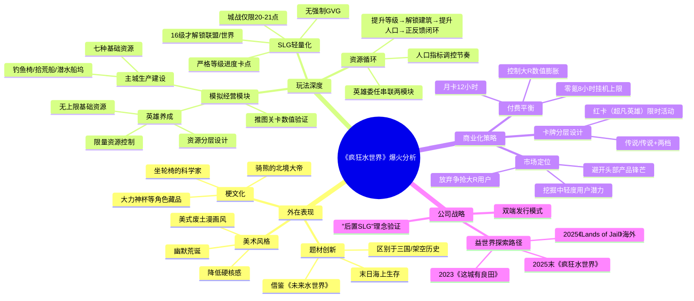

# 3个月抢下畅销第一，熬到爆火：广州公司做SLG太癫狂了

> **原始链接**：https://mp.weixin.qq.com/s/YY5K3R0buxGMv1nxTLk4UA  
> **来源**：游戏那点事  
> **标签**：SLG、模拟经营、小游戏、益世界、买量运营

---

## Phase 3: 概要总览（200-300字）

《疯狂水世界》是由广州益世界研发的"模拟经营+SLG"小游戏，于2025年12月上线微信小游戏平台，2026年1月推出App版本，3月23日登顶抖音小游戏畅销榜。游戏以"末日海上生存"为题材，采用美式废土漫画风格，融入大量网络梗文化。在玩法上，游戏将SLG后置，前中期专注模拟经营，通过"人口"指标调控发展节奏，将英雄养成与主城建设串联形成正反馈循环。商业化方面，游戏通过精细化卡牌分层（传说/传说+/红卡）平衡不同付费层级玩家的生态差距，并将SLG轻量化（城战仅限20-21点），用"护肝"体验换取长线日活。该游戏延续了益世界在《这城有良田》《Lands of Jail》等产品中验证的"后置SLG"设计理念，证明了挖掘中轻度付费用户潜力也能成为SLG突围的新路径。

---

## Phase 4: 思维导图（Mermaid mindmap格式）

---

## Phase 5-6: 提问与回答

### Level 1 - 事实性问题

**Q1: 《疯狂水世界》的开发公司是哪家？总部在哪里？**

根据文章，来自益世界的《疯狂水世界》是广州公司出品："来自益世界的《疯狂水世界》无疑是其中表现最亮眼的一员"。

原文："来自益世界的《疯狂水世界》无疑是其中表现最亮眼的一员"。

---

**Q2: 游戏在哪个时间点登顶了抖音小游戏畅销榜？**

游戏在2026年3月23日登顶："在3月23日，游戏登顶了抖音小游戏畅销榜，并持续在微信小游戏畅销榜上位列前茅"。

原文："在3月23日，游戏登顶了抖音小游戏畅销榜，并持续在微信小游戏畅销榜上位列前茅"。

---

**Q3: 游戏中的七种基础资源是什么？**

七种基础资源是：鱼、塑料、木材、碎布、废金属、玻璃、海藻。

原文："系统会引导玩家在附近的海面上收集物资重建主城，并在这个过程中向他们介绍游戏中的七种基础资源（鱼、塑料、木材、碎布、废金属、玻璃、海藻）"。

---

### Level 2 - 理解性问题

**Q4: 游戏如何在模拟经营和SLG之间找到平衡？**

游戏通过大幅后置SLG玩法来实现平衡：SLG相关的"联盟"与"世界"功能在16级才解锁，玩家在前数小时甚至一天内完全集中于模拟经营。同时，SLG不设数值卡点，被定位为"中后期的内容拓展与养成验证模块"。模拟经营产出的产品可以改善SLG体验，但即使不参与SLG也不会在模拟经营中遇到关键资源缺失的负反馈。

原文："《疯狂水世界》将'联盟'与'世界'这两个和城战相关的核心功能放在了16级解锁，并在前期设置了比较严格的等级进度卡点和有限的经验产出途径。这使得玩家在进入游戏之后的数小时甚至一天之内，体验几乎完全集中于模拟经营之上"。

原文："《疯狂水世界》也没有在SLG玩法中设置数值卡点，而是将其定位为了中后期的内容拓展与养成验证模块"。

---

**Q5: "人口"指标如何调控玩家的发展节奏？**

"人口"并不直接产出资源，而是作为工厂类建筑建造与升级的前置条件。玩家需要消耗产品来建造特殊建筑以增加人口和扩充人口上限。这样的设计将主城建设改造为"提升等级解锁新建筑→提升人口建造新建筑→在新建筑中制作产品换取升级经验"的正反馈数值成长闭环。

原文："为了提升主城建设经营模块的可玩性，《疯狂水世界》还引入了'人口'这一指标来调控玩家的发展节奏。在游戏中，人口并不直接产出资源，而是作为工厂类建筑建造与升级的前置条件"。

---

**Q6: 英雄委任功能如何串联两个核心模块？**

英雄的稀有度和养成程度越高，委派后节省的生产时间就越多。这一功能在优化游戏节奏的同时，也让"英雄养成"和"主城生产建设"两个模块实现了相互串联。

原文："为了缓解这个问题，游戏设计了'英雄委任'这一功能。英雄的稀有度和养成程度越高，委派后节省的生产时间就越多，这在优化游戏节奏的同时，也让'英雄养成'和'主城生产建设'这两个模块实现了相互串联"。

---

### Level 3 - 分析性问题

**Q7: 为什么说《疯狂水世界》找到了"时长积累与付费深度"的平衡？**

游戏通过挂机模块的时间限制设计来体现：零氪玩家只能累积8小时收益（月卡玩家12小时），且不能通过付费"买时间"提前获取资源。这意味着除了大R外，普通玩家必须在一天内多次上线"收菜"，既保证了单位时间内资源获取量基本持平，又拉升了游戏活跃度。

同时，英雄养成体系中，传说+英雄虽可在卡池抽取，但每日奖励只能获取传说稀有度英雄碎片，即使抽到传说+也不能通过日常"肝"满，这样既创造平民与小R差距，又通过资源投放设计控制差距不过大。

原文："值得注意的是，《疯狂水世界》还试图在这一玩法循环中找到时长积累与付费深度的平衡。既让不同消费能力的玩家产生区分度，又不会过于'等级分明'"。

原文："以上面提到的挂机模块为例，零氪玩家只能累积8小时的收益（月卡玩家为12小时），而且不能通过消耗付费货币'买时间'提前获取资源"。

原文："上述两种英雄都可以在卡池中抽取，但玩家在每日奖励中只能获取到'传说'稀有度英雄的碎片，即使抽到'传说+'英雄也不能通过日常'肝'满"。

---

**Q8: 益世界从《这城有良田》到《疯狂水世界》，设计理念如何演进？**

从文章看，益世界在2023年通过《这城有良田》验证了"模拟经营+SLG"方向和"App+小游戏"双端发行模式。《Lands of Jail》（2025年初）围绕"监狱模拟"主题进行细节设计如狱警特殊行动模式、"暴动"事件等。《疯狂水世界》延续了"用人口数代替生产速率"、"后置SLG玩法"等核心理念，但品类研发周期显著加快，反映出益世界对该品类的重视与信心。

原文："基于这些成功经验，'用人口数代替生产速率'、'后置SLG玩法'等设计理念，也顺理成章地延续到了《疯狂水世界》中"。

原文："品类研发周期的显著加快，不仅反映出了益世界对'模拟经营+SLG'品类的重视与信心，也是这家模拟经营大厂在未来发展路径上的一次果断探索"。

---

**Q9: 《疯狂水世界》的成功对SLG赛道有何启示？**

文章指出TOP10头部产品虹吸了SLG赛道超过85%的收入，新游戏很难跟赛道巨头争抢已有大R用户，也很难吸引和培育出忠于自身的新大R。《疯狂水世界》的爆火证明：减少对大R用户体验的投入，去挖掘中轻度付费用户的消费潜力，也能成为新SLG游戏的突围手段。同时，将SLG轻量化、"护肝"化，用更包容性更强的体验换取长线日活，是有效的策略。

原文："促成这一策略的，是严酷的市场现实。目前SLG这个赛道已经相当成熟，对于《疯狂水世界》这样的新秀而言，一方面很难跟赛道巨头争抢已有的大R用户，一方面也很难吸引和培育出忠于自身的新大R，'避其锋芒'才是更优解"。

原文："在这样的背景下，《疯狂水世界》的爆火，证明了减少对大R用户体验的投入，去挖掘中轻度付费用户的消费潜力，也能成为新SLG游戏的突围手段"。

---

## 📝 设计笔记

### 核心洞察

1. **"后置SLG"设计哲学**：将SLG作为中后期内容而非前期核心，让模拟经营用户也能平滑上手
2. **人口作为资源阀门**：用人口而非生产速率调控节奏，创造更直观的成长反馈
3. **卡牌分层控制付费差距**：传说/传说+/红卡三级分层，既刺激付费又维护生态

### 可借鉴的设计点

- 模拟经营+SLG的双模块如何自然过渡
- 英雄委任功能串联两模块的巧妙设计
- 挂机时间限制促进日活的机制
- 城战仅限1小时的轻量化SLG思路

---

*处理时间：2026-04-21*
