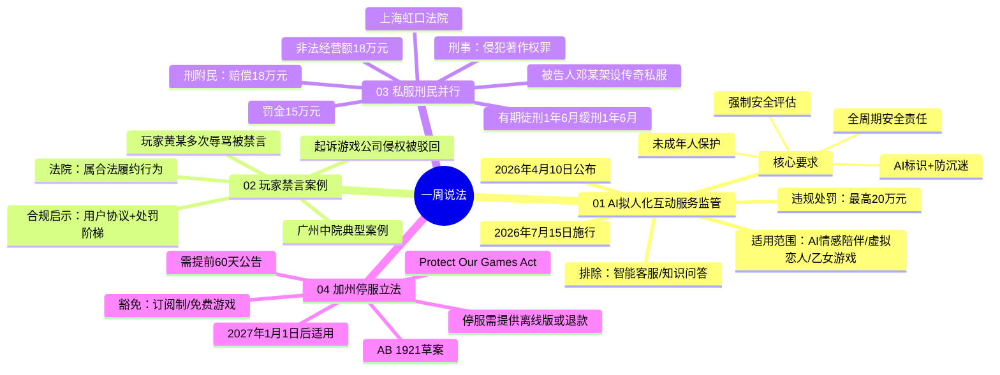

# AI陪伴产品将纳入监管：违规最高罚款20万 | 一周说「法」

## Phase 1: 提取原文

- **文章标题**: AI陪伴产品将纳入监管：违规最高罚款20万 | 一周说「法」
- **作者/来源**: 诺诚游戏法（朱骏超、陈杰、田梦琦）
- **发布平台**: 游戏葡萄
- **原始链接**: https://mp.weixin.qq.com/s/sQH5X7i6sE3aypzrfzDQPw
- **抓取时间**: 2026-04-21
- **标签**: 法规、AI监管、游戏合规

---

## Phase 2: 梳理文章脉络

本文为游戏行业法律合规周报，包含4个独立主题：

| 编号 | 主题 | 类型 |
|------|------|------|
| 01 | 《人工智能拟人化互动服务管理暂行办法》正式公布 | 政策解读 |
| 02 | 辱骂其他玩家被禁言，法院：游戏平台合规管理不构成侵权 | 案例分析 |
| 03 | 私服查处，"刑民并行"同时实现维权与惩戒 | 案例分析 |
| 04 | 美国加州拟立法：游戏停服要求离线可玩或全额退款 | 立法动态 |

---

## Phase 3: 概要总览（200-300字）

本期"一周说「法」"聚焦近期游戏行业四项重要法律动态：

**国内监管层面**，国家网信办等七部委联合发布《人工智能拟人化互动服务管理暂行办法》，针对AI情感陪伴、虚拟恋人等服务设立专门监管框架，明确全周期安全责任、强制安全评估门槛、未成年人保护及AI标识等核心合规要求，违规最高罚款20万元，将于2026年7月15日施行。

**司法实践层面**，广州中院判决玩家因辱骂被禁言不构成侵权，明确游戏公司依约管理行为的合法性；上海虹口法院则首创"刑民并行"模式，在私服侵权案中同步追究刑责并促成民事赔偿18万元。

**海外立法层面**，美国加州提出《Protect Our Games Act》草案，要求游戏公司停服时提供离线版本或全额退款，目前仍在立法推进阶段。

---

## Phase 4: 思维导图

---

## Phase 5: 提问

### Level 1 - 基础理解（What/Who/When/Where）

**Q1**: 《人工智能拟人化互动服务管理暂行办法》将于何时正式施行？

> 来源：*"2026年4月10日...并将于2026年7月15日起施行"*

**Q2**: 哪些AI服务被明确纳入该《办法》的规制范围？

> 来源：*"规制范围是利用AI技术提供'持续性的情感互动服务'，如情感照护、陪伴等"*

**Q3**: 哪家法院判决玩家因辱骂被禁言不构成对游戏公司的侵权？

> 来源：*"广东省广州市中级人民法院...驳回了黄某的全部诉讼请求"*

### Level 2 - 分析理解（How/Why）

**Q4**: 《办法》对用户规模达到什么标准要求强制提交安全评估报告？

> 来源：*"对功能上线、用户规模（注册用户100万或月活10万以上）等情形要求向省级网信部门提交安全评估报告"*

**Q5**: 上海私服案中，"刑民并行"模式相比传统"先刑后民"模式有何优势？

> 来源：*"刑事附带民事诉讼程序允许在追究嫌疑人刑事责任的同时，一并对民事赔偿请求进行审理，显著降低了权利人的维权成本和执行风险"*

**Q6**: 加州《Protect Our Games Act》对游戏停服规定了多少天提前公告期？在此期间是否允许销售？

> 来源：*"发行商需在游戏下线前至少60天...公告，同时...禁止厂商在停服前两个月继续销售相关游戏"*

### Level 3 - 深度思考（Compare/Evaluate/Predict）

**Q7**: 结合《办法》对"情感边界引导"能力的要求，AI角色的对话逻辑设计将面临怎样的具体挑战？这种"避免过度迎合"的标准如何客观界定？

> 来源：*"AI角色的对话逻辑、情感反馈设计必须避免过度迎合、诱导依赖，但该要求缺乏客观的标准，可能为实践中的执行带来极大的挑战"*

**Q8**: 如果一款游戏同时包含可分离的离线内容（如单机剧情）和强依赖服务器的内容（如联机对战），该产品是否仍需受加州停服法案约束？关键判断标准是什么？

> 来源：*"未来争议将更多围绕'常规可用性'（ordinary use）与消费者合理期待的界定展开"*

---

## Phase 6: 回答

### Level 1 回答

**A1**: 《人工智能拟人化互动服务管理暂行办法》将于**2026年7月15日**起正式施行。

> 原文：*"并将于2026年7月15日起施行"*

**A2**: 被纳入规制范围的是利用AI技术提供**"持续性的情感互动服务"**的服务，包括但不限于：
- 情感照护
- AI陪伴/情感陪伴
- 虚拟恋人
- AI乙女/乙游

**明确被排除**的服务是智能客服、知识问答等**不涉及持续情感互动**的服务。

> 原文：*"规制范围是利用AI技术提供'持续性的情感互动服务'，如情感照护、陪伴等，而智能客服、知识问答等不涉及持续情感互动的服务被排除在外"*

**A3**: 此案由**广东省广州市中级人民法院**审理并作出判决。

> 原文：*"广东省广州市中级人民法院发布了一批消费者权益保护典型案例，其中有一则涉及网络游戏服务的纠纷"*

---

### Level 2 回答

**A4**: 根据《办法》规定，当服务满足以下任一条件时，须强制提交安全评估报告：
- **注册用户达100万以上**，或
- **月活跃用户达10万以上**

> 原文：*"对功能上线、用户规模（注册用户100万或月活10万以上）等情形要求向省级网信部门提交安全评估报告"*

**A5**: "刑民并行"模式的核心优势在于：

1. **效率提升**：可在刑事诉讼过程中同步提起刑事附带民事诉讼，一并审理民事赔偿请求，无需等待刑事程序完结后再单独发起民事诉讼
2. **成本降低**：显著降低权利人的维权成本和执行风险
3. **执行保障**：权利人即便赢得诉讼，也能实际挽回经济损失，避免"赢了官司拿不到钱"的困境

传统"先刑后民"或"只刑不民"模式下，权利人往往面临"即便赢得诉讼，也难以实际挽回经济损失"的问题。

> 原文：*"刑事附带民事诉讼程序允许在追究嫌疑人刑事责任的同时，一并对民事赔偿请求进行审理，显著降低了权利人的维权成本和执行风险"*

**A6**: 
- **提前公告期**：至少**60天**
- **禁售期**：停服前**两个月**（约60天）禁止继续销售

> 原文：*"发行商需在游戏下线前至少60天，通过游戏内及官方网站发布公告...同时，法案禁止厂商在停服前两个月继续销售相关游戏"*

---

### Level 3 回答

**A7**: AI角色对话逻辑设计面临的具体挑战：

1. **主观性标准难界定**："避免过度迎合、诱导依赖"是一个高度主观的判断标准，缺乏客观量化指标。不同监管人员、法官可能对何为"过度迎合"有不同理解。

2. **情感化设计 vs 合规设计的张力**：游戏公司设计AI角色的目的本身就是建立情感连接，"情感边界引导"能力要求在建立连接与避免依赖之间找到微妙平衡点。

3. **内容审核与实时生成的矛盾**：AI角色的实时对话内容无法预先审核，如何确保每句回复都"不诱导依赖"是技术难题。

4. **文化差异问题**：不同地区、不同年龄段用户对"情感依赖"的认知和接受度不同，合规边界难以统一。

**预测**：该条款在正式施行后很可能成为执法争议的高发区，建议相关企业在缓冲期内主动与监管机构沟通，争取获得更明确的操作指引。

> 原文：*"AI角色的对话逻辑、情感反馈设计必须避免过度迎合、诱导依赖，但该要求缺乏客观的标准，可能为实践中的执行带来极大的挑战"*

**A8**: 根据文章分析，该产品很可能**仍然需要受法案约束**，但具体义务边界存在争议。关键判断标准是**"常规可用性"（ordinary use）**：

1. **如果用户购买该游戏的核心目的是使用离线内容**：产品设计实质上是可分离的，则可能只需在"离线版/补丁"和"退款"之间二选一

2. **如果用户购买的核心价值依赖于服务器端内容**（如纯联机游戏，即使有单机内容）：则制度压力更高，需严格满足法案要求

3. **可分离离线核心内容的争议点**：未来争议将更多围绕"常规可用性"与消费者合理期待的界定展开，这意味着**游戏宣传口径、功能设计与停服预案之间将被要求保持更高一致性**。

换言之，如果游戏宣传时强调"永久可玩"但实际高度依赖服务器，将面临更高法律风险。

> 原文：*"未来争议将更多围绕'常规可用性'（ordinary use）与消费者合理期待的界定展开，这意味着游戏宣传口径、功能设计与停服预案之间将被要求保持更高一致性"*

---

## Phase 7: 生成完整笔记

# AI陪伴产品将纳入监管：违规最高罚款20万 | 一周说「法」

> **来源**: 游戏葡萄/诺诚游戏法  
> **文章链接**: https://mp.weixin.qq.com/s/sQH5X7i6sE3aypzrfzDQPw  
> **处理日期**: 2026-04-21  
> **标签**: #法规解读 #游戏合规 #AI监管 #私服维权 #停服立法

---

## 📌 核心要点

### 01 | AI拟人化互动服务监管（国内）
- **施行时间**: 2026年7月15日
- **适用范围**: AI情感陪伴/虚拟恋人/乙女游戏
- **核心合规**: 全周期安全责任 + 未成年人保护 + AI标识 + 防沉迷
- **处罚力度**: 最高20万元罚款
- **⚠️ 关键挑战**: "情感边界引导"能力的要求缺乏客观判断标准

### 02 | 玩家禁言案例
- **判决要旨**: 玩家违约被禁言属合法履约，游戏公司不构成侵权
- **合规启示**: 用户协议须明确禁止行为清单 + 阶梯式处罚措施 + 处理流程规范化

### 03 | 私服"刑民并行"维权
- **案例要点**: 私服侵权人赔偿18万元获刑1年6月缓刑
- **核心价值**: 刑事附带民事诉讼可同步实现惩戒与经济赔偿
- **操作建议**: 日常监测中注意证据固定（侵权规模、非法经营额）

### 04 | 加州停服立法（海外）
- **法案**: Protect Our Games Act (AB 1921)
- **要求**: 停服提供离线版/补丁或全额退款
- **公告期**: 提前60天
- **豁免**: 订阅制/免费游戏/已可离线下载产品
- **⚠️ 现状**: 仍在立法推进阶段，非正式法案

---

## 🎯 行动建议（针对游戏公司）

1. **立即行动**（AI情感陪伴功能）：开展自查与合规行动，距离施行约3个月
2. **完善用户协议**：明确禁止行为清单 + 阶梯式处罚 + 规范化处理流程
3. **证据固定意识**：私服/外挂监测中系统收集侵权规模证据
4. **停服预案**：含AI情感系统的产品提前规划离线化方案

---

*处理人: 锅巴*  
*Obsidian每日文章处理 - 2026-04-21*
