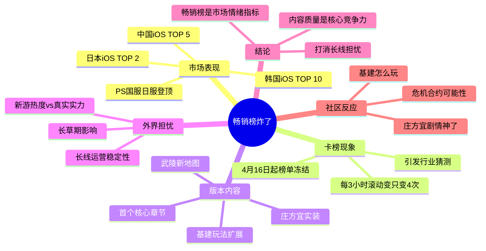

# 畅销榜炸了，谁急了？

> **原文链接**：[畅销榜炸了，谁急了？](https://mp.weixin.qq.com/s/xUbIsGUSW4HqzQV4JObfLw)
> **作者**：秋秋
> **来源**：游戏葡萄
> **日期**：2026-04-18
> **标签**：#游戏资讯 #商业分析 #明日方舟终末地 #版本更新

---

## 📌 概要（200-300字）

4月18日，《明日方舟：终末地》「春晓时」版本更新次日，游戏空降iOS畅销榜日本TOP 2、中国TOP 5、韩国TOP 10，同时登顶国服和日服PS游戏榜单。作为一款PC和主机端占流水大头的跨端产品，终末地单凭移动端就能杀入海内外市场畅销榜前列，含金量极高。

文章围绕两个核心问题展开：一是开服三个月后长草期是否影响流水，验证长线运营稳定性；二是通过卡榜现象分析市场情绪与榜单数据的关系。作者认为，「春晓时」版本的成功打消了外界对游戏长线爆发力的担忧，iOS畅销榜仍是重要的市场情绪指标。但更重要的是，作为跨端产品，流水只是结果的一重印证——社区里玩家热烈讨论「庄方宜剧情」「基建玩法」「危机合约」等纯粹的游戏内容，才真正展示了游戏的独特性和核心竞争力。**好内容确实能赚钱**，这是文章的核心观点。

---

## 🔄 文章脉络

1. **开场数据**：终末地「春晓时」版本上线后登顶海内外畅销榜
2. **卡榜现象**：4月16日起榜单基本不变，引发行业关注
3. **内容分析**：首个核心章节版本、人气角色庄方宜实装、新地图与基建玩法
4. **外界担忧**：开服成绩是否依赖新游热度？长线运营稳不稳？
5. **数据验证**：畅销榜成绩打消了长线爆发力担忧
6. **深层解读**：跨端产品特性，iOS榜单只是部分指标
7. **核心观点**：内容质量是根本，畅销榜是水到渠成的结果

---

## 🧠 思维导图

---

## ❓ 提问

### Level 1 - 基础理解

1. **「春晓时」版本上线后，终末地在iOS畅销榜取得了哪些具体成绩？**
2. **什么是"卡榜现象"？文章中提到了哪些可能的解释？**
3. **「春晓时」版本包含哪些主要内容更新？**

### Level 2 - 深度分析

4. **文章认为iOS畅销榜对跨端产品意味着什么？为什么不能完整反映真实收入？**
5. **为什么「春晓时」版本的成功被视为打消了"长线运营担忧"的证据？**
6. **文章引用了哪些数据来说明玩家对版本的期待和实际反馈？**

### Level 3 - 批判性思考

7. **文章的核心观点是"好内容确实能赚钱"，你认为这个观点是否过于简化？畅销榜成绩和内容质量之间是什么关系？**
8. **卡榜现象真的只是因为"流水太猛冲崩苹果结算系统"吗？有没有其他可能的解释？**
9. **作为游戏策划，从这篇文章中可以提取哪些关于"如何做好版本更新"的启示？**

---

## 💬 回答

### Q1: 「春晓时」版本上线后，终末地在iOS畅销榜取得了哪些具体成绩？

> "4月18日，在《明日方舟：终末地》「春晓时」版本更新次日，游戏稳在了iOS畅销榜日本TOP 2、中国TOP 5、韩国TOP 10。同时登顶国服和日服PS游戏榜单。"

**回答**：日本iOS畅销榜TOP 2、中国iOS畅销榜TOP 5、韩国iOS畅销榜TOP 10，同时登顶国服和日服PS游戏榜单。

---

### Q2: 什么是"卡榜现象"？文章中提到了哪些可能的解释？

> "一个原因是，整个畅销榜的排名数据，自4月16日开始就在七麦数据上基本没有变化。从App Store的更新监测节点也能看出，原本每三小时一滚动的畅销榜，这两天总共才变了四次——这种卡榜现象，把大家的胃口吊到了最高点。"

**回答**：卡榜现象指的是畅销榜排名数据长时间没有变化。原本App Store畅销榜每三小时滚动一次，但4月16日起基本没有变化，两天内只变了四次。文章提到的可能解释包括：
- 「春晓时」版本流水太猛，把苹果结算系统冲崩了
- 撞上了热门新游集中爆发

---

### Q3: 「春晓时」版本包含哪些主要内容更新？

> "人气角色庄方宜实装、加上武陵新地图、基建玩法扩展和大量系统优化"

**回答**：版本主要内容包括：
- 人气角色庄方宜实装
- 武陵新地图
- 基建玩法扩展
- 大量系统优化
- 首个核心章节

---

### Q4: 文章认为iOS畅销榜对跨端产品意味着什么？为什么不能完整反映真实收入？

> "毕竟作为跨端产品，终末地的大半收入来自PC主机端，iOS榜单情况只是其中一个指标，能看出玩家对游戏品质的某种认可，却无法完整还原游戏的真实收入情况。"

**回答**：对于跨端产品来说，iOS畅销榜只是其中一个指标，不能完整反映真实收入情况。因为终末地的大半收入来自PC和主机端，移动端iOS榜单只能说明玩家对游戏品质的某种认可，但无法完整还原游戏的真实收入规模。

---

### Q5: 为什么「春晓时」版本的成功被视为打消了"长线运营担忧"的证据？

> "现在，顶着卡榜的变数和新游扎堆的竞争，终末地用一个空降海内外畅销榜前排的姿态给出了答案：「春晓时」版本距离游戏开服已经过去近三个月，这个成绩打消了外界对游戏长线爆发力的担忧。"

**回答**：因为「春晓时」版本距离游戏开服已经过去近三个月，游戏经历了长草期。在这个时候依然能空降海内外畅销榜前排，说明开服成绩并非单纯依赖新游热度，而是玩家对游戏内容的持续认可，证明了游戏长线运营的稳定性。

---

### Q6: 文章引用了哪些数据来说明玩家对版本的期待和实际反馈？

**数据引用**：
1. 开服成绩："终末地两周全球流水破12亿、国内PC端占比高达60%"
2. 榜单数据：iOS畅销榜日本TOP 2、中国TOP 5、韩国TOP 10
3. 卡榜数据：原本每三小时滚动，两天内只变了四次
4. 社区反馈："庄方宜剧情神了""基建怎么玩""危机合约的可能性"

---

### Q7: 文章核心观点"好内容确实能赚钱"是否过于简化？

**分析**：这个观点看似简单，但文章给出了完整的论证逻辑：
- 版本内容扎实（核心章节+人气角色+玩法扩展+系统优化）
- 玩家社区热烈讨论纯粹的游戏内容
- 畅销榜成绩是水到渠成的结果

**更深层的思考**：畅销榜和内容质量是相互加强的关系。好内容带来付费意愿，付费数据又反馈到榜单。但二者并非线性因果——市场时机、竞品状态、用户基数都会影响最终表现。所以观点本身不复杂，但背后的逻辑是成立的。

---

### Q8: 卡榜现象真的只是因为"流水太猛冲崩苹果结算系统"吗？

**分析**：这只是调侃式的玩笑，更可能的原因包括：
- **结算延迟**：苹果系统在高流水情况下可能延迟结算，导致排名更新滞后
- **数据采样**：七麦等第三方数据的抓取可能存在延迟
- **市场因素**：多款热门游戏同时发布，榜单竞争激烈
- **苹果策略**：不排除苹果有意控制榜单更新频率

调侃归调侃，文章也指出"大家又开始了下一轮讨论：这个成绩，到底是两天累积下来的高位数据，还是第二天的实时回落数据？"——说明行业对卡榜原因并无定论。

---

### Q9: 作为游戏策划，从这篇文章中可以提取哪些启示？

1. **版本节奏把控**：开服三个月才推出首个核心章节，说明终末地在内容储备上有耐心，没有急于求成

2. **核心角色价值**：庄方宜作为"人气角色"能显著拉动流水，说明角色设计要与玩家期待匹配

3. **玩法深度**：玩家讨论"基建怎么玩"而非"抽卡怎么抽"，说明基建等系统玩法能带来更持续的用户粘性

4. **社区氛围**：纯粹讨论玩法和内容的社区氛围，是游戏长线生命力的体现

5. **跨端策略**：PC/主机端占60%流水说明核心用户可能在其他平台，移动端榜单是增量而非全部

6. **期待管理**：版本前瞻就证明玩家憋着劲儿等着——预热和期待管理同样重要

---

## 📚 延伸阅读

- [终末地可能是最快迎来「完全体」的二游](https://mp.weixin.qq.com/s?__biz=MjM5OTc2ODUxMw==&mid=2650002330&idx=1&sn=72d1c58ed5d551672c2b95956b735218&scene=21#wechat_redirect)

---

*笔记整理：锅巴*
*整理时间：2026-04-19*
