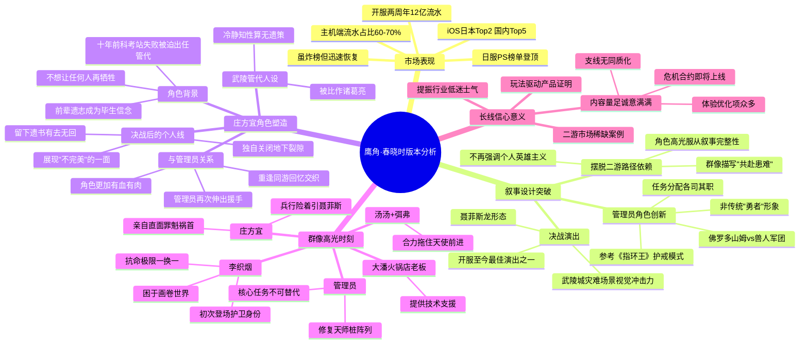

# 猛冲Top2、夯到"炸榜"：这次，鹰角击碎一切质疑

> **来源**：[猛冲Top2、夯到"炸榜"：这次，鹰角击碎一切质疑](https://mp.weixin.qq.com/s/lPYRa2dZ2F4NYfa_XAGM5A)  
> **作者**：游戏那点事 Sam  
> **日期**：2026-04-18（4月17日版本上线）  
> **标签**：#鹰角 #明日方舟终末地 #游戏资讯 #版本分析 #叙事设计

---

## 📌 概要（200-300字）

2026年4月17日，《明日方舟：终末地》「春晓时」版本正式上线。这是游戏上线以来第一个核心章节版本，武陵城主线剧情迎来阶段性高潮。面对聂菲斯与阿达希尔蓄谋已久的全面进攻，终末地在重重压力下交出了一份亮眼答卷：即便iOS商店"炸榜"一天无法被统计，恢复后仍稳居**日本iOS畅销榜Top2、国内Top5**，日服PS榜单登顶。结合主机端流水占比六至七成的数据，整体市场表现可谓"夯爆了"。

本文从**叙事设计**角度深入分析「春晓时」版本的突破性：  
1. **摆脱二游叙事路径依赖**——以群像描写替代个人英雄主义，管理员角色定位创新（参考《指环王》护戒小队模式）  
2. **庄方宜角色塑造**——通过"不完美"展现角色的有血有肉，将责任与个人牺牲写得合理感人  
3. **市场信心意义**——在二游增长停滞的环境下，终末地成功证明了玩法驱动产品的长线潜力

---

## 🧠 思维导图

---

## ❓ 提问（Level 1/2/3）

### Level 1（基础理解）

1. 「春晓时」版本的iOS榜单成绩是什么？恢复统计后达到什么位置？
2. 文中将管理员角色与《指环王》的谁做了类比？这样的类比想说明什么问题？
3. 庄方宜十年前经历了什么事件，导致她成为武陵管代？

### Level 2（深度分析）

4. 作者认为鹰角在叙事上"摆脱二游路径依赖"具体指什么？这与传统的二游叙事模式有何本质区别？
5. 李织烟"抗命极限一换一"的描写，与主流二游的"欲扬先抑"套路有何不同？作者认为这种写法好在哪里？
6. 庄方宜选择独自前往关闭裂隙的决定，为什么作者认为"恰恰符合人物本色"？有哪些前文铺垫？
7. 文中提到"护戒小队"的类比，这个类比如何帮助读者理解终末地的角色分工设计？

### Level 3（批判性思考）

8. 作者认为「春晓时」版本可能存在的叙事风险是什么？庄方宜"不完美"的设计是否真的规避了这些风险？
9. 在二游市场整体低迷的环境下，终末地的成功是否具有可复制性？还是只是个案？
10. 文章花了大量篇幅分析叙事设计，但游戏的市场表现同样亮眼——这两者之间是否有必然联系？还是说鹰角的品牌效应才是根本？

---

## 💬 回答（带原文引用）

**Q1: 「春晓时」版本的iOS榜单成绩？**

> "我们发现《明日方舟：终末地》今天依然成功稳在iOS游戏畅销榜日本Top2、国内Top5，并在日服PS榜单登顶头名。" 结合主机端流水占比高达六至七成，可推知这次「春晓时」版本的整体市场表现可谓"夯爆了"。

**Q4: 鹰角"摆脱二游路径依赖"具体指什么？**

> "在以角色驱动为主的商业模式下，厂商往往习惯在剧情中为版本角色预留足够多的高光，从而充分将其人设塑造到位、让玩家产生抽取动力；但与此同时，为了尽可能将代入感最大化、提供足够多的情绪价值，主角本身又必须始终扮演'英雄'角色，不能给人以无足轻重的观感。"
> 
> "于是，出于同时兼顾这些'必要条件'的考虑，你会发现二游在剧情展开方面往往会陷入高度趋同的'路径依赖'：主角一行人到各个地区解决突发问题，随后查明真相回到主城面对强敌，在主推角色战至力竭时挺身而出……"
> 
> 鹰角的解决方案是：管理员不再是无所不能的主要战力，而是"将管理员和传统的「勇者」形象区别开来、不再作为无所不能的主要战力而存在，从而为其他角色登场的必要性留出空间"。

**Q5: 李织烟的描写与主流二游"欲扬先抑"有何不同？**

> "这种用'自我牺牲'换取短暂胜利的描写，在主流二游剧情通常会成为欲扬先抑、为后续主角团成长和复仇提供情绪铺垫的楔子。但放在终末地这里，鹰角这么写却并不是为了给玩家'发刀'……更多是借李织烟将个人安危抛诸脑后的抉择，紧扣终末地故事的基调之一——「团结」。角色的高光时刻固然重要，但终末地并没有将其凌驾于叙事的完整性之上，而是让其自然发生、成为推动剧情发展的一部分。"

**Q6: 庄方宜独自关闭裂隙为何符合人物本色？**

> "终末地先前版本的主线剧情里面，实际上就曾经出现过多次庄方宜'事必躬亲'的细节铺垫。除了多次婉拒下属分担压力的建议，坚持将最困难的决策和实验工作一应包揽之外，就连街道上哭闹的孩童，庄方宜也能准确记住他的名字，并且主动去耐心询问发生了什么事情。"
> 
> "这种将所有责任扛在身上、负责到有些执拗的性格，又很大一部分源自庄方宜成为武陵管代的经历——十年前，利用息壤关闭裂隙的计划意外失败，导致侵蚀潮吞没了整个科考站以及在场的所有科研人员。在此之后，资历最浅的庄方宜被迫临危受命出任管代，承担起带领众人建设武陵城的重责。完成前辈未竟的遗志，也成为了庄方宜毕生所追求的信念。"
> 
> 因此，"将武陵城连续陷入危机、遭受损失全部归咎于自己失察的庄方宜，能想到的唯一解法，或许也只有'承担起管理者的责任'，独自去关闭武陵地下逐渐外溢的裂隙。"

**Q9: 终末地的成功是否具有可复制性？**

> "且不论国内二游市场仍然敢于尝试玩法驱动的案例有多么稀缺，光是眼下还有新品能够在市场头部站稳脚跟这一点，就足以让许多同行提振起低迷许久的士气。"
> 
> "更重要的是，有了终末地开拓出来的这条路，玩家也完全有理由对于未来能够看到更多在玩法层面有所突破的二游产品，重新拾起自己的信心。"
> 
> 作者的态度偏乐观但谨慎：终末地的成功证明了"玩法驱动"在中国市场仍然可行，但这类成功案例仍然稀缺，其经验能否被复制仍需观察。

---

## 📎 延伸阅读

- [终末地三测体验文章](https://mp.weixin.qq.com/s?__biz=MjM5MDEwMTk2MA==&mid=2651280067&idx=1&sn=ba1cf4470f1cde53d09333e1c5254400)（文中提及）

---

*📝 分析日期：2026-04-19*
*🤖 由锅巴深度分析笔记系统生成*
