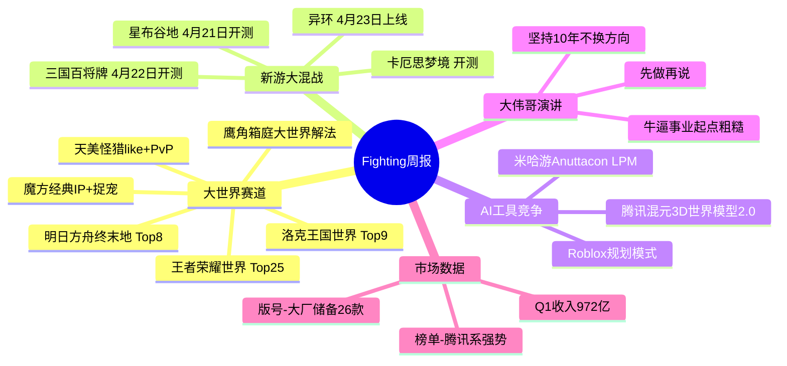

# 天美魔方鹰角大世界首战上交成绩单；完美米哈游B站迎战五一档丨Fighting周报

> 📅 处理日期：2026-04-22
> 📁 来源：游戏资讯/待办/已处理

---

## Phase 1: 原文信息

- **文章标题**：天美魔方鹰角大世界首战上交成绩单；完美米哈游B站迎战五一档丨Fighting周报
- **链接**：https://mp.weixin.qq.com/s/rPW17fVoLiHzCXuVIUQOfg
- **发布日期**：2026年4月

---

## Phase 2: 文章脉络

本文为"Fighting周报"，主要包含6大部分：

1. **大世界赛道成绩单**：天美魔方鹰角大世界首战上交成绩单
2. **新游大混战**：完美都市开放世界、米哈游、B站、腾讯新品集中面世
3. **AI工具竞争**：Roblox发布游戏开发者AI工具，厂商跑马圈地
4. **米哈游刘伟演讲**：大伟哥交大演讲分享创业哲学
5. **国内外游戏榜单**：中国大陆/香港/台湾、美国、日本、韩国、印度市场榜单
6. **微信小游戏、买量市场、版号审批、一周大事件**

---

## Phase 3: 概要总览

本周游戏行业核心动态：国内大世界赛道迎来阶段性成绩单——《明日方舟：终末地》Top8、《洛克王国：世界》Top9、《王者荣耀世界》Top25。下周将迎来新品大混战，完美《异环》定档4月23日、米哈游《星布谷地》4月21日开测、B站《三国：百将牌》4月22日开测。AI领域，中美技术竞速升级，Roblox推出规划模式AI工具，腾讯发布混元3D世界模型2.0。米哈游刘伟（大伟哥）在交大演讲中分享创业哲学："牛逼伟大的事业，起点都非常粗糙"。Q1中国游戏市场实际销售收入972亿元。

---

## Phase 4: 思维导图

---

## Phase 5: 提问（Level 1/2/3）

### Level 1 - 基础理解

**Q1: 三大厂商的大世界解法有何本质差异？**

**Q2: 下周集中上线/开测的四款产品分别属于什么赛道？**

### Level 2 - 深度分析

**Q3: 从榜单表现看，大世界赛道的用户偏好有什么变化趋势？**

**Q4: AI工具（如Roblox规划模式）会如何影响游戏开发的工作流？**

### Level 3 - 反思与应用

**Q5: 大伟哥"坚持10年不换方向"的理念，对自走棋产品的长线运营有什么启示？**

**Q6: 相比直接竞品，《洛克王国：世界》的成绩说明了什么？**

---

## Phase 6: 回答

### A1: 三大厂商的大世界解法有何本质差异？

**原文引用：**
> "鹰角可以说是这一阶段的先锋兵，1月22日《明日方舟：终末地》上线。从玩法类型上属于，该作本质上属于箱庭，但每个关卡地图的内容丰富度又足够称得上大世界，或者说箱庭大世界可能就是鹰角在这一赛道提出的解法。"
> "紧接着是魔方工作室群《洛克王国：世界》，该作以经典IP+捉宠大世界+社交切入赛道。"
> "与前两者的解法又不一样，4月10日先行推出PC端、4月17日上线手游的天美L1《王者荣耀世界》，则采用了王者IP+怪猎like+轻社交+PvP竞技的解法。"

**分析：**
- **鹰角**：箱庭大世界，每个关卡内容丰富但边界清晰，适合重度策略用户
- **魔方**：经典IP资产+成熟捉宠玩法+强社交，抓泛娱乐用户
- **天美**：动作狩猎体验+PvP竞技，抓动作/竞技用户

---

### A2: 下周集中上线/开测的四款产品分别属于什么赛道？

**原文引用：**
> "其中，由完美世界幻塔工作室研发、国内率先上线的二次元都市开放世界游戏《异环》已定档4月23日正式上线。"
> "米哈游方面，公司打造的首款生活模拟经营新作《星布谷地》在经历很长一段封闭测试后，也将于4月21日开启限量删档测试。B站则在三国题材游戏领域做出进一步布局，旗下休闲竞技卡牌《三国：百将牌》将于4月22日上午10点开启不删档测试。"
> "腾讯方面，同期开测的游戏是《卡厄思梦境》。该作由韩国厂商笑门（Smilegate）旗下SUPER CREATIVE研发的二次元肉鸽卡牌RPG游戏。"

**分析：**
| 产品 | 厂商 | 赛道 | 上线时间 |
|------|------|------|----------|
| 异环 | 完美世界 | 二次元都市开放世界 | 4月23日上线 |
| 星布谷地 | 米哈游 | 生活模拟经营 | 4月21日开测 |
| 三国：百将牌 | B站 | 休闲竞技卡牌 | 4月22日开测 |
| 卡厄思梦境 | 腾讯（韩国笑门） | 二次元肉鸽卡牌RPG | 同步开测 |

---

### A3: 从榜单表现看，大世界赛道的用户偏好有什么变化趋势？

**原文引用：**
> "过去5年多时间，国内开放世界/大世界赛道最清晰的逻辑——基本是沿着米哈游《原神》的路径去做进一步探索。大家围绕地图、角色、剧情、探索和持续更新能力的竞争，展开了一场内容创作的耐力赛。可随着市场趋势、玩家喜好的变化，越来越多厂商开始新的解题思路。"

**分析：**
用户偏好从追求"原神like"宏大开放世界，转向更垂直的解法：
- **鹰角**箱庭大世界：内容精炼、关卡驱动
- **魔方**社交捉宠：轻量社交、情感连接
- **天美**动作竞技：快节奏、即时反馈

市场从"内容耐力赛"转向"玩法差异化竞争"。

---

### A4: AI工具会如何影响游戏开发的工作流？

**原文引用：**
> "Roblox宣布在其Roblox Studio工具中推出全新的'规划模式'（Planning Mode），将AI助理从一问一答的代码建议工具，升级为能够规划、构建、测试的多步骤协作开发伙伴。根据官方发布的信息，创作者只需描述自己想要的内容，AI便会分析游戏的代码和数据模型，提出澄清性问题，然后将复杂的提示转化为高度详细、可审查、可编辑的行动计划。"

**分析：**
AI从**被动工具**升级为**协作伙伴**：
- 开发者用自然语言描述需求
- AI分析代码和数据模型
- 生成可审查的行动计划
- 开发者审核后执行

这意味着策划/设计到实现的路径大幅缩短，个人开发者产能提升。

---

### A5: 大伟哥"坚持10年不换方向"的理念对自走棋长线运营的启示？

**原文引用：**
> "我想跟大家讲，很多时候，所谓牛逼的事情、所谓伟大的事业，它的起点都是非常非常非常粗糙的。他表示，现在大家看到米哈游做出了《原神》，觉得米哈游好厉害，能做出有全球影响力的作品。但大家不知道，在这条路上，他们已经走了10年了，而且这10年里，他们从来没有换过方向。"
> "任何时候，想做一件事，最重要的就是马上开始做，学会做一件事的核心，不是先学会，而是先去做。"

**启示：**
1. **方向稳定**：自走棋品类需要持续深耕核心机制，而非追逐热点改方向
2. **起步粗糙但迭代**：先上线验证，再逐步优化，而非追求完美开局
3. **长期主义**：10年不换方向的坚持，米哈游成功的核心也是耐力赛

---

### A6: 相比直接竞品，《洛克王国：世界》的成绩说明了什么？

**原文引用：**
> "该作以经典IP+捉宠大世界+社交切入赛道。3月26日，游戏开服13个小时新进用户数就突破了1500万，次日登顶畅销榜。截至目前，游戏一直保持着较高热度，未曾掉出畅销榜Top10。"

**分析：**
| 产品 | 榜单表现 | 解法 |
|------|---------|------|
| 洛克王国：世界 | Top9，稳居Top10 | 经典IP+成熟捉宠+社交 |
| 明日方舟：终末地 | Top8 | 箱庭大世界+策略 |
| 王者荣耀世界 | Top25 | 怪猎like+IP+PvP |

**结论：**
《洛克王国：世界》的成功说明：
1. **经典IP+成熟玩法**依然有效，不需要创新玩法
2. **简单直接的上手体验**比"宏大复杂"的开放世界更受欢迎
3. **社交元素**是维持长线留存的关键
4. 自走棋赛道同样适用：稳定的核心玩法+社交/社交展示> 追求复杂创新

---

## 关键洞察

1. **大世界赛道分化**：鹰角箱庭、魔方社交捉宠、天美动作竞技，三种解法代表不同用户需求
2. **AI开发工具平民化**：Roblox规划模式让个人开发者也能快速原型开发
3. **米哈游创业哲学**：坚持10年不换方向，先做再说
4. **自走棋启示**：稳定核心+社交>追求复杂创新，经典IP+成熟玩法的商业价值
