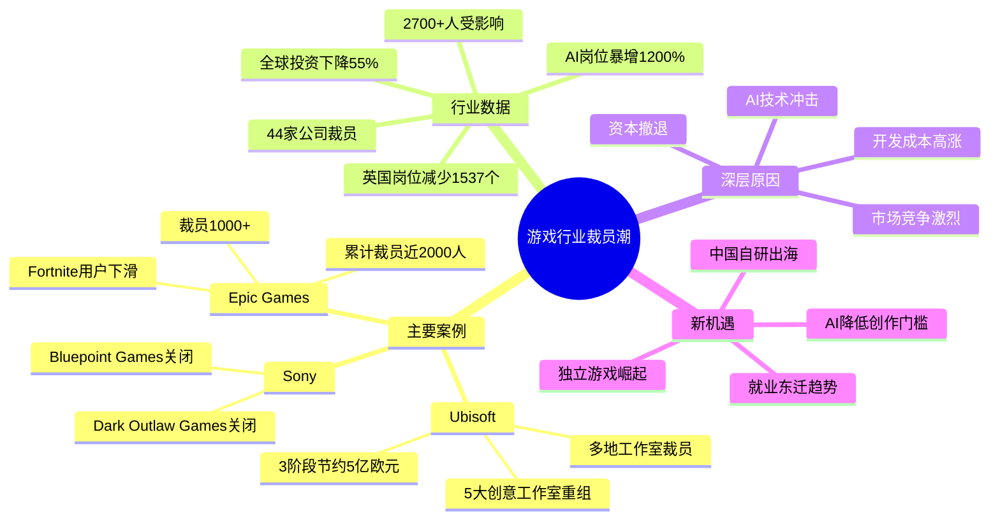

# 仅3个月44家公司裁员，超2700人下岗：残酷的困局出现了

## Phase 1: 提取原文

- **文章标题**: 仅3个月44家公司裁员，超2700人下岗：残酷的困局出现了
- **来源**: 游戏那点事Gamez
- **作者**: Green.Y
- **URL**: https://mp.weixin.qq.com/s/QhVmkqcKDgRspakqaEwt7A

---

## Phase 2: 梳理文章脉络

**文章结构**（3大章节）：

1. **01 短短几个月 多家大厂栽跟头**
   - Epic裁员1000+人，《堡垒之夜》用户下滑
   - 育碧三阶段重组，5大创意工作室整合，多地裁员
   - 索尼关闭Bluepoint Games和Dark Outlaw Games

2. **02 游戏结束了？**
   - 全球44家公司裁员，超2700人下岗
   - 裁员原因：开发成本高涨、市场竞争激烈、AI冲击、资本撤退
   - AI岗位暴增1200%（2.29%→26.23%）
   - 2025年全球游戏私人投资暴跌55%
   - 英国游戏开发岗位净流失1537个

3. **03 挑战的另一面 总是机遇**
   - AI降低创作门槛，独立游戏崛起
   - 就业岗位"东迁"——中国、东南亚增长
   - 《黑神话：悟空》等中国自研产品出海成功
   - 大厂资深开发者可能转向独立领域

---

## Phase 3: 概要总览

本文深度剖析了2026年初全球游戏行业的裁员风暴。文章指出，仅3个月内已有44家公司宣布裁员，影响人数超过2700人。Epic、育碧、索尼等巨头纷纷通过关闭工作室、大幅裁员来应对高成本、低增长的市场环境。

**核心洞察**：
- 当前行业震荡主因是**经济模型调整**而非AI直接替代
- 但AI正在重塑人才需求结构，AI岗位暴涨1200%
- 与大厂收缩形成对比，**独立游戏凭借AI工具**正迎来新机遇
- 全球研发格局正在**"东迁"**——中国、东南亚保持增长势头

---

## Phase 4: 思维导图

---

## Phase 5: 提问

**【Level 1 - 基础理解】**

**Q1**: Epic裁员强调"与AI无关"，那真正原因是什么？

**Q2**: 育碧的三阶段重组计划具体内容是什么？

**Q3**: 索尼关闭Bluepoint Games的原因是什么？

**【Level 2 - 深度分析】**

**Q4**: 文章提到"AI岗位暴增1200%"，这个数据说明了什么行业趋势？

**Q5**: 为什么说当前行业震荡"主因并非技术的直接替代"？

**Q6**: 全球游戏投资下降55%的大环境下，中国游戏产业为什么能保持增长势头？

**【Level 3 - 反思与启发】**

**Q7**: 从业者应该如何应对这场行业变革？

**Q8**: 作为游戏策划，这篇文章对你的自走棋设计工作有什么启示？

---

## Phase 6: 回答

**【Level 1 回答】**

**A1**: Epic裁员的真正原因是什么？
> **回答**: Epic裁员的直接原因是**《堡垒之夜》用户参与度明显下滑，公司支出持续高于收入**。文章指出"尽管在很多人印象中，《堡垒之夜》在海外市场一直占据高位，但对比去年同期的活跃数据，其用户基数出现了可见的衰减"。此外，Epic还经历了与苹果、谷歌的诉讼战，"2020年，因反对苹果与谷歌的应用商店支付抽成，Epic选择正面诉讼，导致《堡垒之夜》在App Store和Google Play双双下架"，这进一步影响了其收入来源。

**A2**: 育碧的三阶段重组计划具体内容是什么？
> **回答**: 育碧的重组计划分为三个阶段：
> - **第一阶段**：整合全球工作室为五大"创意工作室集团"（Creative Houses），分别聚焦不同类型IP，承担端到端的创意、制作、发行与财务责任
> - **第二阶段**：约1亿欧元成本节约，涉及Massive、育碧斯德哥尔摩、育碧哈利法克斯、育碧阿布扎比及RedLynx等多个工作室裁员
> - **第三阶段**：未来两年内再节省2亿欧元，到2028年重组完成后，公司固定成本将比2023年**减少5亿欧元**

**A3**: 索尼关闭Bluepoint Games的原因和行业困境？
> **回答**: 索尼关闭Bluepoint Games的根本原因是**日益充满挑战的行业环境**。内部邮件指出："开发成本上升、行业增长放缓、玩家行为变化以及经济增长放缓，使得可持续开发游戏变得更加困难"。此外，Bluepoint"一度尝试开发一款在线服务游戏，但该项目已在2025年1月被取消"，这也是索尼退出在线服务游戏市场的一部分。

---

**【Level 2 回答】**

**A4**: AI岗位暴增1200%说明了什么？
> **回答**: 这个数据说明**整个行业正在迫切地将AI能力嵌入研发的各个环节**。文章指出"在游戏行业新发布的职位中，明确要求AI相关技能的岗位占比已从去年同期的2.29%飙升至26.23%，涨幅超过十倍"。这表明AI已从辅助工具升级为行业刚需技能，无论主动还是被动，从业者都需要掌握AI能力以保持竞争力。

**A5**: 为什么说当前震荡主因并非AI直接替代？
> **回答**: 文章明确指出"当下的行业震荡，主因并非技术的直接替代，而是**经济模型在多重压力下的调整**"。AI目前"在游戏开发中主要扮演的是'超级辅助工具'的角色"，能高效处理重复性、标准化工作，但"对于需要核心创意、艺术审美与人性化叙事的复杂决策，仍远远无法替代制作人员的匠心和感悟"。因此，AI是效率工具而非裁员主因。

**A6**: 中国游戏产业为什么能保持增长？
> **回答**: 主要有三个原因：
> 1. **成本与产业链优势**：就业岗位呈现"东迁"趋势，欧美缩减而中国、东南亚保持增长
> 2. **产品认知改变**：《黑神话：悟空》《燕云十六声》等产品在海外获得认可，"正逐步打消'中国只能做手游'的刻板印象"
> 3. **策略调整**：国内厂商"依托已被市场验证的IP进行多平台拓展与长线运营"，采取更务实的策略

---

**【Level 3 回答】**

**A7**: 从业者应如何应对行业变革？
> **回答**: 文章给出以下判断：
> - **大厂员工转型独立**：那些从大厂离开的资深开发者"或许将带着未竟的想法与宝贵的经验，转身投入更灵活、更聚焦的小团队开发领域"，未来可能涌现"前索尼"、"前Epic"光环的产品
> - **回归本质**：成功案例"往往带有强烈的社交与聚会属性"，不必总是追逐技术极限，而是"回归到创造乐趣、连接人心的本质"
> - **小团队+AI模式**：独立游戏"凭借更快的节奏、更聚焦的创意，催生出'短周期、大爆款'的产品"

**A8**: 对自走棋设计工作的启示？
> **回答**: 根据文章内容，为自走棋设计工作提炼以下相关启示：
> - **AI辅助设计**：AI工具可以"高效处理大量重复性、标准化的工作"，可用于自走棋的平衡性数据处理、阵容模拟等工作
> - **社交属性很重要**：文章强调成功游戏"往往带有强烈的社交与聚会属性"，自走棋作为天然具有社交竞技属性的品类，可以进一步强化这个优势
> - **短视频传播**：文章提到案例能"通过玩家社群与短视频、流媒体的特点自发传播"，自走棋可以设计更多便于短视频传播的内容（如精彩对局、搞笑失误等）
> - **独立团队机遇**：AI降低门槛为小团队提供了更多机会，可以用更少资源实现创意想法

---

## 关键数据摘要

| 指标 | 数据 |
|------|------|
| 裁员公司数 | 44家 |
| 裁员人数 | 2700+人 |
| AI岗位占比涨幅 | 2.29% → 26.23% (+1200%) |
| 全球游戏投资降幅 | -55% |
| 英国岗位流失 | 1537个 |
| 育碧重组节约成本 | 5亿欧元 |

---

*处理日期：2026-04-23*
*处理人：锅巴*
