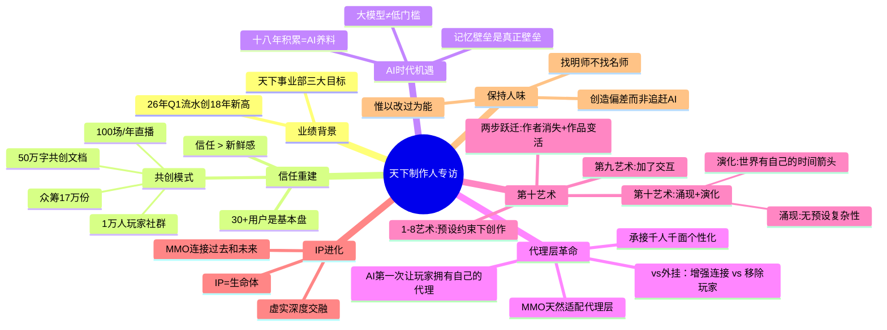

# 26年Q1流水创18年新高，专访网易天下制作人：AI让游戏进阶为第十艺术

> 来源：竞核  
> 链接：https://mp.weixin.qq.com/s/Kd4tVKfBynOFOjxVYqZ5jg  
> 处理日期：2026-04-24

---

## Phase 1: 提取原文

**标题**：26年Q1流水创18年新高，专访网易天下制作人：AI让游戏进阶为第十艺术

**来源**：竞核（游戏行业媒体）

**核心人物**：星一（网易天下事业部制作人）

**关键数据**：
- 2026年Q1流水创18年新高
- 经典版玩家众筹：17万多份（1元/份）
- 共创文档超50万字
- 玩家社群：近1万人，峰值每天大几万条消息
- 团队向玩家直播：去年约100场
- 吉尼斯纪录：《天下3》赛季服同屏/同战场玩家数超大型3D MMO

**天下事业部三大目标**：
1. 重铸荣光
2. 数字永生
3. 让世界多一个天下

---

## Phase 2: 梳理文章脉络

**第一部分：业绩与背景**
- 26年Q1流水创18年新高
- 天下事业部三大目标：重铸荣光、数字永生、让世界多一个天下

**第二部分：信任重建（经典版）**
- 核心观点：信任重于新鲜感
- 老MMO最难的不是做新内容，而是长期经营
- 30+用户是基本盘，更在意稳定感、信任感和长期体验
- 共创模式：众筹（17万份）、共创文档（50万字）、玩家社群（1万人）、每周汇报、直播汇报（100场/年）

**第三部分：AI时代的长线价值**
- 大模型降低创业门槛是伪命题
- 真正的壁垒：记忆壁垒 + AI-native认知
- 十八年的内容积累、玩家记忆、长期活着的MMO世界是核心资产
- 历史积累 = 过去的包袱 → AI时代的养料

**第四部分：AI与游戏的关系**
- AI重要不是因为更聪明，而是**第一次让游戏世界里出现真正属于玩家自己的代理层**
- 代理层 vs 外挂/脚本：代理是增强玩家与世界的连接，外挂是把玩家从游戏里拿掉
- MMO天然适合代理层：任务、日常、社交、探索等大量持续发生但不需要玩家全程亲手完成的事
- 代理层能承接玩家差异（有钱有闲 vs 有点钱没太闲 vs 时间多预算有限）

**第五部分：第十艺术**
- 1-8艺术：在前人设定的基本约束下创作
- 第九艺术：加了"交互"，但参与仍在设计者铺好的分支里
- 第十艺术：多了**涌现**和**演化**
  - **涌现**：AI驱动的NPC和玩家之间自发产生没有人预设过的复杂性
  - **演化**：世界有自己的时间箭头，历史累积、不可逆往前走
- 两步关键跃迁：
  1. 作者的消失
  2. 作品开始"活"
- 涌现式游戏世界 = 用代码孕育时间

**第六部分：IP的未来**
- IP不是形象或游戏本身，而是一个**生命体**
- 下一代真正成立的IP = 现实世界和虚拟世界深度交融
- MMO能连接过去和未来，串起代理层、数字分身、虚实内容

**第七部分：保持人味**
- 三句推荐：
  1. "惟以改过为能，不以无过为贵" —— 不要等"学会了再用AI"，先用于错中学习
  2. "找明师，不找名师" —— 找能说真话的人，不是追名声
  3. "当机器寻找回归，人类需要创造的是偏差" —— 真正能让IP留下来的是AI做不出的那一点偏差

---

## Phase 3: 概要总览

这是一篇网易天下事业部制作人"星一"的深度专访，核心围绕三个主题展开：

**一、《天下》IP的信任重建**：通过经典版共创模式（众筹17万份、1万玩家社群、100场/年直播），将传统MMO从"版本迭代"转向"关系重建"，核心资产从内容变成玩家与世界的信任纽带。

**二、AI时代的MMO机遇**：十八年的历史积累从"历史包袱"变成"AI养料"。最有价值的不是模型本身，而是**代理层**——让每个玩家拥有一个能理解自己、记住自己、替自己行动的数字代理，承接千人千面的个性化需求。

**三、第十艺术**：AI驱动的游戏世界超越第九艺术（交互）进入第十艺术，核心特征是**涌现**（无预设的复杂性自发产生）和**演化**（世界有自己的时间箭头，历史真实累积），游戏从此"活"过来。

星一的底层判断：游戏不只是娱乐产品，而是一个能孕育时间、沉淀文明的生命体。AI不会让人退场，反而会让"人味"和"偏差"变得更重要。

---

## Phase 4: 思维导图

---

## Phase 5: 提问（Level 1/2/3）

### Level 1 - 基础理解（事实性问题）

**L1-1**: 经典版共创模式中，玩家众筹了17万份、50万字共创文档、近1万人社群——这些数据说明了什么？仅凭这些数字能证明共创成功吗？

**L1-2**: 星一认为AI时代的核心壁垒是"记忆壁垒"和"AI-native认知"，但他没有具体说明什么是"AI-native认知"。结合文章，什么是他所说的"AI-native认知"？

### Level 2 - 深层分析（关联性问题）

**L2-1**: 星一说"外挂和脚本更像把玩家从游戏里拿掉，而代理层是增强玩家和世界的连接"——但这两者的边界在哪里？代理层处理的任务（如师门日常）本身不也是"替玩家完成原本需要手动做的事"吗？

**L2-2**: 文章提到第十艺术的"涌现"来自于"规则×个体×交互长出没有人想过的复杂性"。那么，如果NPC之间的经济战争是"涌现"，和设计师预设一个随机事件触发经济波动的区别是什么？边界在哪里？

**L2-3**: 星一认为30+用户更在意"稳定感、信任感和长期体验"，但自走棋的核心用户群通常偏年轻。这种用户分层洞察，对自走棋这类产品的设计有什么借鉴意义？

### Level 3 - 批判思考（延伸性问题）

**L3-1**: 星一把"第十艺术"定义为"涌现+演化"，并认为这是游戏超越电影等传统艺术的关键。但这个定义有没有循环论证的风险？"活着的世界"这个说法，是真正的哲学创新，还是一种营销话术？

**L3-2**: 文章最后强调"AI做不出的那一点偏差"才是IP的核心。但星一访谈中几乎没有提到具体的游戏设计方法论（机制、数值、循环），全是宏观叙事。这是否意味着，在AI时代，具体的"设计技术"已经不重要了？

**L3-3**: 星一说"未来可能只需要两个岗位：产品经理和AI工程师"。如果这是真的，那对于现在的战斗策划、系统策划来说，他们的不可替代性在哪里？

---

## Phase 6: 回答（带原文引用）

### L1-1: 17万份众筹等数据说明了什么？

**回答**：这些数据首先说明了**玩家的情感认同和参与意愿足够强**——愿意花1块钱成为"投资人"，背后是对《天下》这个IP的情感连接，而非单纯的功能需求。17万人参与众筹，说明玩家社群的基础盘依然存在，且有重新信任的意愿。

但这些数字**不能直接证明共创成功**。共创成功的真正标志是：经典版上线后，玩家是否真的留下来了？核心留存数据和付费数据是否回升？星一在文章中没有给出这些后续数据。所以数字是"愿意支持"的信号，但结果仍待验证。

**原文引用**：
> "我们找玩家众筹，一人一块钱，当时筹了十七万多份。投一块钱我们就叫他投资人，谢谢支持我们。"

---

### L1-2: 什么是"AI-native认知"？

**回答**：结合文章上下文，"AI-native认知"指的**不是会用AI工具**，而是**理解AI能力的边界和可能性，并围绕这种能力重新设计产品和用户关系**的思维方式。

星一的核心逻辑是：大模型会越来越普及（通用能力），但每个团队基于自己长期积累的用户关系、数据资产所形成的**独特应用方式**，才是差异化壁垒。他举例说，天下有十八年的MMO世界、用户关系和记忆，这些不是一两天能积累出来的，所以"不是谁都有的机会"。

换句话说，"AI-native认知"是**把AI不是当作效率工具，而是当作重塑产品形态和用户关系的基础设施**的认知方式。

**原文引用**：
> "你想真正杀出来，靠的不只是做得快。你得有独特的记忆壁垒，或者独特的 AI-native 认知。"

---

### L2-1: 代理层处理日常任务，与外挂/脚本有何本质区别？

**回答**：本质区别在于**意图和关系**。

星一的核心区分是：外挂/脚本是**取代**玩家操作，游戏世界里"不需要这个玩家了"；而代理层是**代表**玩家去行动，**玩家仍然在场**，只是把重复低价值的劳动外包出去。

一个关键细节：代理层可以中途被打断并调整。星一举例说："你可以让它跑师门日常，也可以中途打断，问它能不能找个适合拍照的地方。" 这说明代理不是执行固定程序，而是能理解玩家的实时意图并作出调整——这与脚本的确定性执行有根本区别。

**原文引用**：
> "外挂和脚本更像把玩家从游戏里拿掉。我们想做的不是替代玩家，而是增强玩家和世界的连接。"

---

### L2-2: "涌现"与预设随机事件的区别是什么？

**回答**：核心区别在于**因果链的复杂度**。

预设随机事件：设计师知道"当X条件满足时，触发Y事件"，逻辑是线性的、可追溯的。

涌现：星一描述的是"AI驱动的NPC之间高密度交互，自发产生没有人预设过的东西——一场经济战争、一次社群运动、一段没写在剧本里的关系"。这里的因果链是**多主体交互的结果**，不是单一条件触发，且无法在设计时预测具体形态。

但需要注意的是，星一的描述是一种**理想状态的愿景**，而非当前技术实际能做到的。当前的AI NPC还无法稳定产生这种复杂涌现，更多是概念上的可能性。这个观点更像是对"第十艺术"的方向性判断，而非当前实现状态的描述。

**原文引用**：
> "这种高密度的交互，会自发产生一些没有任何设计师预设过的东西……这不是 bug，不是随机事件，是真正的涌现——规则 × 个体 × 交互，长出了没有人想过的复杂性。"

---

### L2-3: 30+用户洞察对自走棋产品的借鉴

**回答**：有借鉴价值，但需要区分产品类型。

星一的洞察核心是：**时间稀缺的用户更在意稳定感和长期价值，不是一次性刺激**。自走棋的核心循环（每局15-30分钟）本身就是碎片化的，天然适配时间有限的玩家。但自走棋的留存挑战和MMO不同——MMO靠社交和世界积累，自走棋靠局内策略深度和meta变化。

可以借鉴的方向：
1. **赛季制的情感锚点**：让30+玩家有"回来的理由"，不只是追新内容，而是有情感连接
2. **降低重复疲劳**：自走棋每局体验差异来自对手和BP，但外围系统（任务、日常）设计应避免过度的重复劳动——代理层的思路可以用于减少机械任务
3. **尊重老玩家的时间价值**：不要用"必须每天完成否则落后"的焦虑驱动设计

---

### L3-1: "第十艺术"是否循环论证或营销话术？

**回答**：有一定程度的循环论证，但也有真实的哲学洞察。

循环论证的地方在于：星一把"涌现+演化"定义为第十艺术的核心，然后又用"第十艺术就是涌现+演化"来说明为什么游戏是第十艺术。这是用自己下的定义来证明自己的结论。

但也有真实洞察：他在艺术谱系中找到了一个真实的哲学区分——前九艺术的创作边界是**预设的**，而第十艺术的创作边界是**涌现的**。这个区分本身是有效的，问题是当前的技术是否能真正实现这种涌现，还是只是一种可能方向。

**原文引用**：
> "一到八艺术，本质上都是在前人设定的基本约束之下创作……第九艺术加了交互，让玩家从观众变成了参与者——但说到底，这个参与还是在设计者铺好的分支里走。"

---

### L3-2: AI时代，"设计技术"是否不重要了？

**回答**：不是不重要，而是**会被重新分层**。

星一的访谈确实缺少对具体设计方法论的讨论，这可能是采访视角（聚焦AI战略）导致的，不等于他认为设计技术不重要。更准确的推断是：

- **基础设计技术**（数值框架、战斗循环、基础手感）→ 会更多由AI辅助完成
- **差异化设计能力**（什么让一个IP与众不同，什么是玩家情感的真正锚点）→ 变得更稀缺，因为这是AI做不出的"偏差"

对于战斗策划来说，数值平衡、战斗手感这类技术不会消失，但可能被AI辅助得更好。而真正不可替代的，是**理解玩家为什么在乎这个游戏**的洞察力——这才是"偏差"所在。

**原文引用**：
> "真正能让一个 IP 留下来的，恰恰不是'AI 也能做'的那部分，而是 AI 做不出的那一点偏差。"

---

### L3-3: 如果未来只有PM和AI工程师，策划的不可替代性在哪？

**回答**：这个问题值得警惕，但也有反驳角度。

**反驳角度**：星一说的是"往这两类能力收敛"，不是说只剩这两个岗位。他的意思是各种分工最终需要这两种能力的组合——不是消灭策划，而是策划也需要理解AI、能用AI。

**真正的不可替代性**（对战斗策划而言）：
1. **对"体验"的直觉判断**：AI可以生成战斗数据，但什么是"对的体验"、什么是"过载感"、什么是"爽快但不过于复杂"——这种主观判断依赖对玩家心理的深度理解
2. **对"数值生态"的全局感**：自走棋的棋子经济、羁绊平衡、节奏设计是一个系统性生态，不是单点调优，需要策划的整体把控
3. **定义问题的能力**：AI能执行，但定义"我们要解决什么问题"是人的职责

**原文引用**：
> "越是在这个时候，人真正该做的判断反而会更重要。"

---

## Phase 7: 生成完整笔记

### 核心洞察摘要

| 维度 | 核心洞察 | 对自走棋的借鉴 |
|------|----------|----------------|
| **产品哲学** | MMO最重要的资产是18年沉淀的世界、用户关系和记忆 | 长期运营产品的核心壁垒是关系，不是内容 |
| **信任重建** | 共创是重建信任的核心路径，不是宣发手段 | 让核心玩家"参与"比让他们"消费"更有价值 |
| **AI机遇** | 代理层 = 玩家拥有自己的AI代理，承接千人千面的个性化需求 | 减少机械任务，让玩家把时间留给有乐趣的部分 |
| **第十艺术** | 涌现（无预设复杂性）+ 演化（世界有自己的时间箭头） | 游戏可以"活着"，有历史、有记忆、不可逆 |
| **人味** | AI做不出的那一点"偏差"才是IP的核心 | 真正的设计价值在于AI无法替代的主观判断 |

### 可行动项

1. **自走棋的代理层想象**：是否有任务/日常系统可以让AI辅助执行，同时保留玩家的核心乐趣？
2. **赛季的情感锚点设计**：如何让赛季不只是"新内容"，而是让玩家有情感连接的节点？
3. **核心用户的"稳定感"**：针对不同投入程度的玩家，如何设计不同的体验路径？

---

*处理完成 | 锅巴 @ 2026-04-24*
