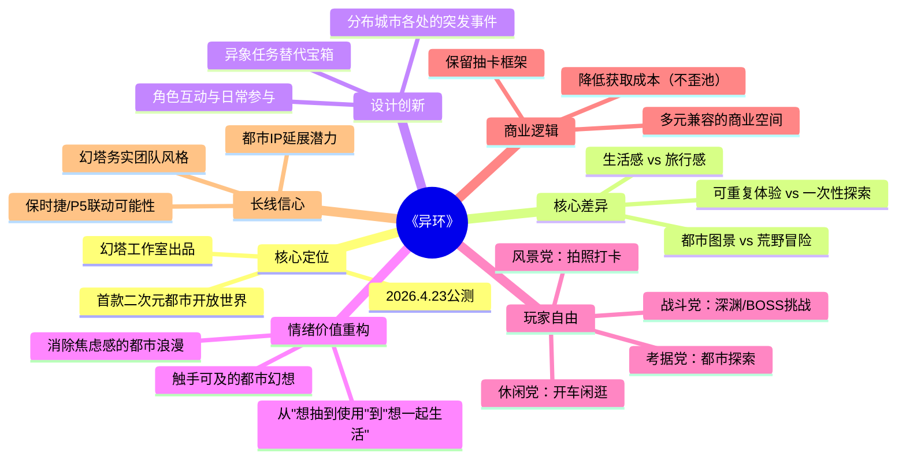

# 不考虑结果，一切都是异环的选择

> **Phase 1: 原文信息**
> - **文章标题**：不考虑结果，一切都是异环的选择
> - **来源**：竞核
> - **链接**：https://mp.weixin.qq.com/s/LYI7LZmPdUAQl8dAPJ__mw
> - **游戏**：《异环》
> - **开发商**：幻塔工作室（完美世界）
> - **发布日期**：2026年4月23日（公测）

---

## Phase 2: 梳理文章脉络

文章以玩家视角切入，通过摩天轮这一具体体验，引出《异环》作为"首款二次元都市开放世界"游戏与以往二游大世界的核心差异。

**核心论点递进**：

1. **开篇引入**：公测上线，回顾从首测到公测的历程，提出核心问题——《异环》与以往二游大世界的本质区别
2. **体验论**：以"摩天轮体验"为切入点，论证"生活感"替代"旅行感"的核心转变
3. **设计论**：分析都市题材天然优势，以及通过"异象任务"等创新设计让玩家从"为任务奔波"转变为"顺便完成任务"
4. **自由论**：强调玩家"选择乐趣"的自由，可以战斗、可以拍照、可以开车、可以无所事事
5. **商业论**：指出创新与妥协并存的"中间态产品"定位，保留传统二游框架但内核革新
6. **未来论**：基于联动潜力和团队执行力，论证长线发展信心

---

## Phase 3: 概要总览

《异环》公测之际，作者以老玩家身份深度剖析这款"首款二次元都市开放世界"游戏的独特价值。文章核心主张：**《异环》用"生活"替代了传统开放世界的"旅行"，重构了二游的情绪价值**。

文章通过摩天轮、流星等具体体验，论证都市题材相比荒野题材的天然代入感优势（70%城镇化率）。同时指出游戏通过"异象任务"创新设计，让玩家从"为任务奔波"转变为"在都市生活中顺便完成任务"。在多元玩法兼容层面，游戏赋予玩家"选择乐趣"的绝对自由，无论战斗党、风景党、还是纯逛街党都能找到舒适区。最后从商业创新与团队执行力角度，论证作者对这款"未来与过去的中间态产品"的长线看好。

---

## Phase 4: 思维导图

---

## Phase 5: 提问（Level 1/2/3）

### Level 1 - 基础理解（来自原文明确表述）

**Q1**：文章认为《异环》与以往二游大世界在底层体验上的"本质区别"是什么？

**Q2**：为什么说都市题材相比荒野题材"天然具有代入感优势"？

**Q3**：《异环》通过什么设计让玩家从"为任务在世界中奔波"转变为"在都市生活中顺便完成任务"？

### Level 2 - 深度分析（需要综合推理）

**Q4**：文章提到"都市题材自身对多元品类的兼容"，请结合文章分析这具体指什么，以及这种兼容性如何影响游戏的商业逻辑？

**Q5**：文章称《异环》是"创新与妥协的中间态产品"，保留了大量传统二游日常。请分析：这种"妥协"对于游戏的长线运营可能产生哪些正面和负面影响？

**Q6**：文章强调"无所事事是一种正向的、被系统认可的乐趣"，这与传统的"资源产出-成长步调"二游逻辑有何根本性冲突？幻塔如何试图解决这一冲突？

### Level 3 - 设计批判与反思（需要多角度论证）

**Q7**：文章认为"生活感替代旅行感"是《异环》的核心创新，但从游戏设计角度思考：这种"都市生活模拟"的体验深度是否真正超越了现实中触手可及的都市生活？如果没有，虚拟都市生活的独特吸引力在哪里？

**Q8**：从自走棋/策略游戏策划视角思考：《异环》的"多元玩法兼容"设计是否适用于其他品类？如果将其设计思路移植到自走棋游戏中，可能带来哪些机遇和挑战？

---

## Phase 6: 回答（带原文引用）

### Q1：本质区别

**回答**：文章认为《异环》与以往二游大世界的本质区别在于用"生活"替代了"旅行"作为核心情绪价值。

**原文引用**：
> "这也是《异环》带给我与其他传统二游最大的不同，它试图用'生活'，去替代过去开放世界的主题——'旅行'。"

> "长期以来，市面上的二次元大世界游戏基本都是荒野开放世界，核心情绪价值是'旅行感'。玩家不断的到达新地点，解锁新区域，在新的地形上冒险，这是荒野类天然的魅力。"

---

### Q2：代入感优势

**回答**：文章从现实基础和玩家背景两个维度论证都市题材的代入感优势。

**原文引用**：
> "在营造'生活感''可重复体验'方面，都市题材就是天然比荒野更加具有代入感。在当前中国近70%的城镇化率下，大部分玩家就是生活在都市中，学校，医院、便利店就是比荒野更加令人熟悉。"

核心逻辑是：都市是玩家真实生活的背景，因此虚拟都市的每一个场景（便利店、学校、医院）都能唤起真实记忆，产生天然的情感连接。

---

### Q3：设计机制

**回答**：《异环》通过"异象任务"和突发事件的分布设计实现了这一转变。

**原文引用**：
> "另一方面，《异环》极其聪明地没有在过去那套'清点探索'的旧体验上缝缝补补，而是通过分布在城市各个角落的'异象'任务，各种突发的事件取代了冰冷的找宝箱。它试图让玩家从'为了完成任务而在世界里奔波'，转变为'在都市生活中顺便完成任务'。"

关键在于"分布"而非"引导"——任务不是玩家主动追寻的目标，而是城市生活自然发生的一部分。

---

### Q4：多元兼容与商业逻辑

**回答**：文章描述的多元兼容体现在两个层面——**玩法兼容**和**商业延展**。

**玩法兼容原文引用**：
> "都市题材自身对'多元品类'的兼容也让不同玩家获得乐趣，深渊和BOSS挑战满足了战斗爱好者；独特的'异象任务'革新了枯燥的'找宝箱'体验；房车系统让都市玩法有了长线需求；甚至你还可以在这里玩到搜打撤抢劫、越狱模拟、麻将、赛车等多种游戏。"

**商业延展原文引用**：
> "随着游戏内容的发展，甚至能想象在未来的版本中，街角的饮品店出现蜜雪冰城，路边的便利店变成罗森。此外，与各类影视、动漫、游戏的联动内容都可能成为游戏中的一部分。"

**分析**：多元兼容使游戏从"单一品类产品"变成"平台型产品"，这极大拓展了商业化的边界——不仅是抽卡收入，还有IP联动、实体品牌植入、活动合作等多元变现路径。

---

### Q5："妥协"的双刃剑效应

**回答**：

**正面影响**：
> "它给老二游玩家提供了一种'想要但从未得到'的优化体验；一种在没有超出认知的操作门槛下，却能获得前所未有的多元游戏体验；一种不需要为数值，为玩法，为跟不上时代而产生焦虑感的游玩体验。"

**潜在风险**：
文章提到团队面临的两难——"既有强烈的玩法创新诉求，但又需要寻找创新与风险的平衡点"。"妥协"可能让创新不够彻底，无法真正颠覆玩家预期；但另一方面，这种务实策略让游戏"拥有了更稳固的生存基本盘"。

**原文引用**：
> "再前进一步，可能是一款彻底革新二游体验的次世代游戏。而后退一小步，则可能又是一款市面上所谓的成熟二游产品。"

---

### Q6："无所事事"与资源产出逻辑的冲突

**回答**：

**冲突本质**：传统二游的"资源产出-成长步调"要求玩家持续进行目标导向的行为（刷副本、清体力、攒资源）。而"无所事事的乐趣"本质上是无目的性的体验。

**解决方案**：
1. **淡化紧迫感**：游戏不要求"数值够高才能拍照，才能体验都市生活"
2. **让生活本身就是回报**：原文"在《异环》的体验清单里，内容的丰富程度甚至带有一种'奢侈感'"
3. **，房车系统提供长线动力**：需要持续参与才能积累的玩法模块

**原文引用**：
> "或许你可以在其他游戏中也获得类似的多元化体验经历，但在《异环》里，'无所事事'是一种正向的、被系统认可的乐趣。"

---

### Q7：虚拟都市生活的独特吸引力

**回答**：

从文章分析，虚拟都市生活的独特吸引力在于**"去焦虑化"和"理想化提炼"**。

**去焦虑化原文引用**：
> "它剔除了现实都市中那些令人焦虑的内容，保留了普通人最向往的体验：一种触手可及、能够被自己掌控的都市浪漫生活，一个前往'生活'而非'生存'的理由。"

**理想化提炼**：文章提到摩天轮和流星——这些在现实中"只要几十块的门票""每个季节都有"的活动，却因为"没有巧合，我可能一辈子都不会去做"。虚拟都市提炼了都市生活中最浪漫、最有记忆点的片段，消除了日常的琐碎与压力。

**结论**：虚拟都市的吸引力不在于"比现实更真实"，而在于"比现实更美好"——它是经过设计者精心筛选的都市精华体验。

---

### Q8：对自走棋游戏的启示

**回答**：

**可借鉴的设计**：

1. **情绪价值重构**：自走棋也可以从纯粹的"上分体验"扩展到"收集/休闲/社交"等多元价值，让不同玩家找到自己的乐趣
2. **减少焦虑感**：减少排名压力，提供可放松的休闲模式
3. **角色/皮肤的生活化**：让角色不只是战斗单位，还可以有邀约、互动等生活场景

**潜在挑战**：
1. 自走棋的核心循环（战斗→胜负→上分）比开放世界更单一，转型难度更大
2. "生活感"需要大量内容支撑，对于轻量级的自走棋品类可能过于奢侈
3. 玩家进入自走棋的心理预期通常是"快速对战"，引入过多休闲内容可能破坏核心体验

**核心启示**：与其在自走棋中强行加入生活系统，不如思考如何让核心对战体验本身变得更"可重复享受"而非"必须完成"——这可能是更务实的方向。

---

## Phase 7: 完整笔记

### 核心洞察

1. **"生活感"是都市题材的独特优势**：不是创造新内容，而是唤醒真实记忆
2. **创新往往发生在"不那么显眼"的地方**：摩天轮、流星——这些"日常中的非常规"比大型副本更能建立情感连接
3. **多元兼容是平台型产品的核心能力**：不是"所有人都玩同一个内容"，而是"每个人都能找到自己的内容"

### 设计关键词

- **去焦虑化**：剔除令玩家焦虑的内容，保留向往的体验
- **顺便完成**：任务作为生活的点缀，而非生活的目的
- **正向的"无所事事"**：系统认可不追求产出的游戏行为
- **情感链接优先于数值成长**：角色是生活伙伴，而非战斗工具

### 可行动项

- [ ] 思考自走棋中的"生活化"元素可能性
- [ ] 探索如何降低玩家的"必须完成"焦虑感
- [ ] 研究"日常中的非常规体验"设计模式

---

*笔记创建日期：2026-04-24*
*处理版本：7 Phase完整分析*
*标签：#都市开放世界 #二游 #情绪价值 #游戏设计*
