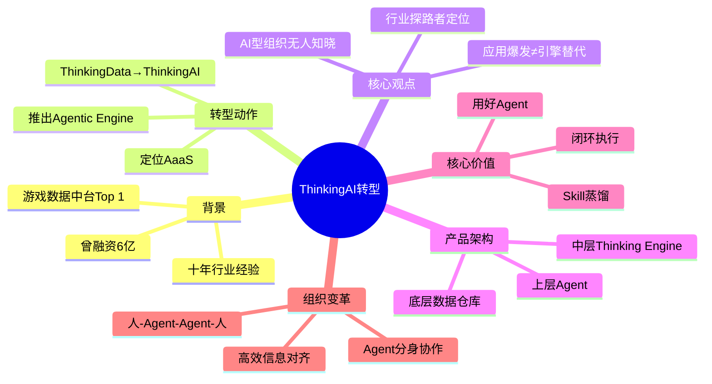

# 曾融资6亿的Top 1公司大转型：想解决游戏行业50%的AI焦虑？

> 来源：游戏葡萄 | 链接：https://mp.weixin.qq.com/s/tSpldSEK_1xzp_10plVF4w | 处理日期：2026-04-24

---

## Phase 1: 提取原文

**公司背景**：数数科技（ThinkingAI），曾融资6亿，游戏行业数据分析Top 1

**核心产品**：Agentic Engine - AI时代的新中台

**关键引言**：
- "现在爆发的是应用，引擎还无法替代"
- "数数科技要跑到整个行业前面探路"
- "他们想用AI解决除了核心创作之外的，那50%让游戏公司焦虑的事情"

**转型动作**：
1. 公司名从ThinkingData改为ThinkingAI
2. 推出Agentic Engine（企业级AI Agent平台）
3. 定位从数据中台转向AaaS（Agentic as a Service）

---

## Phase 2: 梳理文章脉络

### 背景引入
- 过去数据中台：10-15人，1-2年才能搭建
- 现在AI赋能：1-3个资深人员+大模型，一周搞定

### 核心观点1：现在爆发的是应用，引擎还无法替代
- 游戏厂商要的是「即插即用」
- 底层框架才是中台的关键

### 核心观点2：AI型组织转型探路
- 每家厂商都想转型，但没人知道怎么做
- ThinkingAI决定跑到行业前面探路

### 产品介绍：Agentic Engine
- 三层架构：上层Agent + 中层Thinking Engine + 底层数据仓库
- 特点：私有化部署、安全、稳定、可靠、可治理
- 功能：数据看板、项目日报、AI日志、闭环执行

### AI对企业更远的价值
- 将十年经验「蒸馏」成Skill
- 上百个Skills，筛选50-100个首发
- 核心：Agent能否可观测、可诊断、可优化

### 组织变革
- 从「人到人」转向「人-Agent-Agent-人」
- Agent像组织血管，快速流通信息
- 高管建立Agent分身，AI组织运转

---

## Phase 3: 概要总览（200-300字）

本文报道了游戏数据中台龙头公司数数科技（ThinkingAI）的战略转型。这家曾融资6亿、做到游戏行业数据分析Top 1的公司，在AI浪潮中选择主动出击：公司改名、推出新产品Agentic Engine，定位从数据中台转向AaaS（Agentic as a Service）。

文章核心观点：1）现在爆发的是应用层而非引擎层，游戏厂商需要的是「即插即用」的稳定方案；2）每家厂商都想转型成AI组织，但没人知道具体怎么做，ThinkingAI决定跑到行业前面探路。其Agentic Engine采用三层架构（Agent+Thinking Engine+数据仓库），支持私有化部署，强调「闭环执行」和「用好Agent」。

更值得关注的是组织变革：ThinkingAI的高管们已开始实践「人-Agent-Agent-人」的工作模式，用Agent分身处理标准化工作，例会上Agent与Agent直接对齐信息。这代表AI时代企业组织形态的前沿探索。

---

## Phase 4: 思维导图（Mermaid mindmap格式）

---

## Phase 5: 提问（Level 1/2/3问题）

### Level 1 - 基础理解（What/Who/When）

**Q1**: ThinkingAI的Agentic Engine与传统数据中台最大的区别是什么？

**Q2**: 文章提到的「AI糖」指的是什么？它解决了什么问题？

**Q3**: ThinkingAI的Skill是什么？它与MCP是什么关系？

### Level 2 - 深度分析（How/Why）

**Q4**: 为什么游戏厂商难以自建出即插即用的Agent系统？技术难点在哪里？

**Q5**: ThinkingAI提到的三层架构（Agent+Thinking Engine+数据仓库）各层分别承担什么职责？

**Q6**: 从「人到人」转向「人-Agent-Agent-人」，这种组织变革对游戏公司有什么启示？

### Level 3 - 战略思考（What if/So what）

**Q7**: 如果Agent能完全替代数据中台的功能，数据团队的价值将如何重新定义？

**Q8**: ThinkingAI选择「跑到行业前面探路」而非等待客户需求明确，这个策略对其他SaaS公司有什么借鉴意义？

---

## Phase 6: 回答（带原文引用）

### Q1: ThinkingAI的Agentic Engine与传统数据中台最大的区别是什么？

**回答**：传统数据中台只到「拿数据」这一步，而Agentic Engine要**将分析和执行也涵盖进来，再返结果**。原文明确指出："闭环执行是这个中台面向未来的功能。传统中台只到拿数据这一步，Agentic Engine要将分析和执行也涵盖进来，再返结果。" 换言之，传统中台是单向的数据管道，而新中台是能形成「输入→分析→执行→反馈」闭环的智能系统。

---

### Q2: 文章提到的「AI糖」指的是什么？它解决了什么问题？

**回答**：「AI糖」是ThinkingAI在传统数据中台模块中**加的小型AI模块**，像给小奖励一样让游戏团队先尝尝和AI协作的甜头。原文："于是周津想到「AI糖」，像给小奖励一样，在数据中台的每个模块都加小型的AI模块，让游戏团队先尝尝和AI协作的甜头。" 这个策略解决了直接推完整AI方案时客户不知如何上手的困境——先用小功能建立信任，再逐步深入。

---

### Q3: ThinkingAI的Skill是什么？它与MCP是什么关系？

**回答**：Skill是**将行业经验「蒸馏」成可复用的最短路径**，让Agent不必慢慢探索。原文："每一个Skill本质上都在告诉Agent，没必要浪费时间慢慢探索思路，有一条最短路径给你走，这能帮游戏团队降低不少Token消耗。" 关于MCP，原文提到："行业经验就是业务上的ROI，**MCP加Skill的调用和封装**，其实就是把最高效、最快速、最短捷的一个路径告诉了Agent。" MCP是技术框架，Skill是框架上承载的行业经验内容。

---

### Q4: 为什么游戏厂商难以自建出即插即用的Agent系统？技术难点在哪里？

**回答**：核心难点在于**数据层的不规范和长链系统的复杂性**。原文指出："国内项目都是做长线，数据表命名不规范，加上会不断出新功能，也很难标准化，这就让AI查表的准确率不够。" 更关键的是："游戏厂商需要的是能支撑长期经营的长链——稳定、可靠、可治理"，而"现在企业建Agent中台难用，是因为AI做的多是短链业务，人人能验证idea，快速拿结果，但也因为短链，不够稳定"。单靠上层Agent无法构建稳定可靠的企业级系统，需要配合成熟的中台和底层数据仓库。

---

### Q5: ThinkingAI提到的三层架构各层分别承担什么职责？

**回答**：
- **上层（Agent）**：对话入口，理解用户需求，调度下层资源，输出结果
- **中层（Thinking Engine）**：多年积累的业务分析系统，能搭看板BI、做业务分析，"上层的Agent会优先在这里调内容分析，如果用户看不明白，还能调看板去查，而这里有跑了多年的业务系统能接住AI的思考"
- **底层（数据仓库）**：迭代十余年的数据架构，规范后的仓库"能帮Agent兜底，让它少胡说，多查证"

三层形成长链，互相配合，确保Agent输出的稳定性和准确性。

---

### Q6: 从「人到人」转向「人-Agent-Agent-人」，这种组织变革对游戏公司有什么启示？

**回答**：这代表**信息流通方式的根本改变**。原文描述："Agent像组织的血管一样快速流通，向人输出结果，而人则要不断迭代自己的认知，向组织注入源源不断的idea。" 具体实践：CTO用Agent搭「外脑」连接所有知识库；市场部负责人建Agent分身处理标准化工作；员工大会上"AI项目负责人的Agent和CTO的Agent对齐演讲方案，两「人」四句话敲定了方向"。启示：1）高管应率先使用AI工具；2）建立标准化流程让Agent处理；3）人的价值转向提出好问题和迭代认知。

---

### Q7: 如果Agent能完全替代数据中台的功能，数据团队的价值将如何重新定义？

**回答**：数据团队的价值将**从「执行层」转向「设计层」**。原文案例："提炼AI Skill并不难...难的是把效果调好。一开始他们看Agent回答的准确率，现在则更多看Agent给的思路，对一线业务有没有帮助。" 未来数据团队的核心工作不再是跑数据报表，而是：1）设计好的Skill和workflow；2）标注和优化Agent问题；3）验证Agent输出的业务价值。简言之，从「做数据的人」变成「教会AI做数据的人」。

---

### Q8: ThinkingAI选择「跑到行业前面探路」而非等待客户需求明确，这个策略对其他SaaS公司有什么借鉴意义？

**回答**：核心启示是**「需求不明确时，领先一步比等待更安全」**。原文解释："每个游戏厂商都知道要转型成AI组织，但AI型组织是什么模样，又该如何运转呢？现在没人知道答案"，"与其盯着游戏厂商的需求出解决方案，不如跑到行业前面去，搭建一个属于AI时代的工作流"。借鉴：1）在看不清方向时，先自己下场实践，积累第一手经验；2）把内部实践产品化，比单纯做外包服务更有护城河；3）行业探路者的身份能建立品牌影响力，即使产品不完美也能获得关注。

---

## Phase 7: 生成完整笔记

### 核心洞察

1. **应用≠引擎**：AI爆发的是应用层机会，但底层框架（数据架构、业务系统）仍是稀缺能力
2. **闭环执行**：下一代中台不只是拿数据，而是「分析→执行→反馈」一体化
3. **Skill成为资产**：将行业经验沉淀为可复用路径，是AI时代的核心壁垒
4. **组织即产品**：ThinkingAI先把内部改造成AI组织，再向外输出，这种「吃自己狗粮」的方式值得学习

### 对游戏策划的启示

作为自走棋战斗策划，可以关注：
- **数据驱动决策自动化**：Agent能否自动分析战斗数据并给出平衡建议？
- **工作流优化**：将重复的数值调整、测试反馈流程Agent化
- **知识沉淀**：把战斗设计经验固化成Skill，供团队复用

### 延伸思考

> "会用AI的团队，比不会用AI的团队有更强的竞争力。" —— 市场负责人

在Riot的自走棋团队中，如何用Agent提升战斗设计效率？比如：
- 自动生成数值表格
- 分析对局数据找出不平衡点
- 快速生成设计文档草稿

---

*处理完成 | 锅巴*
