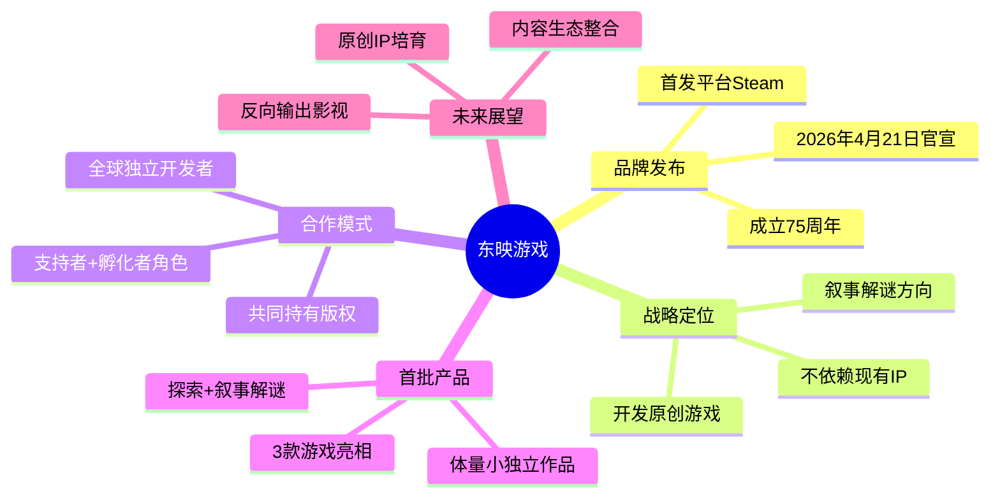

# 影视巨头入局游戏，突然掏出3款"陌生"新作

> **来源**: 游戏那点事Gamez  
> **链接**: https://mp.weixin.qq.com/s/_-CEoMmyA3ktWqoEhGWScw  
> **处理日期**: 2026-04-25

---

## Phase 1: 提取原文

**原文标题**: 影视巨头入局游戏，突然掏出3款"陌生"新作

**核心信息摘录**:

- 2026年4月21日，日本东映株式会社宣布推出全新游戏业务品牌"东映游戏"
- 今年正值东映成立75周年
- 业务首先在Steam展开，随后登陆Switch、PS、Xbox
- 长期目标：从游戏出发，打造全新、全球影响力的IP
- **关键决策**: 近期计划不直接使用《航海王》《龙珠》《假面骑士》等现有IP，而是开发原创游戏
- 品牌标志由开罗游戏工作室负责制作，采用像素动画风格
- 首批展示三款游戏，其中两款已悄然在Steam上架
- 游戏体量不大，侧重探索与叙事解谜
- 合作工作室多为初创团队，包括韩国团队Black Tangerine Studio（4位韩国女生组成）
- 计划启动"每日一游"公布节奏
- 版权由开发工作室与东映游戏共同持有
- 可类比鹰角"开拓芯"，扮演支持者与孵化者角色
- 东映2033愿景："用迷人的故事为未来增添色彩"

---

## Phase 2: 梳理文章脉络

**开篇**: 东映成立75周年之际，宣布入局游戏

**核心事件**:
1. 东映游戏品牌正式发布
2. 首批3款游戏公开，首发平台为Steam
3. 战略选择：不依赖现有IP，走原创独立游戏路线
4. 合作模式：与全球独立开发者合作，共同持有版权
5. 游戏类型聚焦：叙事、解谜、探索

**战略逻辑**:
- 以75年内容经验延续为叙事优势
- 避开与万代南梦宫等大厂直接竞争
- 通过"支持者"角色孵化原创IP

**未来展望**:
- 原创游戏成功 → 可能反向输出为影视内容
- 探索影视与游戏内容共生的新模式

---

## Phase 3: 概要总览

东映株式会社在成立75周年之际，宣布推出全新游戏业务品牌"东映游戏"，正式进军游戏领域。与许多大厂不同，东映选择不依赖《航海王》《龙珠》等现有重量级IP，而是携手全球独立开发者开发原创游戏作品。首批三款游戏已在Steam亮相，均为体量较小的叙事解谜类作品，契合东映在影视动画领域积累的叙事优势。此举旨在通过"支持者+孵化者"的角色，探索"从游戏开始，培育新故事"的路径，若成功将为影视与游戏的内容共生提供参考样本。

---

## Phase 4: 思维导图

---

## Phase 5: 提问

### Level 1 - 基础理解题

**Q1**: 东映游戏为什么选择不直接使用《航海王》《龙珠》等现有IP，而是开发原创游戏？
> 原文："值得注意的是，尽管东映旗下拥有《航海王》《龙珠》《假面骑士》等众多重量级IP，但他们表示，近期计划推出的游戏并不会直接使用这些现有IP，而是计划携手日本及海外的创作者，开发完全原创的游戏作品。"

**Q2**: 东映游戏的合作模式是怎样的？版权如何分配？
> 原文："一个值得关注的细节是，官网显示这些游戏的版权由开发工作室与东映游戏共同持有。"

**Q3**: 东映游戏首批游戏是什么类型？有什么特点？
> 原文："从已公布的画面与信息来看，这几款游戏体量并不大，带有明显的小型独立作品气质。在玩法上，它们大多侧重于探索与叙事解谜，这种强调'好故事'的游戏也是东映多年来在影视与动画领域积累的核心能力。"

### Level 2 - 深度分析题

**Q4**: 东映游戏与鹰角"开拓芯"等类似业务的共同点是什么？这反映了什么行业趋势？
> 原文："从已公布的合作模式看，东映游戏对开发团队的干预似乎不多，更像是在扮演支持者与孵化者的角色。这让人联想到一些专注于扶持独立团队的业务形态，例如鹰角的'开拓芯'等。"

**Q5**: 东映选择此时入局游戏的战略意图是什么？如何与其2033愿景关联？
> 原文："东映在数年前曾提出一项直到2033年的中长期愿景：'用迷人的故事为未来增添色彩'。如今涉足游戏业务，尤其侧重叙事与探索的类型，似乎正是沿着这条路径的自然延伸。"

**Q6**: 东映入局游戏可能对行业产生什么影响？
> 原文："东映以深厚的叙事功底进入游戏领域，可能会在无形中拉高市场对游戏故事与角色塑造的期待。这对其他专注叙事的工作室可能形成一定压力，也可能促使那些拥有内容基因、但游戏经验较少的娱乐集团，重新审视并尝试进入这一领域，从而催生更多跨界合作。"

### Level 3 - 延伸思考题

**Q7**: 如果东映的"从游戏开始，培育新故事"模式成功，会产生什么连锁反应？
> 原文："从长远看，如果这些原创游戏能成功构建独特的世界观并吸引全球粉丝，未来它们或许有机会反向输出，改编为动画、电影或其它衍生内容，甚至与东映现有的影视IP产生轻度联动，从而为公司的内容生态注入新鲜血液。"

**Q8**: 文章提到"从《最后生还者》《辐射》到《超级马力欧》系列，成功从游戏改编的影视作品不断涌现"，这对东映的战略有什么参照意义？
> 原文："近年来，从《最后生还者》《辐射》到《超级马力欧》系列，成功从游戏改编的影视作品不断涌现，未来还有《艾尔登法环》《塞尔达传说》等作品备受期待。这股潮流无疑为东映这样以影视见长的公司布局游戏，提供了一个颇有参照意义的积极信号。"

**Q9**: 东映选择与独立开发者合作、强调"偏爱"的理念，这对大型娱乐公司有什么启发？
> 原文："他们更倾向于支持开发者释放对游戏创作的热情与'偏爱'，鼓励更具个人特色的作品。这种路径，也巧妙地避开了与万代南梦宫等以成熟大型IP运营见长的巨头直接竞争。"

---

## Phase 6: 回答

### Level 1 - 基础理解题

**A1**: 东映选择开发原创游戏而非直接使用现有IP，主要目的是避免与万代南梦宫等以成熟大型IP运营见长的巨头直接竞争，同时走出差异化路线。通过与全球创作者合作开发原创作品，东映可以探索"从游戏开始，培育新故事"的模式，而不消耗已有IP的价值。

**A2**: 东映游戏的合作模式是"支持者+孵化者"，对开发团队干预不多。版权分配上，官网显示版权由开发工作室与东映游戏共同持有。这种模式让东映能借助自身资源扶持独立开发者，同时分享IP权益。

**A3**: 首批三款游戏均为体量较小的独立作品，侧重探索与叙事解谜玩法。这契合东映在影视动画领域积累的"好故事"核心能力，是其内容经验在游戏领域的延伸。

### Level 2 - 深度分析题

**A4**: 东映游戏与鹰角"开拓芯"的共同点在于：扮演"支持者+孵化者"角色，对开发团队干预不多，专注提供资源和平台支持而非主导开发。这反映了游戏行业一个趋势：拥有内容基因的大厂开始通过扶持独立开发者的方式参与游戏业务，而非亲自下场做大型项目。

**A5**: 东映入局游戏的战略意图是将其2033愿景"用迷人的故事为未来增添色彩"付诸实践。游戏，尤其是叙事解谜类游戏，是这条路径的自然延伸——通过游戏这一新媒体载体，用好故事创造新的IP资产，同时也为未来内容生态整合做准备。

**A6**: 东映入局可能产生两方面影响：1) 抬高市场对游戏故事与角色塑造的期待，给专注叙事的工作室带来压力；2) 促使更多拥有内容基因但缺乏游戏经验的娱乐集团重新审视并尝试进入游戏领域，从而催生更多跨界合作。

### Level 3 - 延伸思考题

**A7**: 若东映模式成功，可能产生连锁反应：原创游戏成功构建独特世界观 → 吸引全球粉丝 → 反向输出为动画/电影等衍生内容 → 与东映现有影视IP产生轻度联动 → 丰富公司内容生态。这意味着影视与游戏的边界将进一步模糊，形成真正的内容共生闭环。

**A8**: 游戏改编影视的成功案例（最后生还者、辐射、超级马力欧等）为东映提供了积极的参照信号——影视公司做游戏不只是消耗现有IP，而是可以通过游戏创造新IP，未来再反向输出影视内容，实现双向赋能。

**A9**: 东映的实践对大型娱乐公司的启发是：与其直接与巨头竞争IP运营，不如利用自身优势（叙事能力、内容经验）扮演孵化者角色，支持独立开发者创作"有个人特色"的作品。这既能降低风险、避免直接竞争，又能为公司培育新的IP种子。

---

## Phase 7: 生成完整笔记

# 影视巨头入局游戏，突然掏出3款"陌生"新作

## 核心要点

东映株式会社在75周年之际宣布推出"东映游戏"品牌，入局游戏领域。与许多大厂不同，东映选择：
- **不依赖**《航海王》《龙珠》等现有IP
- **携手全球独立开发者**开发原创游戏
- **共同持有版权**，扮演支持者+孵化者角色
- **聚焦叙事解谜**类小型独立作品

## 战略逻辑

1. **差异化竞争**：避开与万代南梦宫等直接竞争
2. **能力延伸**：将影视动画的叙事优势迁移到游戏
3. **IP培育**：通过游戏创造新IP，未来可反向输出影视

## 行业启示

- 大厂开始通过"孵化者"角色参与游戏业务
- 影视与游戏的边界将进一步模糊
- 拥有内容基因的公司可能掀起新一轮跨界热潮

## 关键引用

> "用迷人的故事为未来增添色彩" —— 东映2033愿景

> "东映比任何人都更相信，那些热爱并致力于创造游戏的开发者心中，存有一份独一无二的'偏爱'。"

---

*处理完成 | 锅巴 · AI探索先锋队*
