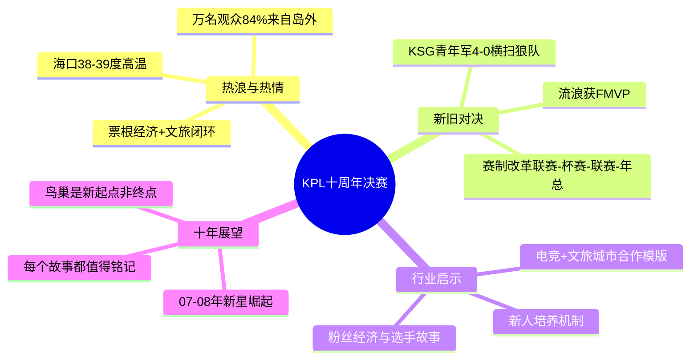

# 炸上热搜，1万人奔赴：这个10周年的第一战太"热"了

> **来源**：游戏那点事Gamez  
> **链接**：https://mp.weixin.qq.com/s/_IRCmqytoofytbMEgWVuVw  
> **日期**：2026-04-24  
> **处理日期**：2026-04-25  
> **标签**：#KPL #电竞 #移动电竞 #赛事运营 #文旅融合

---

## 📌 核心摘要

2026年4月11日，KPL春季赛决赛在海口五源河体育馆举行。KSG以4-0横扫十冠王重庆狼队，夺得队史首冠。万人观众顶着38-39度高温前来，84%来自岛外。KPL与海口政府推出"票根经济"，打造"电竞+文旅"模版。十周年庆典以蓝色星海承载记忆，KPL将鸟巢定义为"第一步"的新起点。

---

## 🔍 7 Phase 深度分析

### Phase 1: 原文信息
- **标题**：炸上热搜，1万人奔赴：这个10周年的第一战太"热"了
- **来源**：游戏那点事Gamez
- **链接**：https://mp.weixin.qq.com/s/_IRCmqytoofytbMEgWVuVw
- **日期**：2026-04-24

### Phase 2: 文章脉络

**Section 01 - 热浪、热度与热情**
- 决赛当天海口气温38-39度，但场外排起长队
- 84%观众来自岛外，万人奔赴
- KPL与海口政府合作"票根经济"：酒店、餐饮、交通优惠
- 形成"观赛+旅游"消费闭环，打造"电竞+文旅"模版

**Section 02 - 热门、热爱与热血**
- KSG新阵容（句号、流浪等新人）击败十冠王重庆狼队
- 赛制改革"联赛-杯赛-联赛-年总"，增加竞争激烈度
- 新人崛起：07、08年出生的选手即将成为当家明星
- 格局动荡倒逼战术创新，同时保障人才上升通道

**Section 03 - 一步、十步与万里**
- KPL十年：从最初不被看好，到去年走进鸟巢
- 黄承定义：鸟巢是"第一步"的终点，也是新起点
- 决赛舞美以蓝色星海讲述十年故事
- 价值观：每一个留下故事的人，都值得被铭记

### Phase 3: 概要总览

2026年4月11日，KPL春季赛决赛在海口五源河体育馆举行，KSG以4-0横扫十冠王重庆狼队，夺得队史首冠。这场十周年庆典上，万名观众顶着38-39度高温前来，其中84%来自岛外，场面堪比"火焰山"。

赛事与海口政府联手推出"票根经济"，形成"观赛+旅游"完整消费闭环。赛制改革让新人大量涌现，流浪等年轻选手斩获FMVP。KPL联盟主席黄承表示，鸟巢是前十年"第一步"的终点，接下来十年将从07、08年新世代中诞生新星。决赛舞美以蓝色星海承载19届回忆，让赛事成为所有参与者共同记忆的载体。

### Phase 4: 思维导图

### Phase 5: 提问

#### Level 1 - 基础事实

**L1-1**: KSG在这场决赛中的比分和结果是什么？击败的是什么对手？
> 原文：决赛当天...KSG这支队史第二次站上决赛舞台的队伍...KSG不给机会，4比0利落地横扫对手，拿下队史首个KPL冠军。

**L1-2**: KPL与海口政府合作推出了哪些具体措施来吸引观众？
> 原文：KPL联盟与海口市政府共同推出了"票根经济"——观众凭票根，酒店打折、餐饮优惠样样都省一点；交通上有6条免费公交专线、3条摆渡专线。

**L1-3**: 决赛当天海口的气温条件如何？观众到场情况怎样？
> 原文：决赛当天，海口市气温最高飙到38-39度...本次决赛的购票数据显示，比赛整体到场的观众超过1万名，而其中有近84%的观众来自岛外。

#### Level 2 - 原因分析

**L2-1**: 为什么说"格局的动荡对联盟来说或许是件好事"？
> 原文：格局的动荡对联盟来说或许是件好事——表面上看，它维持了观众的新鲜感和商业关注度，但更深一层，KPL是在把青训选秀、培养工作都往赛事体系的变化方向去调整。一方面，人员的更换倒逼战术创新。

**L2-2**: KPL为什么要进行赛制改革，从赛季结构上做出调整？
> 原文：与往年不同，今年的赛期排布改成了"联赛-杯赛-联赛-年总"的新节奏。黄承解释说，一方面是更加适合观众观赛，另一方面，是为俱乐部的赛训留出更多弹性空间。

**L2-3**: 为什么说KPL的"根"扎在"年轻"和"热血"这两个词上？
> 原文：电竞的根，终究还是扎在"年轻"和"热血"这两个词上...年轻选手正通过更完善的选拔与培养机制，沿着清晰的路径走上职业舞台。

#### Level 3 - 深度洞察

> 原文：我们希望'电竞+文旅'的话题和影响力能够借助海口的模式形成一个成熟的组合，未来为海口之外的其他城市打造模版，在更广的范围内达到更好的效果。

**L3-2**: KPL认为"鸟巢只是第一步"，这种"永远在起步"的心态对游戏/赛事的长线运营有什么启示？
> 原文："对于KPL前面的十年，鸟巢无疑是一个高点；在接下来的十年里，对我们团队来说，它同时是一个新的起点。"...KPL的核心生命力在他们自己眼里，不是通过外部体系的接纳来证明，而是来自自我认可。

**L3-3**: 文章提到"不是只有赢家才配载入史册"，这种叙事策略对维护选手生态和粉丝粘性有什么作用？
> 原文：不是只有赢家才配载入史册，每一个在此留下或热血、或遗憾的故事的人，都值得被铭记和镌刻。KPL就像一个记录者，让所有故事展露在阳光下待人翻阅、品尝。

### Phase 6: 回答

#### L1-1: KSG的比分和结果
**答**：KSG以4-0的比分利落横扫重庆狼队，夺得队史首个KPL冠军。重庆狼队是赛前更被看好的十冠王队伍，且在季后赛曾对KSG实现过"让三追四"的精彩逆转，但决赛未能再次创造奇迹。
> 原文引用："KSG不给机会，4比0利落地横扫对手，拿下队史首个KPL冠军。"

#### L1-2: KPL与海口的具体合作措施
**答**：推出了"票根经济"政策——观众凭票根享受酒店打折、餐饮优惠；交通方面提供6条免费公交专线和3条摆渡专线。同时海口文旅支持下，城市公共资源遍布游戏与选手宣传内容，线下还设第二观赛点和快闪店，覆盖近三周时间。
> 原文引用："KPL联盟与海口市政府共同推出了'票根经济'——观众凭票根，酒店打折、餐饮优惠样样都省一点；交通上有6条免费公交专线、3条摆渡专线。"

#### L1-3: 气温和观众情况
**答**：决赛当天海口最高气温飙到38-39度。购票数据显示，到场观众超过1万人，其中近84%来自岛外，跨越千里奔赴这场电竞盛宴。
> 原文引用："决赛当天，海口市气温最高飙到38-39度...本次决赛的购票数据显示，比赛整体到场的观众超过1万名，而其中有近84%的观众来自岛外。"

#### L2-1: 格局动荡为何是好事
**答**：格局动荡带来两方面好处——**战术层面**：新人无畏、老将有经验，新旧碰撞逼着每支队不断琢磨新的针对战术，否则就会被后来者淘汰。**人才层面**：人员的更换倒逼战术创新，同时维护选手权利，保障人才上升通道，让粉丝喜爱的选手能够越战越勇。
> 原文引用："一方面，人员的更换倒逼战术创新。老选手有经验而新人不怕输，各个队伍的新旧碰撞，逼着每支队都得不断琢磨新的针对战术，不然就会被后来者拍在沙滩上。另一方面，也维护了选手的权利，保障人才上升通道。"

#### L2-2: 赛制改革的原因
**答**：黄承解释新赛制"联赛-杯赛-联赛-年总"有两个考量：一是从**观众角度**，更适合观赛节奏；二是从**俱乐部角度**，为赛训留出更多弹性空间，让队伍有更充裕的训练和调整时间。
> 原文引用："与往年不同，今年的赛期排布改成了'联赛-杯赛-联赛-年总'的新节奏。黄承解释说，一方面是更加适合观众观赛，另一方面，是为俱乐部的赛训留出更多弹性空间。"

#### L2-3: 为什么"年轻"和"热血"是KPL的根
**答**：电竞作为竞技体育，本质依赖新鲜血液的更替。"年轻"意味着潜力和未来，"热血"意味着投入和激情。文章指出已有更多年轻选手通过更完善的选拔与培养机制，沿着清晰路径走上职业舞台。黄承还透露，未来两三年的当家明星可能从07、08年出生的选手中产生。
> 原文引用："电竞的根，终究还是扎在'年轻'和'热血'这两个词上...如今，已经有更多年轻选手，正通过更完善的选拔与培养机制，沿着清晰的路径走上职业舞台。"

#### L3-2: "鸟巢只是第一步"对长线运营的启示
**答**：KPL的核心逻辑是**自我认可驱动**而非外部证明——鸟巢这样的顶级舞台是里程碑但不是终点。对游戏/赛事运营而言，这意味着：①**永远保持起步心态**，每个成就都是新起点；②**用户忠诚度来自情感连接**而非成绩认可，KPL通过记录每个人（不限于赢家）的故事来建立这种连接；③**生命力来自持续创造新故事**，而非躺在过去的荣光上。这种心态让KPL十年走得稳当且长远。
> 原文引用："对于KPL前面的十年，鸟巢无疑是一个高点；在接下来的十年里，对我们团队来说，它同时是一个新的起点。"...KPL的核心生命力在他们自己眼里，不是通过外部体系的接纳来证明，而是来自自我认可。

#### L3-3: "不只记录赢家"对选手生态的作用
**答**：这种叙事策略维护了**去中心化的故事权**——每个参与者（选手、粉丝、工作人员）的故事都有被记录的价值。这带来三重效果：①**降低失败代价**：输了比赛的选手和粉丝依然感到被尊重，减少"赢家通吃"的挫败感；②**增强粉丝粘性**：粉丝看到自己喜欢的选手无论输赢都被铭记，产生更强的归属感；③**丰富赛事叙事层次**：让赛事从单纯的竞技结果变成"人生故事汇"，增加情感深度和传播素材。KPL通过把自己定位为"记录者"而非"裁判者"，建立起更立体的品牌形象。
> 原文引用："不是只有赢家才配载入史册，每一个在此留下或热血、或遗憾的故事的人，都值得被铭记和镌刻。KPL就像一个记录者，让所有故事展露在阳光下待人翻阅、品尝，而自己也拥有很多新的节点和意义。"

---
