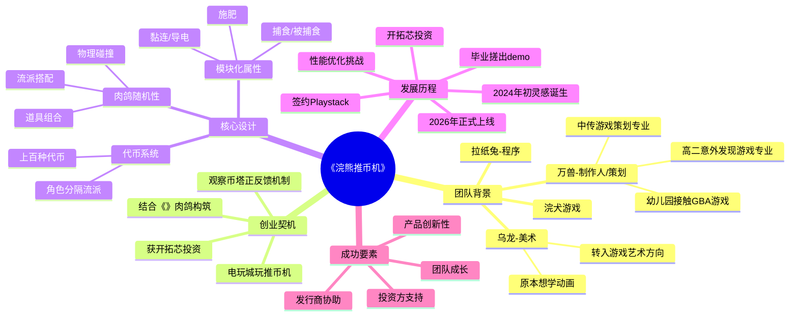

# 00后毕业生创业一年半，首日销量10万：我们和制作人聊了聊

> **来源**: 游戏葡萄  
> **链接**: https://mp.weixin.qq.com/s/-cIeIhTzlvbrZwyZ0rR3mA  
> **处理日期**: 2026-04-26  
> **标签**: 独立游戏 / 创业 / 肉鸽游戏 / 推币机 / 团队建设

---

## Phase 1: 提取原文

**文章基本信息：**
- 标题：00后毕业生创业一年半，首日销量10万：我们和制作人聊了聊
- 来源：游戏葡萄
- 作者：王丹 & 大田
- 核心产品：《浣熊推币机》
- 团队：浣犬游戏（3人：万兽-制作人/策划、乌龙-美术、拉纸兔-程序）
- 投资方：开拓芯
- 发行商：Playstack

---

## Phase 2: 梳理文章脉络

**01 - 阴差阳错开始的游戏生涯**
- 万兽幼儿园就玩GBA游戏，但从未想过以游戏为职业
- 高二填志愿时意外发现国内有游戏相关专业，报考中国传媒大学游戏策划专业
- 大一参加GameJam，对游戏开发一窍不通，做出"连游戏都算不上"的东西
- 大一下游戏创作课，每两周和不同同学组队做游戏切片，逐渐找到做策划的感觉
- 作为策划不会代码不会画画，选择做程序和美术之间的桥梁——沟通协调
- 乌龙原本想学动画，最终进入游戏艺术方向，逐渐发掘游戏美术的有趣之处

**02 - 为自己的想法，找到落地的机会**
- 2024年初，乌龙带万兽去电玩城玩推币机
- 万兽观察到推币机的"币塔"设计带来的正反馈机制
- 玩《》时获得灵感：把推币机和构筑式肉鸽结合
- 毕业后告诉父母可能要啃老几个月做游戏，获得家人支持
- 两人两周搓出demo，获得开拓芯投资，成立浣犬游戏
- 开拓芯提供：资金、线下办公场地、每月看版本给反馈、处理工商事务、介绍发行商

**03 - 比肉鸽更多的随机性**
- 肉鸽乐趣来源：随机性带来的可重复游玩性
- 《浣熊推币机》通过角色系统分隔大流派，流派下再根据币种、芯片、礼品等随机道具搭配不同打法
- 能上机台的代币有上百种
- 设计方法：围绕推币机本身挖掘可玩性 + 观察同品类游戏获取灵感
- 模块化属性设计：捕食、被捕食、施肥、黏连、导电等
- 细节冲突处理：如狼币和猫币的捕食对象做了区分
- 独特卖点：物理碰撞结果也存在随机性，设计师自己都难以预料

**04 - 从未后悔过创业做独游**
- 最大困难：性能优化（demo曾因优化问题被差评）
- 最大激励：与《小丑牌》发行商Playstack签约获得认可
- 游戏上线时收到大量祝福
- 创业感悟：学生思维 vs 创业思维的区别
- 成长：沟通表达能力提升，从"闷头做游戏"到主动对外合作
- 团队成功关键：浣犬团队成长 + 开拓芯支持 + Playstack协助

---

## Phase 3: 概要总览（200-300字）

本文讲述了00后大学毕业生万兽、乌龙在毕业后仅用一年半时间，开发出爆款独立游戏《浣熊推币机》的创业故事。游戏上线24小时销量突破10万份，成为2026年上半年最火爆的国产独游之一。

团队三人均毕业于中国传媒大学游戏系，在校期间曾共同开发毕设项目但未能上线。毕业后，他们抓住在电玩城玩推币机时的灵感火花，结合《》的构筑式肉鸽玩法，用两周时间搓出demo并获得开拓芯投资。

游戏的核心创新在于将传统推币机的物理机制与肉鸽卡牌游戏的构筑系统深度融合，通过上百种代币、模块化属性设计，创造出远超传统肉鸽的随机性和可重复游玩性。团队在一年内克服了性能优化、发行合作等重重挑战，最终实现首日10万销量，并计划登陆主机和移动端。

---

## Phase 4: 思维导图（Mermaid mindmap格式）

---

## Phase 5: 提问（Level 1/2/3级别问题）

### Level 1 - 基础理解（What/Who/When）

**Q1. 《浣熊推币机》的团队成员有哪些？各自的角色是什么？**
- 原文：万兽（制作人/策划）、乌龙（美术）、拉纸兔（程序），三人成立"浣犬游戏"

**Q2. 《浣熊推币机》的核心玩法机制是什么？**
- 原文：把推币机和构筑式肉鸽结合，通过角色系统分隔大流派，流派下根据币种、芯片、礼品等随机道具搭配不同打法

**Q3. 团队是在什么时间点获得开拓芯投资的？**
- 原文：2024年秋，万兽与乌龙从中国传媒大学毕业，用两周时间搓出《浣熊推币机》原型demo，获得开拓芯投资

### Level 2 - 深度分析（How/Why）

**Q4. 团队是如何处理大量代币之间的效果冲突问题的？**
- 原文：浣犬提前预设了模块化属性，拿大类先给代币的效果做区分，并对同模块化属性下不同币种之间的细节冲突做了区分处理

**Q5. 开拓芯为浣犬团队提供了哪些具体支持？**
- 原文：资金投资、线下办公场地、每月看版本提供专业玩家和商业化视角反馈、处理工商事务、介绍发行商Playstack、协助翻译和理解合同

**Q6. 《浣熊推币机》的物理碰撞随机性具体是如何体现的？为什么这是一个独特的卖点？**
- 原文：物理碰撞结果也存在随机性，设计师在设计币种和道具时很难预料最终会碰出什么，往往要等设计实装后才能看到实际的连锁反应

### Level 3 - 反思洞察（So What/What If）

**Q7. 从学生思维到创业思维，团队经历了哪些认知转变？**
- 原文：以前在学校很少考虑受众、性能优化、商业化落地；以前觉得宣传片自己剪、社媒自己运营；现在意识到好的产品需要面向玩家，背后需要多方努力

**Q8. 这篇文章对独立游戏开发者有什么借鉴意义？**
- 原文：提到需要很多人的努力才能把产品做好；强调对外沟通合作的重要性

**Q9. 为什么说《浣熊推币机》比其他肉鸽游戏有更多的随机性？这种设计理念对游戏设计有什么启发？**
- 原文：肉鸽最好玩的地方在于随机性带来的可重复游玩性；《浣熊推币机》的随机乐趣不仅来源于流派搭配，还来源于物理碰撞结果的随机性

---

## Phase 6: 回答（带原文引用）

### Q1. 《浣熊推币机》的团队成员有哪些？各自的角色是什么？

**回答：**
团队名为"浣犬游戏"，共3名成员：

- **万兽（制作人/策划）**：游戏设计核心推动者，负责整体策划和制作协调
- **乌龙（美术）**：负责游戏视觉设计和美术风格把控
- **拉纸兔（程序）**：负责游戏程序开发和性能优化

> "2024年秋，万兽（制作人）与乌龙（美术）从中国传媒大学游戏系毕业，两人用两周时间搓出《浣熊推币机》原型demo，获得开拓芯投资后，成立'浣犬游戏'，拉纸兔（程序）入伙，三个人组队"

---

### Q2. 《浣熊推币机》的核心玩法机制是什么？

**回答：**
游戏将传统推币机的物理机制与构筑式肉鸽深度融合。

玩家通过以下维度构建玩法：
1. **角色系统**：分隔比较大的流派（如生物学家可以玩动物捕食或种树，大胃王可以做菜）
2. **随机道具**：芯片、礼品、挂件等道具的随机组合
3. **代币系统**：上百种可上机台的代币，每种有不同的模块化属性
4. **物理碰撞**：机台上代币的物理运动结果本身也具有随机性

> "刚好那段时间我们在玩《小丑牌》，就想到可以把推币机和构筑式肉鸽结合在一起"

> "我们会通过角色系统去分隔比较大的流派，但流派下依然可以再根据币种、芯片、礼品等随机道具，来搭配不同打法"

---

### Q3. 团队是在什么时间点获得开拓芯投资的？

**回答：**
2024年秋季，即万兽和乌龙毕业时。

万兽、乌龙两人毕业后用两周时间搓出《浣熊推币机》demo，带着demo找到开拓芯后，后者很快就确认了投资意向。

> "2024年秋，万兽（制作人）与乌龙（美术）从中国传媒大学游戏系毕业，两人用两周时间搓出《浣熊推币机》原型demo，获得开拓芯投资后，成立'浣犬游戏'"

---

### Q4. 团队是如何处理大量代币之间的效果冲突问题的？

**回答：**
浣犬采用了**模块化属性**设计方法来解决这个问题。

具体做法：
1. 先预设模块化属性类别（如捕食、被捕食、施肥、黏连、导电等）
2. 用大类先给代币的效果做区分
3. 对同模块化属性下不同币种之间的**细节冲突**做区分处理

典型案例：狼币和猫币都有"捕食"属性，但为了避免游玩体验冲突，团队对两者的捕食对象做了明确区分——猫和狼不互相抢食物。

> "浣犬也考虑到了这个问题。所以他们提前预设了模块化属性，拿大类先给代币的效果做区分"

> "狼币具体能吃哪些币？现在我们又有一个猫币，它的模块化属性也是捕食，那它的捕食对象会和狼币重叠吗？猫和狼互相抢食物的话，游玩体验其实不会好……最后我们还是对狼和猫的捕食对象做了区分"

---

### Q5. 开拓芯为浣犬团队提供了哪些具体支持？

**回答：**
开拓芯提供的支持是多维度的：

1. **资金投资**：提供创业所需的启动资金
2. **线下办公场地**：省去场地开销，也让团队与其他独游团队有交流机会
3. **每月版本反馈**：根据版本提供偏专业玩家和商业化视角的反馈（如建议增加长按自动吐币功能、鼠标左右键吐币）
4. **工商事务处理**：帮忙处理很多流程上的工作
5. **发行商对接**：为团队提供公司事务、寻找发行商方面的辅导，介绍Playstack并协助翻译和理解合同

> "他们为包括浣犬在内的独游团队提供了线下办公场地。这一方面帮浣犬省去了场地开销，另一方面也让浣犬与其他独游团队有了交流机会"

> "浣犬基本每个月都会找开拓芯看看版本，展示开发进度。开拓芯则会根据版本提供一些偏专业玩家和商业化视角的反馈"

> "开拓芯在、工商事务上帮忙处理了很多流程上的工作，也开设了很多讲座，为团队提供公司事务、寻找发行商方面的辅导，帮浣犬建立起商业概念。浣犬在和发行商Playstack沟通时，开拓芯还介绍了靠谱的外援协助翻译和理解合同"

---

### Q6. 《浣熊推币机》的物理碰撞随机性具体是如何体现的？为什么这是一个独特的卖点？

**回答：**
**物理碰撞随机性的体现：**
游戏中的代币在机台上的物理运动、碰撞结果是不可预测的。设计师在设计币种和道具时，很难预料它们最终会碰出什么效果，往往要等设计实装后才能看到实际的连锁反应。

**为什么是独特卖点：**
传统肉鸽游戏的随机性主要来源于：
- 随机获得的卡牌/道具
- 随机出现的敌人/事件
- 流派搭配的组合

但《浣熊推币机》在此基础上叠加了**物理层随机性**，即：
- 同样的道具组合 + 不同的物理碰撞结果 = 完全不同的游戏体验
- 这种"难以预料的连锁反应"带来了额外的惊喜感和可重复游玩性

> "《浣熊推币机》的随机乐趣，并不单纯来源于肉鸽流派搭配——它的物理碰撞结果，也存在随机性"

> "浣犬自己在设计币种和道具时，其实很难预料它们最终会碰出什么，往往要等设计实装后，他们才能看到实际的连锁反应"

---

### Q7. 从学生思维到创业思维，团队经历了哪些认知转变？

**回答：**
万兽在创业过程中深刻体会到"学生思维"和"创业思维"的区别：

**学生思维的局限：**
- 很少考虑受众——做作品更多是自我表达
- 不怎么需要考虑性能优化
- 不怎么需要考虑商业化落地
- 把做游戏想得过于简单，觉得宣传片可以自己剪、社媒可以自己运营
- 以为不管是研发还是发行的工作，都能自己扛

**创业思维的成长：**
- 深刻意识到好的产品必须面向玩家
- 理解产品背后需要多方的努力和协作
- 从"闷头做游戏"转变为主动与资方、发行商沟通
- 学会去社交、找大佬请教建议
- 沟通和表达能力提升，可以比较自如地应对

> "以前还在学校时，万兽搓学生作品很少考虑受众，也不怎么需要考虑性能优化、商业化落地的问题。同时，她一度把做游戏这事想得有些过于简单，觉得宣传片可以自己剪，社媒自己运营就行，不管是研发还是发行的工作，都以为能自己扛"

> "直到现在创业、真正做出能上架的产品，她才深刻意识到，一个好的产品，终归得面向玩家，且背后需要多方的努力"

> "现在说话都感觉顺了很多，可以比较自如地应对了"

---

### Q8. 这篇文章对独立游戏开发者有什么借鉴意义？

**回答：**
文章提供了几个重要启示：

1. **Idea与执行同样重要**：好创意需要快速落地验证（两周搓出demo）
2. **找准定位与差异化**：《浣熊推币机》的成功在于找到了"推币机+肉鸽"这个独特结合点
3. **善用外部资源**：开拓芯不仅提供资金，还提供场地、反馈、发行商对接等全方位支持
4. **重视性能优化**：demo阶段就因优化问题被差评，性能问题不解决会影响玩家口碑
5. **建立模块化设计思维**：面对大量内容，用模块化属性处理复杂设计，避免冲突
6. **多方协作才能做好产品**：研发只是其中一环，需要资方、发行商、技术支持等多方配合
7. **持续迭代与改进**：如狼/猫捕食对象区分这类细节打磨很重要

> "真的需要很多人的努力，才能把它做得更好"

---

### Q9. 为什么说《浣熊推币机》比其他肉鸽游戏有更多的随机性？这种设计理念对游戏设计有什么启发？

**回答：**
**更多随机性的来源：**

传统肉鸽游戏的随机性维度：
- 抽卡/开箱的随机奖励
- 事件/敌人出现的随机性
- 流派构筑的组合随机性

《浣熊推币机》在此基础上增加了：
- **物理碰撞的随机性**：同样的构筑 + 不同的物理结果 = 每次游戏都是独特体验
- **双层随机叠加**：肉鸽构筑层 + 物理碰撞层，两者相互影响产生不可预测的连锁反应

**设计理念启发：**

1. **跨品类融合**：将两种不同玩法的核心机制深度融合，创造"1+1>2"的效果
2. **引入物理层随机性**：物理引擎的不可预测性可以成为游戏设计的一部分
3. **模块化设计应对复杂性**：用大类属性区分处理大量内容，避免陷入无限细节
4. **让设计师也感到惊喜**：当设计者自己都无法完全预料结果时玩家也会感到新鲜

> "肉鸽最好玩的地方在于随机性带来的可重复游玩性"

> "《浣熊推币机》的随机乐趣，并不单纯来源于肉鸽流派搭配——它的物理碰撞结果，也存在随机性"

> "浣犬自己在设计币种和道具时，其实很难预料它们最终会碰出什么，往往要等设计实装后，他们才能看到实际的连锁反应"

---

## Phase 7: 生成完整笔记

---

# 📝 完整分析笔记

## 🎮 案例信息
- **游戏名**: 《浣熊推币机》
- **团队**: 浣犬游戏（3人）
- **类型**: 推币机 + 构筑式肉鸽
- **上线时间**: 2026年3月
- **首日成绩**: 24小时销量突破10万份

## 🔑 核心洞察

### 1. 创新机制
将传统推币机的物理机制与肉鸽卡牌构筑系统深度融合，创造双重随机性（肉鸽构筑层 + 物理碰撞层），这在其他肉鸽游戏中是罕见的。

### 2. 模块化设计
面对上百种代币和道具，采用模块化属性设计（捕食、被捕食、施肥、黏连、导电等），用大类先做区分，再处理细节冲突，保证系统可扩展性。

### 3. 外部支持的重要性
开拓芯提供的不只是资金，而是"资金+场地+每月反馈+工商支持+发行商对接"的综合支持，大幅降低创业风险。

### 4. 学生→创业者转变
从"闷头做"到"主动沟通"，从"什么都自己扛"到"专业的事交给专业的人"，这种认知转变是创业成功的关键。

## 💡 可借鉴的设计思路

1. **跨品类融合**：找到两种玩法的核心共鸣点（如推币的"币塔推进"和肉鸽的"构筑积累"）
2. **物理随机性**：考虑将物理引擎的不可预测性纳入游戏设计
3. **模块化扩展**：用大类属性处理大量内容，避免组合爆炸
4. **快速验证**：两周搓出demo，快速获取投资方反馈

## ⚠️ 注意事项

1. **性能优化不能拖**：demo阶段就因优化被差评，及早解决
2. **发行商选择很重要**：Playstack作为《小丑牌》发行商，带来了品类认知和海外发行资源
3. **团队互补**：策划+美术+程序铁三角，分工明确

---

*笔记生成时间: 2026-04-26*
*处理Agent: 锅巴*
