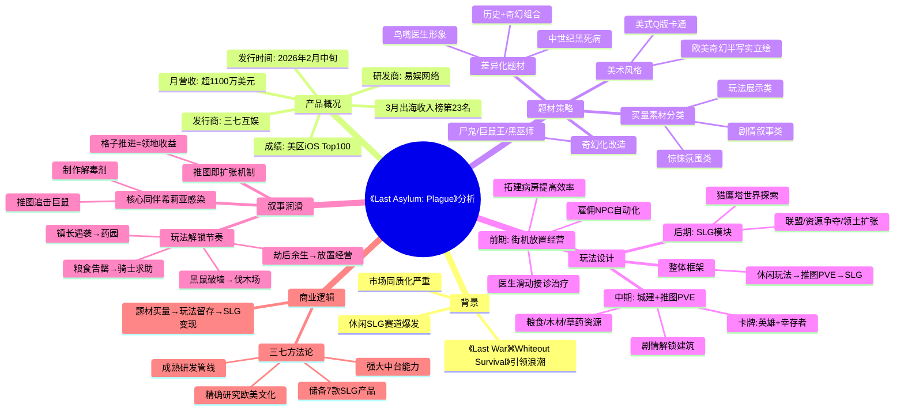

# 两家广州大厂又偷偷联手了：曾造150亿流水神话

## 📋 原文信息

| 项目 | 内容 |
|------|------|
| 标题 | 两家广州大厂又偷偷联手了：曾造150亿流水神话 |
| 来源 | 游戏那点事Gamez |
| 链接 | https://mp.weixin.qq.com/s/HJvP6JgJtZj7JFG1Ns_AOA |
| 分析日期 | 2026-04-27 |

---

## Phase 1: 提取原文

- **URL**: https://mp.weixin.qq.com/s/HJvP6JgJtZj7JFG1Ns_AOA
- **来源**: 游戏那点事Gamez

---

## Phase 2: 梳理文章脉络

1. **背景铺垫**：休闲SLG赛道爆发，《Last War》《Whiteout Survival》引领休闲化浪潮
2. **产品引入**：《Last Asylum: Plague》由易娱网络研发、三七互娱发行，2026年2月发布
3. **成绩亮点**：美区iOS畅销榜Top100，SensorTower 3月出海收入榜第23名（唯一新游），月营收超1100万美元
4. **核心策略Part1（题材差异化）**：选择"中世纪黑死病+鸟嘴医生"题材，历史+奇幻组合避免撞车
5. **核心策略Part2（玩法融合）**：街机放置经营→推图PVE→SLG，剧情引导串联
6. **核心策略Part3（叙事润滑）**：用故事引导玩法过渡，实现流畅体验
7. **三七的SLG方法论**：精确研究欧美文化+题材买量+成熟运营
8. **结论**：三七沉淀出可复制的SLG出海方法论

---

## Phase 3: 概要总览

本文分析了易娱网络研发、三七互娱发行的休闲SLG新品《Last Asylum: Plague》。游戏以"中世纪黑死病"为题材切入点，采用美式Q版卡通风格搭配欧美奇幻立绘，实现题材差异化。核心玩法框架为"休闲玩法→推图PVE→SLG"，通过完整叙事逻辑润滑玩法过渡。游戏于2026年2月发布后迅速跻身美区iOS畅销榜Top100，3月冲入SensorTower出海手游收入榜第23名，成为当月唯一上榜新游，月营收超1100万美元。文章认为这是三七深厚SLG底蕴与强大中台能力的一次集中兑现，验证了其可复制的SLG出海方法论。

---

## Phase 4: 思维导图

---

## Phase 5: 提问（Level 1/2/3）

### Level 1（基础理解：事实性问题）

**Q1**: 《Last Asylum: Plague》的月营收具体是多少？在上榜产品中处于什么位置？

**Q2**: 游戏选择"中世纪黑死病"题材相比传统丧尸/末日题材有什么差异化优势？

**Q3**: 游戏前期街机放置经营玩法的核心交互是什么？

### Level 2（机制分析：设计逻辑问题）

**Q4**: 游戏是如何通过剧情将三种基础资源（粮食、木材、草药）的玩法逐一引入的？

**Q5**: "推图即扩张"机制具体是如何实现的？它解决了传统SLG融合产品的什么痛点？

**Q6**: 卡牌养成分为"英雄"和"幸存者"两类，它们在获取方式上有何区别？

### Level 3（深度洞察：战略/方法论问题）

**Q7**: 三七互娱的SLG方法论是否可以被称为"可复制的标准化流程"？其核心壁垒在哪里？

**Q8**: 文章认为题材只是"噱头"还是会"与核心玩法产生有效联动"？文中哪些证据支持这个判断？

**Q9**: 在休闲SLG"红海"市场中，《Last Asylum: Plague》的成功对其他厂商有什么警示或借鉴意义？

---

## Phase 6: 回答（带原文引用）

### Q1: 《Last Asylum: Plague》的月营收具体是多少？在上榜产品中处于什么位置？

**答**：根据SensorTower数据，《Last Asylum: Plague》2026年3月营收超过**1100万美元**（人民币约7500万元）。在上榜产品中，它是**3月唯一一款上榜的新游**，并在SensorTower发布的2026年3月出海手游收入榜中排名第23位。

> 原文引用："根据该机构统计，游戏仅在3月的营收就超过了1100万美元（人民币约7500万），其中美国、日韩、欧洲等核心市场为其收入提供了主要贡献。"
>
> 原文引用："在SensorTower发布的2026年3月出海手游收入榜中，《Last Asylum: Plague》还冲到了第23名，是本月唯一一款上榜的新游。"

---

### Q2: 游戏选择"中世纪黑死病"题材相比传统丧尸/末日题材有什么差异化优势？

**答**：传统SLG产品多使用近未来背景和科幻设定（如《后天》式寒灾、《生化危机》式丧尸爆发），导致题材"撞车"严重。《Last Asylum: Plague》选择"中世纪黑死病"这一历史事件切入，具备三个差异化优势：
1. **认知门槛低**：黑死病是欧美文化圈中知名度极高的历史事件，玩家天然有代入感；
2. **末日氛围强**：14世纪黑死病夺去欧洲三分之一人口（约2500万人），文化创伤延续至今；
3. **题材表达独特**：历史+奇幻（尸鬼、巨鼠王、黑巫师）的组合拓宽了表达空间，避免与热门产品视觉撞车。

> 原文引用："纵观利用这一策略跑出的热门产品，它们往往更倾向于使用近未来背景和经典的科幻设定——比如《后天》式的全球寒灾，或者《生化危机》式的丧尸爆发。但随着赛道入局者不断增多，这一包装策略的同质化也日益严重。"
>
> 原文引用："这样'历史+奇幻'的组合，不仅借助受众熟知的瘟疫背景降低了认知门槛、营造出末日生存氛围，还拓宽了游戏的表达空间。使其能够为玩家呈现更独特的故事，在题材表现上实现了显著的差异化。"

---

### Q3: 游戏前期街机放置经营玩法的核心交互是什么？

**答**：玩家需要**滑动屏幕操控医生**，通过接诊、治疗病人赚取铜币，并消耗铜币拓建病房、提高医疗效率。具体流程为：手动治疗一定数量病人后，可消耗资源雇佣"护士""接诊员"等NPC接管教堂运作，实现从"手操"到"自动化"的过渡。

> 原文引用："玩家需要滑动屏幕操控医生，通过接诊、治疗病人赚取铜币，并消耗这些铜币来拓建病房、提高医疗效率。"
>
> 原文引用："当玩家手动救治一定数量的病人之后，就可以消耗资源雇佣'护士'、'接诊员'等NPC接管教堂的运作，实现从'手操'到'自动化'的过渡。"

---

### Q4: 游戏是如何通过剧情将三种基础资源（粮食、木材、草药）的玩法逐一引入的？

**答**：游戏通过连续的剧情事件逐一引入三种资源玩法，而非一股脑塞给玩家：
- **木材**：在玩家熟悉放置经营基本玩法后，通过"黑鼠破墙"的剧情事件引导玩家重建伐木场，以收集木材修复教堂；
- **粮食**：随着教堂规模扩张，初始粮食储备告罄，引入"骑士求助"剧情，在补充队伍战力的同时指引玩家收复农田恢复粮食生产；
- **草药/药园**：利用"镇长遇袭身亡、玩家临危受命接任"的桥段铺垫，并通过点燃药粉火盆驱鼠的任务引入药园玩法。

> 原文引用："游戏没有将这些与生产有关的概念一股脑塞给玩家，而是选择用连续的剧情任务向他们逐一介绍这些建筑的用途。"
>
> 原文引用："比如说在玩家熟悉放置经营玩法的基本玩法后，系统就会通过'黑鼠破墙'的剧情事件引导玩家重建伐木场，以收集木材修复教堂。"
>
> 原文引用："随着教堂规模的不断扩张，玩家的初始粮食储备也会逐渐告罄。这个时候，游戏趁机引入了'骑士求助'这一剧情。"
>
> 原文引用："至于药材以及药园的相关介绍，则利用了'镇长遇袭身亡，玩家临危受命接任'的桥段作为铺垫，并设计了一个点燃药粉火盆驱鼠的任务进行驱动。"

---

### Q5: "推图即扩张"机制具体是如何实现的？它解决了传统SLG融合产品的什么痛点？

**答**：《Last Asylum: Plague》将推图场景和主城置于同一地图内，玩家每推进一定数量的格子，就可以将探索过的地块直接整合成新的主城领地，并解锁新的功能性建筑。这样**玩家的通关成果直接转化为可见的领地收益**，提供了流畅而及时的正反馈。

这一机制解决的核心痛点是：传统SLG融合产品中，副玩法（Puzzle/放置等）与SLG本体之间存在明显的逻辑断层，玩家常常在完成副玩法后感到"不知道为什么要继续"，导致用户流失。

> 原文引用："《Last Asylum: Plague》没有将推图PVE做成一个独立的模块，而是将其与城建及卡牌养成玩法几乎无缝地融合到了一起。游戏中，推图场景和主城位于同一地图内，玩家每推进一定数量的格子，就可以将探索过的地块直接整合成新的主城领地，并解锁新的功能性建筑。这样'推图即扩张'的机制将玩家的通关成果直接转化了可见的领地收益，为他们提供了流畅而及时的正反馈。"

---

### Q6: 卡牌养成分为"英雄"和"幸存者"两类，它们在获取方式上有何区别？

**答**：游戏没有对"英雄"（负责战斗）和"幸存者"（负责生产）的获取渠道进行严格区分，两者在前期获取方式都比较有限。除了付费抽卡外，扩充阵容最有效的方式是**通过推图PVE解救幸存者**。这种设计将推图PVE的驱动力从单纯的剧情推进延伸到了阵容扩充，进一步增强了玩法闭环。

> 原文引用："《Last Asylum: Plague》的卡牌养成玩法则分为负责战斗的'英雄'和负责生产的'幸存者'两个板块，游戏没有对它们的获取渠道进行严格区分，但两者在前期的获取方式都比较有限。除了付费抽卡外，扩充阵容最有效的方式就是通过推图PVE解救幸存者，从而进一步增加了玩法的驱动力。"

---

### Q7: 三七互娱的SLG方法论是否可以被称为"可复制的标准化流程"？其核心壁垒在哪里？

**答**：文章认为三七已沉淀出**可复制的SLG出海方法论**，但其核心壁垒并非单一技术或产品，而是一套系统性能力：
1. **对欧美文化和用户画像的精确研究**：能够选择有文化共鸣的差异化题材；
2. **强大的中台能力和成熟研发管线**：可同时在更多方向上探索内容不同的新产品并保证研发质量；
3. **成熟的运营策略**：能承接住题材买量带来的人气，实现用户留存和变现。

值得注意的是，三七在储备的26款产品中**SLG占7席**，说明SLG是其战略聚焦方向，这种持续深耕的决心也是方法论的一部分。

> 原文引用："回顾《Last Asylum: Plague》的成功可以发现，三七对欧美文化和用户画像的精确研究使其在题材上实现了有效突破，而在玩法设计上的优化和成熟的运营策略则利用好了题材买量带来的人气，最终在一片红海中创造出了自己的生存空间。"
>
> 原文引用："像三七这样有小游戏和SLG基因、研发能力强的厂商，在这条赛道上显然相当强势。在强大中台能力和成熟研发管线的加持下，它们可以同时在更多方向上探索内容不同的新产品，并保证其研发质量，从而更灵敏地把握住市场方向。"
>
> 原文引用："这款开年新作的成功跑出，可以说是三七深厚SLG底蕴与强大中台能力的一次集中兑现。它不仅展现了公司在该领域强劲的市场爆发力，更印证了三七已经沉淀出一套成熟且可复制的SLG出海方法论，足以支撑后续更多精品的突围。"

---

### Q8: 文章认为题材只是"噱头"还是会"与核心玩法产生有效联动"？文中哪些证据支持这个判断？

**答**：文章明确认为题材**不只是噱头，而是与核心玩法产生了有效联动**。主要证据包括：

1. **玩法与题材的契合**：前期放置经营玩法中，玩家扮演"瘟疫医生"救治病人；中期推图追击巨鼠制作解毒剂——这些都直接源于"黑死病"题材；
2. **资源体系与题材绑定**：粮食、木材、草药三种资源对应农场、伐木场、药园，是黑死病题材下合理的生产体系；
3. **叙事驱动的玩法解锁**：每解锁一个资源体系都伴随着相应的剧情事件，形成完整的题材体验闭环；
4. **买量素材的题材一致性**：买量素材围绕医生救治、鼠群袭击等与题材直接相关的场景，而非泛化的末日氛围。

> 原文引用："更重要的是，这套优秀的题材包装没有单纯停留在买量噱头上，而是与游戏的核心玩法产生了有效联动，成功将题材带来的流量转化为了稳定的玩家基础。"
>
> 原文引用："游戏通过扎实的玩法设计与适度的微创新承接住了题材带来的高人气，再结合三七强大的发行实力，最终打造出了一款气质独特且受到玩家喜爱的产品，并为行业提供了一个SLG'红海'突围的示范案例。"

---

### Q9: 在休闲SLG"红海"市场中，《Last Asylum: Plague》的成功对其他厂商有什么警示或借鉴意义？

**答**：

**警示**：
1. **题材同质化已死**：继续走"丧尸/末日+三消/Survival"的路径已难以突围，市场正在惩罚缺乏创新的跟随者；
2. **单纯玩法叠加不够**：没有叙事润滑的玩法融合会导致体验断层，玩家难以完成从轻度到重度的过渡。

**借鉴**：
1. **深挖文化母题**：选择有历史深度和文化共鸣的题材（如中世纪黑死病），而非泛化的"末日感"；
2. **叙事即引导**：用完整的剧情逻辑串联玩法模块，降低玩家的理解成本和过渡摩擦；
3. **副玩法要"入戏"**：前端副玩法必须与题材深度绑定，而非通用的小游戏模板；
4. **中台能力是关键**：快速试错、多线并行的研发能力决定了谁能率先找到差异化路径。

> 原文引用："在竞争白热化的SLG赛道中，各家厂商常常会通过特定的题材包装，来为游戏营造'末日感'和'生存感'，以此来降低买量成本并提高转化率。但随着赛道入局者不断增多，这一包装策略的同质化也日益严重，产品间不可避免地陷入了题材'撞车'的尴尬境地。"
>
> 原文引用："《Last Asylum: Plague》在整体设计上其实并没有太多脱离常轨的地方，使用的也是相当经典的'SLG+X'框架。但游戏利用比较完整合理的剧情逻辑，有效地润滑了玩法过渡，使玩家的体验非常平稳，尽可能避免了玩法逻辑差异过大带来的突兀感。"

---

## 🎮 游戏设计关键词

- #休闲SLG #中世纪黑死病 #题材差异化 #叙事润滑 #推图即扩张
- #易娱网络 #三七互娱 #放置经营 #卡牌PVE #SLG出海

---

*分析完成时间: 2026-04-27*
*执行者: 锅巴*
