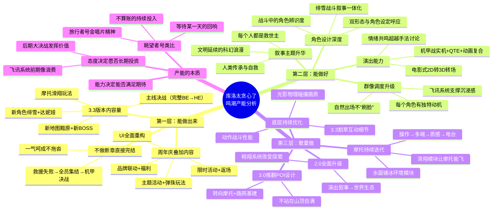

# 库洛太贪心了

> 来源：游戏葡萄
> 作者：秋秋
> 原始链接：https://mp.weixin.qq.com/s/jh5HNyDFwmQAUtvkw2DPuQ

---

## Phase 3: 概要总览

本文以《鸣潮》3.3二周年版本为切入点，深入剖析库洛的"产能"策略。文章将库洛的产能分为三个层次：第一层"能做出来"——3.3版本不仅包含主线决战、新角色绯雪和达妮娅、新地图黯原、新BOSS、摩托滑翔玩法，还叠加了全套周年庆活动、联动和UI重构，堪称"两三个版本塞进一个版本"；第二层"能做好"——机甲战从CG变成实机可玩+QTE的复合体验，角色设计（如绯雪的战斗叙事）和群像调度（每个角色都有独特价值）超越了简单堆料；第三层"敢重做"——从1.X到2.0的全方位升级，到3.0放弃成熟的POI设计转向"摩托+路网"，再到3.3让摩托能"飞"，库洛始终在推倒重来、迭代优化。文章以"眺望者号"采集星海回响的剧情收尾，类比旅行者号金唱片，点出产能的本质：既是能力也是态度，是愿意为长期价值"不算账"的投入。

---

## Phase 4: 思维导图

---

## Phase 5-6: 提问与回答

### Level 1 - 事实性问题

**Q1: 《鸣潮》3.3版本包含哪些主要内容？**

A: 3.3版本是《鸣潮》二周年版本，包含：主线大决战（救援爱弥斯、驾驶隧者对抗阿列夫一）、新角色绯雪和达妮娅、新地图「黯原」、新BOSS（达妮娅黑化版和阿列夫一机甲投影版）、新声骸套装、摩托滑翔玩法、UI全面重构。此外叠加了周年庆活动：主题活动「小团快跑·锦标赛」、弹珠玩法「星弹奇游」、各类限时/返场活动和品牌联动。

**Q2: 文章将库洛的产能分为哪三个层次？**

A: 第一层"能做出来"——内容量的堆叠，把多个版本的内容塞进一个版本；第二层"能做好"——超越简单堆料，在演出、角色设计、群像调度上追求品质和沉浸感；第三层"敢重做"——不断推翻已上线的成熟内容，迭代优化底层系统。

**Q3: 3.3版本的机甲战有什么特别之处？**

A: 机甲战不是一次性CG演出，而是做成了实机可玩+QTE演出+动画演出的复合体验。主线过完后，玩家还能在副本中反复体验。从3.0版本玩家第一次看到隧者就在期待"开机甲"，到3.3版本真正落地。

### Level 2 - 理解性问题

**Q1: 为什么文章认为库洛"贪心"？这种"贪心"体现在哪些方面？**

A: "贪心"在这里是褒义用法，指库洛不满足于做一个"够用"的版本。具体体现：①内容量上，把两三个版本的内容全塞进周年庆一个版本，而非分期释放；②叙事上，不做BE断章收割情绪，而是直接给出一气呵成的完整故事；③品质上，机甲战不做取巧的CG短片，硬做成了实机可玩的复合体验；④迭代上，不躺在已验证的成功方案上（如2.X的POI设计），持续推倒重来。

**Q2: 文章说《鸣潮》的演出已经"从用了什么手法过渡到了让我感受到了什么"，这意味着什么？**

A: 这标志着库洛的演出能力进入了成熟阶段。早期玩家讨论的是"用了什么转场技巧""这段运镜如何"，关注的是制作手法本身；现在玩家讨论的是"这段让我泪目了""情绪共鸣在哪里"，关注的是情感效果。这表明库洛的手法已经内化为基本功，不再被观众"察觉"到技巧的存在，达到了"大巧不工"的境界。

**Q3: 飞讯系统在3.3大决战中如何"发挥价值"？**

A: 飞讯系统是3.0新增的文字交互系统，当时补齐了所有地区所有角色的对话内容，看起来像是"浪费产能"。但在3.3大决战的全员地图搜集符文环节，库洛用了全地图角色标点+飞讯联系反馈进度来推进搜集任务——谁在哪、正在干嘛一目了然。这种沉浸感如果没有飞讯系统支撑，只能用播片或台词带过，体验会大打折扣。这是"当年埋下的种子后来开花"的典型案例。

### Level 3 - 分析性问题

**Q1: 库洛"敢重做"的策略在商业上是否合理？对游戏策划有什么启示？**

A: 从短期商业角度看，推翻已验证成功的方案（如2.X的POI设计→3.0的摩托+路网）确实存在风险——不仅浪费前期投入，还可能引发玩家不适（如从翱翔降级到地面前行）。但从长线运营角度看，这种策略有几个关键价值：①防止玩家产生"版本疲劳"，每次大版本都有新鲜感；②积累多元化的设计方法论，团队能力不固化在单一模式上；③向玩家传递"我们还在进步"的信号，维持社区信心。

对游戏策划的启示：①存量内容的迭代不能只看短期ROI，有些投入的价值需要时间发酵（如飞讯系统）；②"重做"不等于否定过去，而是基于积累进行新的探索（2.X的POI经验支撑了3.0的路网设计）；③迭代需要同时兼顾宏观架构（翱翔→摩托+路网）和微观细节（割草互动、各向异性采样）。

**Q2: 文章结尾用"旅行者号金唱片"类比库洛的产能策略，这个类比是否准确？对游戏行业有什么普遍意义？**

A: 这个类比传神但需要审慎看待。旅行者号的发射确实没有短期回报预期——它在1977年发射，至今近50年仍在飞行，其科学价值和象征意义远超任何功利计算。库洛的某些投入（如飞讯系统、底层优化）确实类似这种"不算账"的长期主义。

但也有局限：游戏是商业产品，不可能完全不计回报。库洛能持续"贪心"，前提是《鸣潮》的商业表现足够支撑——如果没有流水打底，"推倒重来"可能变成"挥霍资源"。所以准确的表述应该是：在核心商业指标健康的前提下，库洛愿意把超额利润再投资到长期品质上，而不是追求短期利润最大化。

对游戏行业的普遍意义：中国游戏行业长期存在"赚快钱"的惯性，库洛的做法提供了一种"慢即是快"的样本——当品质积累到一定程度，品牌效应和用户忠诚度会成为更持久的竞争壁垒。

**Q3: 从《鸣潮》3.3版本的设计中，可以提取哪些可落地的设计原则适用于自走棋/策略游戏？**

A: 虽然品类差异很大，但以下几个原则可以迁移：

1. **群像角色的功能差异化**：3.3中每个角色都有独特动机和价值（琳奈超速搜集符文、西格莉卡符文精通），不是简单"分点元气"。自走棋棋子设计中，同一羁绊/阵营的角色应该有互补而非重叠的功能定位。

2. **战斗叙事的一体化**：绯雪的设计（巫女身份→双刀优雅、射箭天赋→蓄力弓箭、冰雪主题→视觉元素统一）展示了角色"人设-动作-特效"的闭环。自走棋棋子可以从角色背景故事中提取核心tag，转化为战斗机制中的辨识性特征。

3. **不做取巧方案，做"实机复合体验"**：机甲战不做CG而是做可玩内容。在自走棋中，特殊机制（如BOSS战、特殊事件）应该设计为引擎内可实现、可复用的系统，而非一次性播片。

4. **"当时看来浪费，后来开花"的埋点思维**：飞讯系统的渐进式价值释放。自走棋的底层系统设计时应该预留扩展接口，即使当前版本用不上，未来可能成为差异化玩法的支撑。

5. **"不做断章"的节奏完整性**：3.3不给玩家BE断章，而是一气呵成给到完整体验。自走棋赛季/版本的节奏设计也应该考虑给玩家完整闭环，而非强行分段制造悬念。

---

## 📝 设计笔记

### 核心洞察

库洛的"贪心"本质上是一种**以长期品质换取品牌壁垒**的策略。在《鸣潮》商业表现趋于稳定后，库洛没有选择"降本增效"或"稳扎稳打"，而是持续把超额利润投入到品质积累中——无论是内容量的堆叠、品质的精细化（机甲战实机化），还是底层系统的重构（摩托迭代、UI重做）。这种策略的风险在于短期ROI不显，但收益在于构建了难以复制的竞争壁垒：玩家习惯了"每次都有惊喜"后，对竞品的容忍阈值会显著提高。

### 可借鉴的设计点

1. **版本节奏的"超预期"设计**：将一个版本的内容量做到"两三个版本"之和，用"过度交付"建立口碑
2. **高光时刻的"实机化"**：机甲战不做CG取巧，做成实机可玩+可复用的系统，提升沉浸感的同时也降低了后续内容复用的边际成本
3. **底层系统的"埋点投资"**（如飞讯系统）：看似浪费的投入可能在未来的叙事场景中成为关键支撑
4. **角色设计的"人设-机制闭环"**：战斗动作、技能特效、视觉元素全部服务于角色人设，避免"换个皮肤"的流水线感
5. **群像角色的"功能锚点"**：每个角色在剧情中/战斗中都应有独特的、不可替代的价值定位

---

*处理时间：2026-05-03 08:20 UTC*
