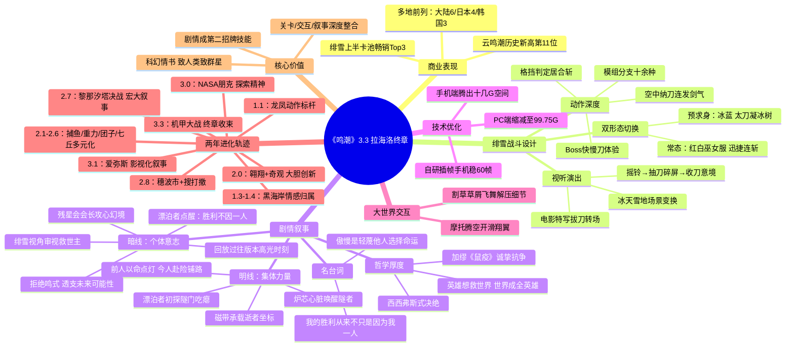

# 畅销Top3，又一次杀青：库洛神了！

> 来源：游戏那点事Gamez
> 作者：西泽步
> 原始链接：https://mp.weixin.qq.com/s/XAeT9lIrexj8Dcmm1rDYgw

---

## Phase 3: 概要总览

本文是《鸣潮》3.3版本「自星海尽处回响」的深度评测。作为两周年兼拉海洛地区终章，该版本上线即登iOS畅销榜多地前列（大陆第六、日本第四、韩国第三），《云·鸣潮》创下历史新高。文章从三个维度展开分析：一是新角色绯雪的双形态战斗设计——巫女服+冰蓝太刀双形态切换，动作模组十余种且支持格挡居合与空中纳刀，堪称"夯中夯"；二是剧情层面——在已知结局救回爱弥斯的前提下，库洛通过"磁带"这一科幻意象完成叙事升华，前人以命点灯、今人赴险铺路的文明接力令人动容，绯雪拒绝成为鸣式共鸣者的个体意志选择则注入了西西弗斯式的哲学厚度；三是两年来《鸣潮》的进化轨迹——从单纯堆料到关卡、交互、叙事深度整合，剧情已成为与动作设计并驾齐驱的"招牌技能"。文章认为，库洛以务实与专注，成功将《鸣潮》打造为懂得用游戏语言讲好故事的多面手产品。

---

## Phase 4: 思维导图

---

## Phase 5-6: 提问与回答

### Level 1 - 事实性问题

**Q1: 《鸣潮》3.3版本上线后在各地区的畅销表现如何？**

A: 截至发稿前，凭借绯雪上半卡池表现，《鸣潮》在iOS游戏畅销榜攀升至中国大陆第六、日本第四、中国台湾第三、韩国第三，《云·鸣潮》来到中国大陆第11位，创下历史最好成绩。

**Q2: 新角色绯雪的战斗设计有哪些核心特征？**

A: 绯雪拥有双形态切换机制——常态为红白巫女服，点按迅捷连斩，长按箭术三连；切换至"预求身"形态时转为冰蓝服饰，太刀挥斩可凝出冰树。动作模组分支多达十余种，可在任意连段中插入具有格挡判定的居合斩，支持空中纳刀与连发剑气。二段大招的演出逻辑为：摇铃特写→抽刀碎屏→收刀呈现巫女立于冰树圆月下的意境。

**Q3: 剧情中磁带的叙事功能是什么？**

A: 磁带最初是拉海洛地区的特色终端，拥有记录信息的仪式感。在终章中，爱弥斯的磁带倒转后，迸发出远超容量上限的海量空间坐标——这些坐标是过去被虚质磁暴吞噬的普通人，在深渊中自愿献出生命最后微弱频率所篆刻下的隧者方位。

**Q4: 残星会会长对绯雪施展了什么攻心手段？**

A: 会长拟态成等待巫女的"往人"，将绯雪拖入幕布与器材交织的梦核幻境，像放电影一般向她展示漂泊者过往一次次力挽狂澜的成功战绩（包括2.7版本击败利维亚坦的画面），以此放大主角的"神性"高光来反衬"凡人"的无力感，逼迫绯雪献出精神力天赋。

**Q5: 3.3版本在技术优化方面有哪些改进？**

A: 手机端包体大小优化腾出了十几G内存空间，PC端包体缩减至99.75G。同时引入了测试版的自研插帧技术，手机跑60帧更加流畅稳定。此外新增了摩托车腾空时直接张开滑翔翼的载具交互，以及割草时草屑飞舞等细节。

---

### Level 2 - 理解性问题

**Q1: 文章为什么强调"能在大家猜得到结局的故事里，依然把过程讲得鲜活丰满，是一件了不起的事"？**

A: 3.3版本作为拉海洛终章，救回爱弥斯、战胜阿列夫一的大团圆结局在玩家预期之中。相比于3.1版本爱弥斯悲剧的意难平或2.7版本八个版本铺垫才迎来的释放，3.3在悬念营造和情绪回味上先天不占优势。但库洛通过两条叙事线的交织——明线（集体力量：逝者以命点灯→众人赴险铺路→漂泊者决战）和暗线（个体意志：绯雪审视救世主→拒绝鸣式→被漂泊者点醒），在高密度剧情节奏中赋予每个角色饱满的弧光，使"已知结局"的过程体验依然鲜活丰满。这体现了编剧在既定框架下调动情感节奏的能力。

**Q2: 漂泊者对绯雪说的"我的胜利，从来不只是因为我一人"在叙事结构上发挥了什么作用？**

A: 这句话是3.3版本叙事主题的集中表达，在结构上完成了三重功能：①对绯雪——打破了她对"救世主"孤独痛苦的刻板认知，让她从透支自己的恶性循环中解脱出来，完成了角色成长；②对故事主题——呼应了前半段磁带中逝者坐标、众人收集符文、炉芯心脏等集体力量的铺垫，使明暗两条叙事线在此交汇；③对两年历程——在二周年节点回望玩家经历，暗示漂泊者从1.1龙凤到3.3拉海洛的所有胜利都不是孤胆英雄的神话，形成了"文明接力"的宏大叙事闭环。

**Q3: 文章如何论证"剧情已成为《鸣潮》与动作设计并驾齐驱的第二招牌技能"？**

A: 文章通过纵向回顾两年的版本进化轨迹来论证：1.1龙凤→1.3-1.4黑海岸→2.0黎那汐塔→2.7决战→3.1爱弥斯→3.3拉海洛终章，每个版本都在持续积累叙事能力。具体表现为：角色塑造从"立得住"到"有弧光"，叙事手法从线性到多线交织+影视化转场，主题从信仰意义到探索精神+人类意志，情感表达从震撼到深刻（引用加缪和西西弗斯）。最终结论是"不再只是一个能玩的故事，而是懂得用游戏语言讲好故事的多面手产品"——叙事不再依附于玩法，而是在关卡设计、交互体验、视听演出中与玩法深度融合。

---

### Level 3 - 分析性问题

**Q1: 《鸣潮》3.3版本在"故事→经历"的转化上有哪些值得游戏设计师借鉴的手法？**

A: 可以从以下维度分析：

**1. 主角受挫的叙事授权**：漂泊者初探隧门即被击退，"主角光环吃瘪"的处理手法打破了"玩家永远正确"的惯性，让玩家体验无力感的同时，也为后续群像登场创造了合理的叙事空间。这在数值成长型游戏中尤为难得——它意味着设计师敢于在关键时刻削弱玩家的权力感，以换取更强的戏剧张力。

**2. 玩法叙事化的三类资产复用**：版本投放了三组大型动作资产（迎战黑化达妮娅、驾驶隧者机甲对拼、一阶段机甲战），每一组都是独立的玩法模块。关键在于它们都被嵌入了叙事节奏中——不是"打过场→看过场"的割裂，而是战斗本身承载着情绪释放（复仇）、角色关系（并肩）、世界观呈现（机甲vs机甲）。建议自走棋等品类也可以将"关键战斗"设计为带有叙事属性的特殊对局。

**3. 世界状态与情感联动**：绯雪释放二段大时场景化为冰天雪地，若不主动终结则雪景持续存在。这种"玩家可控的世界状态变化"将叙事中的"巫女的孤独"具象化为玩家可感知、可操作的环境变化。类似思路可应用于自走棋的棋盘/场景设计中，让关键棋子登场时触发环境效果。

**4. 科幻道具的情感转义**：磁带从"记录信息的终端"升华为"逝者生命最后的坐标载体"，完成了道具从功能到情感的语义跃迁。这提示设计师：游戏中的功能性系统（背包、图鉴、道具）可以被赋予叙事第二义，在关键时刻完成情感升华。

**5. 跨版本的情感连续性**：残星会会长向绯雪回放漂泊者过往战绩的设计，既是剧情需要，也是在二周年节点让玩家借绯雪视角"回顾自己的来时路"。这种打破第四面墙的体验实际上是在强化玩家对过去所有版本投入的情感投资回报，是长线运营游戏值得借鉴的玩家情感管理手法。

A: 库洛的内容运营方法论可归纳为"三阶进化模型"：

**关键原则**：每一阶都在前阶的"安全区"内做增量，而非每版本推翻重来。这种"累积型创新"而非"颠覆型创新"的思路，对长线运营尤为重要。

---

## 📝 设计笔记

### 核心洞察

- **"已知结局"不等于"无法精彩"**：当结局已被剧透（救回爱弥斯），叙事重心转向"过程中的选择和代价"——这正是自走棋等策略游戏可以借鉴的：胜负结果不是唯一叙事，每一步决策的戏剧性本身就有价值。

### 可借鉴的设计点

- **道具情感转义**：磁带从功能→叙事的语义跃迁思路，可用于自走棋的装备/信使系统
- **世界状态玩家可控**：战斗改变场景环境并持续保留的设计，可用于棋盘特效系统
- **主角受挫授群像权**：关键时刻让主角吃瘪来为配角创造高光空间
- **跨版本情感回顾**：在里程碑节点让玩家回顾过往成就的手法，可转化为赛季回顾/年录系统
- **三组资产串行投放**：将大型玩法内容分阶段嵌入叙事节奏而非一次性堆叠

---

*处理时间：2026-05-02 20:04 UTC*
