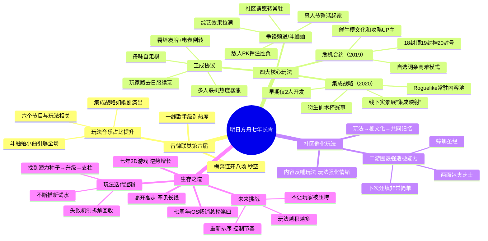

# 畅销总榜第四，鹰角这小日子过的

> 来源：游戏葡萄
> 作者：文/修理
> 原始链接：https://mp.weixin.qq.com/s/4981d20qLozh_6NudixhOQ
> 发布时间：2026-05-01

---

## Phase 3: 概要总览

本文以《明日方舟》第六届音律联觉音乐会为切入点，深入分析了鹰角七年长线运营的成功密码。音乐会现场，危机合约、集成战略、卫戍协议、争锋频道四大玩法主题曲引起全场狂欢，揭示了玩法记忆才是玩家最深的情感纽带。文章梳理了鹰角的玩法迭代逻辑：不断推新试水→找到潜力种子→持续升级→形成玩法支柱，失败模式的机制也不会浪费，会被拆解回收。社区在其中扮演催化剂角色——方舟玩家是二游圈最强造梗群体，将玩法提炼为文化符号，形成"内容反哺玩法、玩法强化情绪"的正向循环。面对一款2019年的2D游戏如今仍登顶iOS畅销榜第四的"反常"成绩，鹰角的答案很朴素：专注玩法就是生存之道。不过玩法越积越多后的节奏控制，将是下一阶段的核心课题。

---

## Phase 4: 思维导图

---

## Phase 5-6: 提问与回答

### Level 1 - 事实性问题

**Q1: 音律联觉第六届在哪个场馆举办，开了多少场？**

A: 在上海梅赛德斯-奔驰文化中心（梅奔）举办，连开八场，每轮开票都是秒空。

**Q2: 《明日方舟》七年来推出了多少个玩法模式？**

A: 不算各种迷你活动和节日彩蛋，已经超过十五个玩法模式。

**Q3: 文章提到的四个登上音律联觉的"重量级玩法"是哪四个？**

A: 危机合约、集成战略、卫戍协议、争锋频道（斗蛐蛐）。

**Q4: 集成战略最早由几个人开发？**

A: 最早只有两个人做肉鸽关卡。

**Q5: 争锋频道最初以什么形式出现？**

A: 最初是2024年愚人节的整活活动，把敌人放进竞技场互相PK，玩家下注押输赢。

---

### Level 2 - 理解性问题

**Q1: 为什么玩法BGM在音律联觉现场比其他类型的音乐更能引爆全场？**

A: 因为玩法音乐背后承载的是玩家真真切切投入过成百上千小时的真实记忆。乐声响起时，玩家脑中会闪过危机合约登顶的巅峰时刻、卫戍协议里胡过的牌、斗蛐蛐的综艺名场面——这种情绪不亚于剧情冲击，甚至从时间投入看，玩法才是大多数玩家的共同记忆基底。

**Q2: 《明日方舟》的玩法迭代逻辑是什么？为什么这种逻辑能持续七年？**

A: 核心逻辑是"不断推新玩法试水→从中找到有潜力的种子→不断迭代升级→直到它成为一根玩法支柱"。表现不够理想的模式不会浪费，机制会被拆解、回收，经验累积后再推陈出新。这种"不浪费任何一次尝试"的机制确保了迭代效率极高，七年积累下来形成了一套丰富且差异化的玩法矩阵。

**Q3: 文章所述"社区催化玩法"机制具体是如何运作的？**

A: 这是一个三阶段循环：①社区将玩法体验提炼为易于传播的梗和文化符号（如危机合约催生"下次还填非常简单"、斗蛐蛐催生"部分选手缺乏职业道德"）；②这些梗成为玩家间的共同语言和身份认同；③新玩家被文化符号吸引入坑→体验玩法→产生新的共同记忆→继续造梗传播。社区充当了"玩法体验→文化符号→社交裂变"的转化器。

**Q4: 为什么说《明日方舟》的逆势增长是"反常"的？**

A: 三点反常：①19年的2D游戏按理早该被时代淘汰，但它仍在创造新高；②游戏行业高开低走很常见，低开高走也不稀奇，但高开高走还一高好几年极其罕见；③多数二游五年后玩家粘性靠情感惯性维持，与"好不好玩"关系不大，但《明日方舟》一直在用新玩法提供新鲜感。

---

### Level 3 - 分析性问题

---

## 📝 设计笔记

### 核心洞察

"玩法让玩家留下来，在长期的游玩中积累共同记忆。这些记忆支撑起社交裂变，拉来新人，新人又因为玩法留下来，继续这个循环。"——这是《明日方舟》七年长青的最底层逻辑。玩法不仅仅是留住玩家的工具，更是社区文化的原材料。

### 可借鉴的设计点

1. **"试水→升级→支柱"的玩法迭代模型**：以低成本的限时活动测试玩法概念，验证成功后再投入资源打磨为常驻内容
2. **社区化玩法设计**：在设计玩法时就考虑其"传播性"——是否容易产生名场面、梗、讨论话题
3. **失败回收机制**：即便不成功的玩法尝试也不浪费，机制拆解后用于后续设计
4. **玩法主题差异化**：同一模式的不同主题要有足够的机制差异和辨识度（如集成战略的骰子/密文板/通宝/零件系统）
5. **让音乐/文化成为玩法的延伸**：为重要玩法定制主题曲，将其转化为超越游戏本身的文化产品

---

*处理时间：2026-05-02 13:19 UTC*
