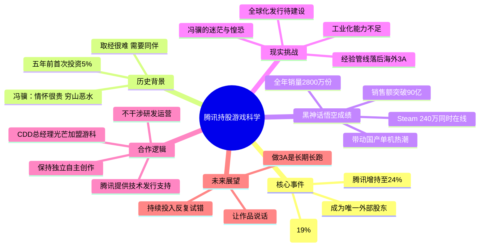

# 腾讯成唯一外部股东，持股24%：游戏科学更自由了？

> 来源：游戏那点事Gamez
> 原始链接：https://mp.weixin.qq.com/s/hDQkZxHHqS2ssseU_fiHPA

---

## Phase 3: 概要总览（200-300字）

2026年5月1日，企查查信息显示游戏科学完成股权变更——英雄金控（原持股19%）退出，腾讯增持至24%，成为唯一外部股东。这一变动呼应了五年前冯骥的名言"情怀很贵，穷山恶水。取经很难，需要同伴。"自2024年8月《黑神话：悟空》上线以来，游戏全球大获成功（Steam 240万同时在线、全年2800万份销量、销售额破90亿），带动了国产单机市场热潮。但冯骥坦言内心迷茫，国产3A在经验、管线、工业化等方面仍落后于海外顶尖大厂，做3A是一场需要持续投入、反复试错、不断迭代的长跑。腾讯此前已在技术和发行上给予大量支持，CDD总经理光芒于去年10月加入游戏科学。此次增持未改变其"独立自主做内容"的初衷——腾讯一向不干涉被投公司的研发运营。这背后折射出一个现实：当团队站上更高台阶后，单打独斗难以为继，需要更坚实的"同伴"来支撑长线投入。正如冯骥所说："让作品说话。"

---

## Phase 4: 思维导图

---

## Phase 5-6: 提问与回答

### Level 1 - 事实性问题

**Q1: 此次股权变更中，腾讯持股比例从多少增至多少？英雄金控原持股比例是多少？**

A: 腾讯持股从5%增至24%，退出的英雄金控原持股19%。

**Q2: 《黑神话：悟空》上线后取得了哪些具体成绩？**

A: Steam 240万同时在线人数，2025年全年销量预估2800万份，销售额突破90亿元。

**Q3: 腾讯互娱CDD总经理是谁，何时加入游戏科学？**

A: 光芒（腾讯互娱内容生态部CDD总经理），于2025年10月加入游戏科学。

**Q4: 游戏科学的公司全称是什么？**

A: 深圳游科互动。

---

### Level 2 - 理解性问题

**Q1: 为什么游戏科学愿意接受腾讯进一步增持？**

A: 核心原因有三：①腾讯历来不干涉被投公司的研发和运营，游戏科学可保持"独立自主做内容"的初衷；②腾讯此前已在技术和发行上给予大量支持，双方有深度合作基础；③当团队站上更高台阶后，单打独斗难以为继——3A游戏的持续开发需要稳定的资金、技术和资源支撑，腾讯是最合适的"同伴"。

**Q2: 冯骥所说的"穷山恶水"具体指什么？**

A: 指国内单机/3A游戏市场的长期困境：缺乏工业化开发经验和完善的管线体系、资金投入巨大但市场回报不确定、人才储备不足、全球化发行和品牌建设能力薄弱。即使《黑神话：悟空》大获成功，这些结构性短板并未一夜之间消失——冯骥自己也坦言"迷茫、虚无与惶恐"。

**Q3: 腾讯对游戏科学的投资模式与其他投资/收购有何不同？**

A: 腾讯对游戏科学的投资模式是典型的"非控制型战略投资"：不谋求控制权，不干涉日常研发和运营决策，以提供技术、发行、资金等资源支持为主。这与传统收购（控制决策权）或对赌型投资（业绩交换股权）有本质区别，更接近"合作伙伴"而非"掌控者"的模式。

---

### Level 3 - 分析性问题

**Q1: 腾讯成为唯一外部股东后，游戏科学真的"更自由"了吗？**

A: 表面上看持股比例增加意味着话语权增大，但实际分析呈现两面性：

**正面因素**：①腾讯一贯保持"不干涉"策略，历史上对Riot、Epic、FromSoftware等被投公司均给予高度自主权；②英雄金控退出后股权结构更集中，决策链路变短，可能反而提升运营效率；③单一外部股东且态度明确（不干涉），比多家股东各怀诉求更"清净"。

**潜在风险**：①24%的持股在关键决策上已有相当分量；②若未来腾讯战略方向变化，长期"不干涉"承诺能否持续存疑；③外部股东单一化意味着缺乏制衡力量，一旦关系生变，回旋余地变小。

总体而言，短期内游戏科学确实更"自由"——获得了更稳定的资源支持且减少了多头博弈的成本；但长期来看，这种"自由"是建立在双方信任和战略共识之上的，需要持续用"让作品说话"来维护。

**Q2: 国产3A游戏的长线发展需要哪些关键支撑？**

A: 从游戏科学的案例可归纳出四个关键维度：

1. **工业管线建设**：需要持续的UE5等引擎技术积累、标准化开发流程、大规模团队协作能力——这不是一款游戏能补齐的，需要反复迭代。
2. **稳定资金来源**：3A开发投入巨大（动辄数亿），单纯靠一款游戏的收入不可持续。游戏科学选择引入腾讯作为战略投资者，本质上是在构建"长线资金池"。
3. **全球化能力**：从《黑神话：悟空》2800万份销量来看，海外市场贡献了很大比例，未来国产3A必须建立全球化发行渠道和品牌认知。
4. **人才梯队**：不能只依赖核心创始人的个人能力。腾讯CDD总经理光芒加入游科、鸣谢名单中多名腾讯人员参与，都说明跨组织人才协作的必要性。

**Q3: 《黑神话：悟空》的成功模式能否被复制？**

A: 可部分复制，但完全重现难度极高：

**可复制的部分**：①验证了国产3A商业模式的可行性——高品质单机游戏在全球化市场可以盈利；②证明了"死磕品质+长周期研发"路径的合理性；③为后来者探索了UE5引擎的技术落地路径。

**难以复制的部分**：①天时——《黑神话》恰逢国产3A市场空白期，首因效应极强；②地利——基于国民级IP"西游记"，自带文化势能；③人和——游戏科学团队在《斗战神》时期积累的技术和叙事功底不可替代。

对其他团队而言，更务实的策略不是"复制黑神话"，而是"借鉴其方法论"：找到自己独特的文化IP、建立长期技术积累、选择适合自己的合作伙伴模式。

---

## 📝 设计笔记

### 核心洞察

1. **"不干涉"型战略投资是最佳的外部资源引入模式**：游戏科学证明，保持创作自主权的同时引入外部资源（资金、技术、发行）是完全可行的，关键在于选择价值观一致的"同伴"。
2. **成功之后更需要"同伴"**：很多人误以为《黑神话》成功后游戏科学可以高枕无忧，但实际上越是站上高位，后续投入越大，越需要稳定的外部支撑。

### 可借鉴的设计点

- **长线思维**：做大型游戏项目要有"长征"心态——不是靠一场战役定输赢，而是靠持续迭代积累势能
- **IP价值观先行**：游戏的商业化成功建立在"让作品说话"的价值观之上，产品品质是一切的前提
- **合作伙伴选择**：选择"不干涉创作"的合作伙伴比选择"给更多钱"的合作伙伴更重要

---

*处理时间：2026-05-02 16:15*
