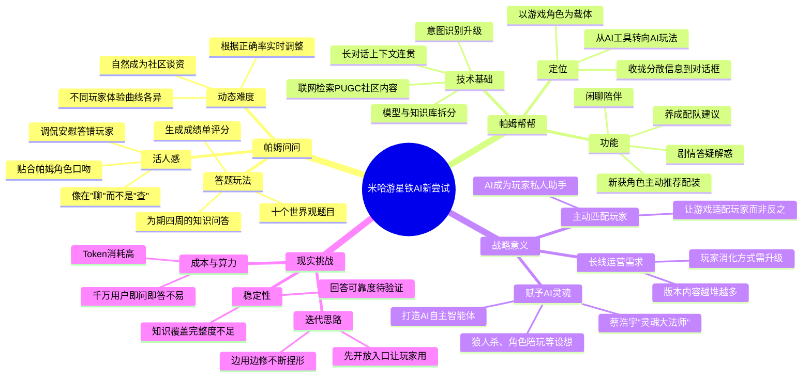

# 25-04-29 米哈游AI，今天做了一次新尝试

> 来源：游戏那点事Gamez
> 原始链接：https://mp.weixin.qq.com/s/DM-wtaoqsVYszZcEKIXUoQ

---

## Phase 3: 概要总览（200-300字）

本文报道了米哈游旗下《星铁》在2026年4月27日上线的AI驱动玩法"帕姆问问"——一个基于帕姆AI的答题活动。与传统的问答AI不同，帕姆AI展现出极强的"活人感"：它能贴合列车长帕姆的角色口吻，根据玩家正确率动态调整题目难度，答错时还会顺势讲解背景故事。文章进一步指出，"帕姆问问"只是帕姆AI的入口体验，真正的核心"帕姆帮帮"已于4月22日周年庆版本落地，提供养成配队、剧情答疑、闲聊陪伴等AI功能。技术上，帕姆AI采用模型与知识库拆分设计，支持意图识别、长对话上下文连贯和联网检索社区PUGC内容。文章认为，米哈游的AI战略并非单纯做工具，而是试图赋予AI"灵魂"，让AI从回答问题进化为参与Gameplay——这符合蔡浩宇"灵魂大法师"的技术愿景。文章同时指出，AI当前仍有成本和稳定性挑战，行业处于"边用边修"的阶段。

---

## Phase 4: 思维导图

---

## Phase 5-6: 提问与回答

### Level 1 - 事实性问题

**Q1: "帕姆问问"是什么时候上线的？具体是什么玩法？**

A: "帕姆问问"于2026年4月27日上线。它是一个基于AI驱动的答题活动，为期四周。第一周为知识问答环节，帕姆AI会给出十个有关《星铁》世界观的问题，根据玩家回答正确与否评估玩家对游戏的熟悉程度，并生成对应的"成绩单"。

**Q2: 帕姆AI背后用到了哪些技术？**

A: 根据米哈游在4月23日交大宣讲中的介绍：①模型与知识库拆分设计，让AI既能维持角色口吻又能调取后台世界观资料进行动态输出；②升级了意图识别功能，玩家用口语化描述也能被准确理解；③支持长对话上下文连贯，能自动补充前提把单独问题串成完整对话；④具备联网能力，可检索社区的PUGC内容来补充本地知识库。

**Q3: "帕姆帮帮"与"帕姆问问"是什么关系？**

A: "帕姆帮帮"是帕姆AI的真正功能本体，已于4月22日周年庆版本落地，提供养成配队、剧情答疑、闲聊等实际功能。"帕姆问问"则是帕姆AI的一个具象化入口和体验载体——玩家通过答题就能感受到这个AI"懂不懂《星铁》"，从而降低接受门槛，让玩家更容易习惯使用"帕姆帮帮"的各项功能。

### Level 2 - 理解性问题

**Q1: 为什么文章说帕姆AI的"活人感"是它与同类产品拉开差距的关键？**

A: 帕姆AI的"活人感"体现在多个层面：首先，它维持了帕姆这一角色的口吻和性格，回答方式贴合角色设定而非通用AI腔调；其次，它能主动根据上下文推断玩家意图，比如问完"配队"紧接着问"光锥呢"，帕姆能自动补充前提而不需要玩家重新说明；再次，在答题互动中帕姆会根据正确率调整态度，从调侃到安慰，让交互像对话而非查询。这种角色一致性+上下文连贯+情绪表达的组合，让玩家不觉得在跟"机械AI"对话，而是在跟一个游戏里的"NPC朋友"聊天。

**Q2: 米哈游做AI的核心思路是什么？与传统"先做好再上线"的功能开发逻辑有何不同？**

A: 米哈游的AI核心思路是"让游戏主动匹配玩家需求"而非让玩家适应游戏。与传统功能开发逻辑的差异在于：传统做法是"把路径定好、把内容填上，等体验稳定后再引导玩家"；而米哈游是"先给入口让玩家去试，再根据反馈不断捏出AI后续的雏形"。这种"边用边修"的迭代模式，本质上是将AI视为一个需要玩家共同参与的"生长品"，而非一次性交付的"功能"。

**Q3: 帕姆AI的动态难度设计为什么能引发社区传播？**

A: 帕姆AI不会按固定顺序出题，而是根据玩家当前正确率实时调整难度。结果是每个玩家的答题体验完全不同——有人前面速通后面被高难题卡住，有人一路顺风最后一题翻车。这些不同的难度曲线自然成为玩家之间的谈资（"你第几题挂的""这题要怎么答"）。加上帕姆会根据表现生成不同tag，玩家从"自己玩一轮"变成"顺手发一下"，最终演变成"大家一起玩"，形成了自发的社交裂变传播。

### Level 3 - 分析性问题

**Q1: 从游戏设计角度看，帕姆AI的"模型+知识库拆分"架构对被赋予灵魂的NPC设计有何启示？**

A: 这个架构的核心价值在于实现了"角色人格"与"知识能力"的解耦。传统的游戏AI要么是固定对话树（缺乏智能但人格稳定），要么是通用大模型（有智能但缺乏角色一致性）。米哈游的拆分设计让模型负责对话能力和角色性格表达，知识库负责世界观信息的准确调取，两者互不干扰但协同工作。

对游戏NPC设计的启示：①**人格模块独立化**——将角色的语气、口吻、性格特征作为独立配置层，可复用到不同NPC上；②**知识库分层管理**——世界观信息、养成数据、攻略内容分库存储，AI按需调用，避免"一本手册打天下"的泛化回答；③**上下文记忆系统**——让NPC记住对话历史并自动补全前提，是从"问答式"进化到"对话式"的关键；④对自走棋等策略游戏而言，这种架构可以用来打造"教练型NPC"——用固定人格包裹动态策略建议，让AI推荐既专业又不失个性。

**Q2: 在Token成本高企的2026年，米哈游给千万级用户开放即问即答的AI玩法，其商业逻辑是什么？**

A: 看似烧钱，实则是战略投资：①**降低用户流失率**——长线运营游戏面临的最大问题是内容膨胀导致新老玩家断层，AI助手降低了新玩家的理解门槛和老玩家的回流成本，直接作用于留存指标；②**占据AI心智入口**——一旦玩家习惯在游戏内通过AI解决所有问题（查资料、配队、闲聊），这个AI入口就成为了用户行为的"收口器"，未来可以承载更多变现场景；③**数据飞轮**——千万用户的真实交互数据是训练更精准游戏AI的最佳语料，先发优势一旦建立便很难被追赶；④**品牌溢价**——"技术宅"的标签本身就是米哈游的核心竞争力之一，AI探索带来的品牌价值远超Token账单。

**Q3: 文章提到AI"不再止步于回答问题，而是参与到Gameplay之中"，结合自走棋品类，可以有哪些具体落地场景？**

①**AI教练/复盘助手**：对局结束后，AI助手基于玩家阵容、装备、站位进行复盘分析，用角色化的口吻（比如吉祥物NPC）给出建议，如"你第三轮没拿XX英雄，不然这局稳了喵~"——既有信息量又有情绪价值。

②**AI对手模拟**：让AI学习真实玩家的阵容偏好和决策模式，生成风格化的AI对手（如"激进型""稳健型""整活型"），丰富PVE体验和练习场景。

③**AI阵容推荐师**：基于玩家已有的英雄/装备池，AI实时分析当前对局形势，给出动态阵容过渡建议，替代传统静态攻略。这比单纯检索攻略更有价值，因为自走棋的决策高度依赖当前局面。

④**AI叙事填充**：在自动战斗间隙，让角色化的AI NPC对场上战况进行实时"解说"或"吐槽"，增加观战和挂机的娱乐性。

关键设计原则：AI输出必须锚定在具体游戏决策上（选什么、怎么放），而非泛泛之谈——这才是让AI从"工具"变为"玩法"的分水岭。

---

## 📝 设计笔记

### 核心洞察

米哈游对AI的定位不是"给游戏加一个AI功能"，而是"让AI重新定义玩家与游戏的交互范式"。帕姆AI从"问答式"到"对话式"再到"参与式"的演进路径，为整个游戏行业的AI集成提供了可参考的路线图。

### 可借鉴的设计点

1. **"先入口后功能"的推广策略**：用低门槛的答题玩法（帕姆问问）让玩家建立对AI的信任感，再自然过渡到实用功能（帕姆帮帮），比直接上线一个复杂的AI助手更容易被接受。

2. **角色人格与知识引擎解耦**：让NPC角色保持一致性的同时具备动态知识调用能力，这是"有灵魂的AI"的技术前提。

3. **动态难度作为社交货币**：让每个玩家的AI互动结果天然具备差异性，从而催生社交分享和社区传播。

4. **上下文记忆的对话设计**：允许玩家用省略语、代词进行连续提问而不需要每次补全上下文，是AI"拟人化"的关键体验突破。

---

*处理时间：2026-05-03 04:12 UTC*
