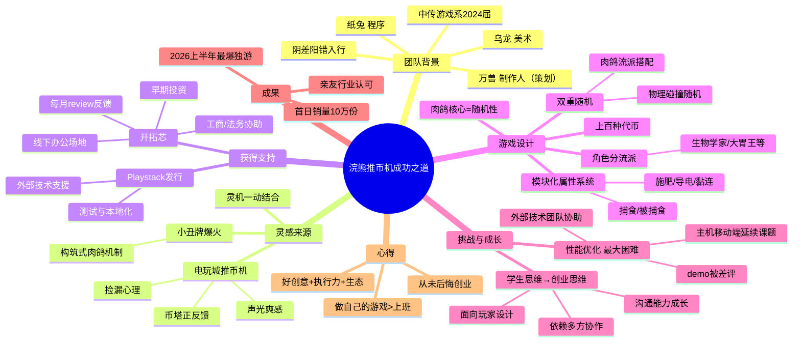

# 26-04-25 00后毕业生创业一年半，首日销量10万：我们和制作人聊了聊

> 来源：游戏葡萄
> 原始链接：https://mp.weixin.qq.com/s/-cIeIhTzlvbrZwyZ0rR3mA

---

## Phase 3: 概要总览

本文是游戏葡萄对独立游戏《浣熊推币机》制作人万兽的深度访谈。万兽与美术乌龙2024年从中国传媒大学游戏系毕业后，用两周时间搓出原型demo，获得开拓芯投资，拉程序纸兔入伙，三人用约一年半将游戏推上Steam。游戏上线24小时销量即突破10万份，成为2026上半年最爆的国产独游之一。

《浣熊推币机》的核心创意来自电玩城推币机与小丑牌构筑式肉鸽的灵机结合。游戏设计了上百种代币、模块化属性系统（捕食/施肥/导电等），让物理碰撞随机性与肉鸽流派搭配产生双重随机乐趣。项目最大挑战是性能优化——大量物理运动碰撞对设备性能要求高，demo曾因此被差评，后求助发行商Playstack引入外部技术支援才改善。

访谈记录了团队从"学生思维"到"创业思维"的转变：从闷头做游戏到面向玩家设计，从以为能自己扛宣传运营到依靠多方协作。万兽表示从未后悔选择创业——"上班是在为别人的游戏服务，做自己的游戏更自由地表达想法"。文章印证了好创意+执行力+生态支持（开拓芯投资/Playstack发行/外部技术）是独游成功的关键组合。

---

## Phase 4: 思维导图

---

## Phase 5-6: 提问与回答

### Level 1 - 事实性问题

**Q1: 《浣熊推币机》的团队成员分别是谁？**

A: 万兽担任制作人（策划），乌龙负责美术，纸兔负责程序。万兽和乌龙2024年毕业于中国传媒大学游戏系（艺术与科技「数字娱乐方向」），纸兔是后来拉入伙的。三人组成「浣犬游戏」工作室。

**Q2: 游戏的核心玩法机制是什么？**

A: 将推币机物理玩法与构筑式肉鸽（roguelike）结合。玩家在机台上投放代币，利用推板将币推下获得收益；同时游戏提供上百种代币（分不同流派效果）、芯片、礼品、挂件等道具，玩家可通过角色系统分隔大流派，在流派下根据随机道具搭配不同打法（如动物捕食、种树、做菜等）。

**Q3: 开拓芯和Playstack分别提供了什么支持？**

A: 开拓芯提供：①早期投资资金；②线下办公场地（帮省开销+社群交流）；③每月版本review反馈（如建议增加长按自动吐币功能）；④工商事务流程处理、公司事务辅导、合同翻译协助。Playstack提供：②测试和本地化支持；③引入外部技术团队协助性能优化。Playstack同时也是《小丑牌》的发行商，品类发行经验丰富。

### Level 2 - 理解性问题

**Q1: 为什么说《浣熊推币机》的随机性"比肉鸽更多"？**

A: 传统肉鸽的随机性主要来源于道具/流派的组合搭配。而《浣熊推币机》在此基础上叠加了**物理碰撞的随机性**——代币在机台上碰撞、推落的结果具有不可预测性。万兽自己也说，设计时很难预料代币和道具最终会碰出什么效果，往往要等实装后才能看到连锁反应（如化学家流派"噼里啪啦放烟花"）。这种「肉鸽搭配随机 + 物理碰撞随机」的双重随机，是游戏独特的卖点。

**Q2: 浣犬团队是如何解决模块化属性下代币冲突问题的？**

A: 他们先给代币预设大类模块化属性（捕食、被捕食、施肥、黏连、导电等），这本身不难。难点在于同属性下不同币种的细节冲突。万兽举了一个具体例子：狼币和猫币的模块化属性都是"捕食"，但如果两者捕食对象重叠，就会互相抢食物，影响游玩体验。最终他们对狼和猫的捕食对象做了区分。这说明在肉鸽道具系统中，大类属性分类只是第一层，细节设计的打磨才是关键。

**Q3: 万兽所说的"学生思维"和"创业思维"的区别是什么？**

A: 「学生思维」的特点：①不考虑受众——做学生作品时不需要想谁会玩；②不考虑性能优化和商业化落地；③以为什么都能自己扛——宣传片自己剪、社媒自己运营、研发发行一人包办；④闷头做游戏，不主动沟通。「创业思维」的转变：①面向玩家设计产品，考虑市场受众；②意识到好的产品需要多方协作（投资方、发行商、技术支援）；③主动沟通、对外合作，提升表达能力。万兽说这是她"最重要、关键的成长"。

### Level 3 - 分析性问题

**Q1: 从《浣熊推币机》的成功看，什么样的创意原型最容易获得投资？**

A: 访谈揭示了几个关键要素：①**已有的正反馈验证**——推币机在电玩城已被证明具有极强的正反馈循环（币塔目标→推落爽感→"不推完就亏了"的损失厌恶），创意不是凭空造出来的，而是嫁接在两个已被验证的体验之上（推币机+肉鸽）；②**可快速验证的原型**——两周就能搓出demo，商业模式、核心循环一目了然；③**差异化足够明确**——"推币机+肉鸽"这个组合在市场上极其罕见，开拓芯认为"最珍贵的就是团队的创意"。这提示独立游戏创业应寻找"已验证的核心体验 × 新的品类嫁接"的创意公式，且尽早用最小原型验证。

**Q2: 作为策划从业者，从《浣熊推币机》的设计中可以借鉴什么方法论？**

A: 三个可借鉴的设计思路：
1. **双重随机叠加**：在已有随机性框架（肉鸽Build）之上叠加物理层的随机性（推币碰撞），让每次游戏体验的不可预测性成倍增长，大幅提升可重复游玩性。
2. **模块化属性系统**：为道具预设大类属性（捕食/施肥/导电），先做大框架分类，再逐层细化。这降低了上百种代币之间的复杂度管理成本。
3. **跨品类观察启发设计**：万兽从抓娃娃机游戏《Cupiclaw 丘比娃娃机》的"水中抓奖品"获得灵感，思考推币机能否从地形角度做设计——最终实现了鱼骨装置（阻挡代币）。启示是：不要只盯着同品类竞品，跨品类的机制平移往往能带来新鲜感。

**Q3: 开拓芯的模式对游戏行业的孵化生态有何启示？**

A: 开拓芯的投资孵化模式有几点值得关注：①**不只投钱**——提供办公场地（解决实体成本+促进跨团队交流）、每月版本review（从商业化/专业玩家视角给反馈）、工商法务辅导。这种"资金+空间+智力+服务"的组合拳，恰到好处地补足了毕业生团队在商业经验和资源上的短板。②**押注创意而非规模**——开拓芯看重的是"团队的创意"和原型潜力，而非团队规模或过往履历。③**成效可见**——浣犬团队从demo到首日10万销量的路径证明了这个模式可行。对整个行业而言，这意味着"独立游戏孵化器+发行商+技术外包"的生态协作网络可以系统性地降低独立游戏创业门槛。

---

## 📝 设计笔记

### 核心洞察

1. **创意公式**：已验证的核心体验（推币机正反馈循环）× 新的品类嫁接（构筑式肉鸽）= 高辨识度的差异化产品
2. **独游成功三要素**：好创意 + 快速原型执行力 + 生态支持网络（孵化器/发行商/技术外包）
3. **从学生到创业者的转变**本质是：从"自己能做"的思维 → "需要谁一起做"的思维转变

### 可借鉴的设计点

1. **双重随机系统**：在确定性框架上叠加非确定性层（物理碰撞），赋予游戏独特的涌现式乐趣
2. **模块化属性分级**：先大类区分（捕食/施肥/导电），再逐级细化冲突关系，管理复杂度的同时保持设计空间
3. **跨品类启发**：从抓娃娃机 → 推币机地形设计（鱼骨装置），机制平移思维值得学习
4. **操作感迭代**：从单次按键吐币 → 长按自动吐币 + 鼠标左右键，小改进大体验提升

---

*处理时间：2026-05-04 16:09 UTC*
