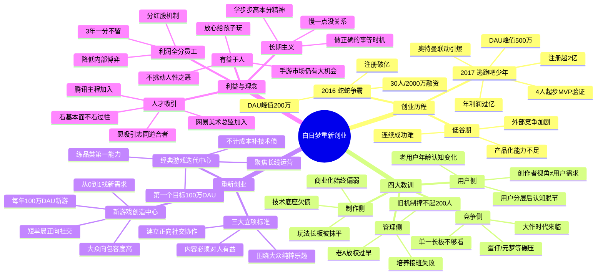

# 26-04-26 利润数亿、用户超2亿，深圳最隐秘的大DAU团队决定重新创业

> 来源：游戏葡萄
> 原始链接：https://mp.weixin.qq.com/s/PK17d6-mJAbZ55fwdZ5_zA

---

## Phase 3: 概要总览

白日梦是一家深圳的游戏公司，2016年以不到2000万融资起步，先后推出《蛇蛇争霸》（DAU峰值200万）和《逃跑吧！少年》（DAU峰值500万、注册超2亿、年利润过亿）两款大DAU产品。然而连续成功后，公司陷入"无法连续成功"的困境：玩法长板被竞品工业化水平抹平、创作者视角脱离真实用户需求、创始人放权过早导致方向缺失、组织机制难以支撑200人团队的规模化运营。2024年底创始人老A重返一线，宣布公司重新创业，将组织划分为"经典游戏迭代中心"（聚焦长线运营能力建设）和"新游戏创造中心"（从0到1做包容度高的大众向游戏），目标3-5年做出500万DAU经典游戏。公司坚持"乐趣与社交优先、有益于人"的理念，更推出3年利润全分员工的激进分红机制，试图让一群人开心地做成一件长期的事。

---

## Phase 4: 思维导图

---

## Phase 5-6: 提问与回答

### Level 1 - 事实性问题

**Q1: 白日梦公司成立至今推出了哪几款主要游戏？各自的DAU峰值和注册用户数是多少？**

A: 两款主要产品。第一款是2016年推出的《蛇蛇争霸》，贪吃蛇竞技类游戏，DAU峰值达到200万，注册用户破亿。第二款是2017年立项、2018年上线的《逃跑吧！少年》，非对称追逃游戏，DAU峰值在2023年暑期达到500万，注册用户超2亿，曾为公司贡献过亿年利润。

**Q2: 白日梦重新创业后，公司被划分为哪两个中心？各自的核心任务是什么？**

A: 划分为"经典游戏迭代中心"和"新游戏创造中心"。前者聚焦长线运营能力建设，以《逃跑吧！少年》为第一个任务，目标是沉淀通用的长线运营能力，不计成本地补上过去欠下的技术债和产品化功课；后者负责从0到1寻找大众用户未被满足的需求，目标是每年踏踏实实做出一款100万DAU的新游戏，不赌爆款，先按公司理念跑通模式。

**Q3: 老A宣布的3年利润分配承诺是什么？**

A: 公司在未来3年内赚到的所有利润将一分不留地全部分发给员工，核心员工免费获得"分红股"，让大家真正进入共同创业关系。3年后再视情况启动新的分配机制。公司账上还留有足够支撑未来几年发展的本金，所以可以把利润全部拿出来分给团队，帮助大家度过这段攻坚期。

---

### Level 2 - 理解性问题

**Q1: 白日梦在连续成功之后为什么会进入低谷期？核心症结是什么？**

A: 核心症结并非"做不出产品"，而是"没有把成功转化为能力"。具体表现在四个维度：

①**制作侧**：团队擅长从0到1的创意，但品质打磨、产品化、长线运营、技术底座这些"1到N"的能力一直没跟上。早期为了快速迭代牺牲了代码规范和美术品质，后期玩家频繁遭遇崩溃和断线问题。

②**用户侧**：创作者视角跑在了用户前面。老A举例一位核心成员在自己不满意的版本上打S级评价，理由是"我做到了我想做的"。当用户规模扩大、分层变复杂后，光凭体感和经验已经不够了。

③**管理侧**：老A推崇"不知有之"的管理理念，过早脱离业务一线，既没培养出合适的接班人，也没在关键期为团队指明方向。旧有"不管具体产品、全权交制作人"的机制能激发创意，却无法支撑200人大团队的稳定运营。

④**竞争侧**：2023年后行业进入大作时代，《蛋仔派对》《元梦之星》等头部产品工业化品质高、核心玩法成熟，白日梦早期赖以生存的单一"玩法长板"被全面抹平。

**Q2: 白日梦新确立的三个立项标准是什么？分别解决了过去的什么问题？**

A: 三个标准及其对应的问题：

①**围绕大众用户的纯粹乐趣**：解决了"创作者自嗨"问题。让团队把眼光从"我觉得有意思"转向用户真实的感受和体验，不能再靠创作者的主观判断替代用户需求。

②**能建立正向社交协作关系**：解决了"纯竞技导向"问题。当前多数手游靠挑动胜负欲留人，白日梦认为未来应该建立正向、有温度的社交关系，在协作多赢的方向里藏着未被满足的大机会。

③**游戏内容必须对人有益**：解决了"价值观底线"问题。不做血腥暴力游戏，不利用人性之恶。要求游戏能开拓想象力、锻炼策略思维、讲述动人故事或传递新知识，让家长放心给孩子玩。

这三个标准本质是将创作自由放入一个有纪律的框架内——方向被约束了，但框架内的创作自由是百分之百的。

**Q3: 老A对"做容易的事"和"做有价值的事"有什么区别看法？这对团队决策有什么影响？**

A: 老A的核心观点：容易实现的事不代表容易成功——用户不喜欢，前面做的一切都是白投入，而且"都不知道自己是怎么输的"。选择有价值的方向，就算面对失败，至少方向是对的，等能力再强一点、团队再壮一点，说不定就能成功。

这个认知对团队决策的深层影响是：白日梦不会因为某个方向"难"就放弃，也不会因为某个方向"容易"就转向。它需要团队持续练基本功，做正确的事，然后等待时机发生。老A以步步高体系为例——他亲眼看过太多人用这种"本分"的方式最终赚到了大钱，所以他愿意接受慢。

---

### Level 3 - 分析性问题

**Q1: 白日梦"利润全分员工"的机制能否支撑长线经营？这种分配逻辑有哪些潜在风险？**

A: 优势面：
- 短期内大幅降低内部博弈和资源竞争，让团队安心投入创作而非算账
- 吸引"纯粹热爱游戏"的人才而非"热爱挣钱"的人才，保持文化纯度
- 配合"公司只有一个利润池"的设计，避免了项目间赛马式恶性竞争
- 为从0到1的创新提供了安全感——失败也能共享利润池的保障

潜在风险：
- **3年期限后的悬崖效应**：一旦重启新分配机制，如果落差过大，可能引发核心人才流失，尤其那些已习惯高分红的人
- **长期研发储备金不足**：利润全分挤压了公司级研发弹药库，一旦3年内未出爆款且本金耗尽，公司抗风险能力将急剧下降
- **"搭便车"隐患**：不是所有人都有同等贡献，统一分享可能挫伤高绩效者的积极性，也可能让低绩效者失去改进动力
- **退出机制空白**：如果3年后有人离开，分红股如何处理？文章未提及
- 本质上，这个机制是用短期利益确定性换长期创作专注度。但要持续，必须配合3年内跑出足够体量的商业回报来支撑下一轮分配

**Q2: 从创意驱动的0-1团队转型为有产品化能力的规模化团队，白日梦的这一探索对国内中小游戏团队有什么启示？**

A: 几个关键启示：

①**0-1和1-N需要两种完全不同的人**。白日梦过去的问题是用"创作者思维"打"长线运营的仗"，二者本质上不是同一种能力。中小团队在渡过早期存活阶段后，必须有意识地引入运营型人才，而不是让创作者强行兼任。

②**纪律是创作的底座，不是枷锁**。白日梦新机制要求"第一个月必须跑出核心MVP"，本质是用时间约束倒逼聚焦。中小团队常见的问题是创意发散无止境——如果没有硬性纪律，创意就会变成拖延。

③**早期成功极容易掩盖能力短板**。白日梦靠两款大DAU产品赚了数亿利润，但一直到2022年都没解决产品化问题。中小团队在产品数据好时要保持清醒：是运气红利还是可复用的能力？

④**创始人"退得太靠后"是危险的**。老A承认自己在公司跨越期过早放权。对中小团队而言，在从0到1到10的关键阶段，一号位仍然需要冲在最前面收集信息、创造价值——把仗打完了，把框架建起来，再谈放权。

⑤**重新创业需要"不计成本"的决心**。白日梦对经典游戏迭代中心说"两三年内不计成本不计投入地搞定长线运营能力"，这种敢于押注核心短板的态度值得借鉴。

**Q3: 老A强调的"有益于人"游戏理念，在商业化主导的行业环境下可持续吗？与Supercell/任天堂模式有何异同？**

A: 可持续性分析：
- **乐观面**：用户对"正能量游戏"有真实需求——文中提到有家长带孩子来参观公司、说孩子玩这个放心。手游是覆盖面最大的娱乐方式，"放心给孩子玩"确实是一个明确但未被充分满足的市场缺口。如果能跑通商业模型，这个差异化定位本身就是壁垒。
- **悲观面**：白日梦至今的商业化能力依然偏弱，如果做不出足够赚钱的好游戏，"有益于人"就只是一个无法持续的道德主张。老A自述物欲不高、愿意推迟买别墅，但他的员工未必全是这种人。

与Supercell的异同：
- **相同点**：都信奉"玩法创新+小型团队+快速MVP验证"；都容忍失败甚至"庆祝失败"；都认为乐趣在商业化之前
- **差异点**：Supercell追求的是"全球数亿人玩很多年"的纯粹商业成功，不特别强调"道德价值"维度；白日梦额外加了一层"对人有益"的价值观筛选，这在商业逻辑上增加了约束条件

与任天堂的异同：
- **相同点**：都追求"全家人都能放心玩"的游戏品质；都认为游戏应该带来正向体验而非单纯的胜负刺激
- **差异点**：任天堂有极强的IP护城河和硬件平台生态来支撑其理念；白日梦作为手游开发商，只能靠产品力和用户口碑，没有生态兜底

**核心判断**：这个理念能否持续，取决于白日梦能否在3-5年内至少跑出一款"既叫好又叫座"的标杆产品，完成"有益于人→用户认可→商业回报→更多投入"的正循环。在此之前，它更多是一种富有魅力的信念，而非已验证的模式。

---

## 📝 设计笔记

### 核心洞察

白日梦的经历揭示了一个对游戏团队极具普遍性的规律：**从0到1和从1到N，需要的不是能力的线性增强，而是能力的结构性重组。** 擅长"做出好玩的东西"的人，未必擅长"让好玩的持续好玩下去"——前者需要创作者直觉，后者需要用户服务思维。大多数中小团队的困境不是创意枯竭，而是错把砍柴刀当成了整个军工厂。

### 可借鉴的设计点

1. **MVP硬性时限机制**：新创意必须在第一个月内跑出核心MVP版本，一切以客观数据和用户反馈为唯一标准。这倒逼团队聚焦核心乐趣而非外围打磨，避免创意在完美主义中消耗殆尽。

2. **"通用道具卡"设计思维**：《逃跑吧！少年》因资源不足做不出复杂角色模型，反而沉淀出"十几个简单道具排列组合出几十种玩法"的设计范式。这本质上是一种高性价比的内容杠杆——投入少、变化多、更新空间大。对中小团队的启示是：资源有限时，做可组合的通用系统比做定制化内容更划算。

3. **IP联动"功能化"而非"皮肤化"**：白日梦做奥特曼联动时没有套壳卖皮肤，而是观察到粉丝线下喜欢收集交换卡牌，直接把卡牌玩法做进游戏中。这比简单的IP植入更能引发用户共鸣和裂变。核心原则：IP联动的设计逻辑应该来自用户已有的行为习惯，而非品牌方的授权需求。

4. **"正向社交"作为差异化定位**：在几乎所有手游都在用胜负和排名驱动留存时，白日梦押注"建立正向、有温度的社交关系"。这是一种反共识的战略选择——如果成功，它就拥有了一个几乎无对手的用户心智定位。

---

*处理时间：2026-05-04 08:04*
