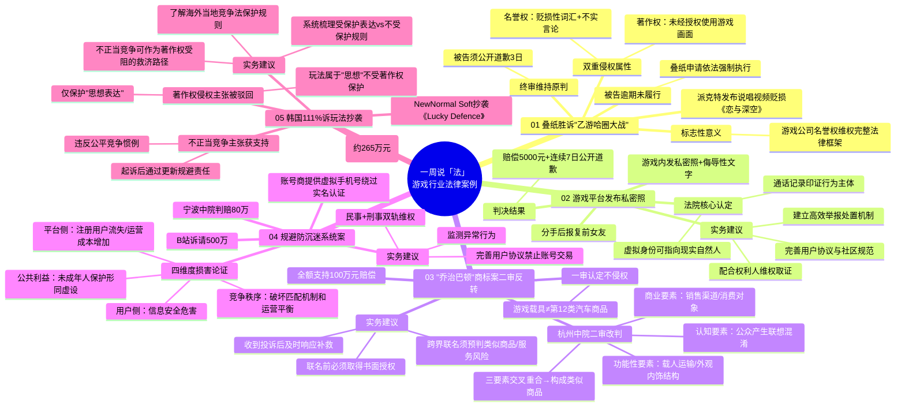

# 26-04-26 叠纸胜诉，"乙游哈圈大战"落幕，律师解读 | 一周说「法」

> 来源：游戏葡萄
> 作者：诺诚游戏法 朱骏超 曾思雨
> 原始链接：https://mp.weixin.qq.com/s/eraffNctQA3QxQ3-6GAVjg

---

## Phase 3: 概要总览

本文为游戏葡萄"一周说「法」"专栏，由诺诚游戏法律师团队梳理了近期5个游戏行业相关法律案例。核心案件是叠纸诉派克特名誉侵权案终审胜诉——说唱歌手派克特因发布贬损《恋与深空》的说唱视频并擅自使用游戏画面，被法院认定同时侵犯著作权与名誉权，须公开道歉3日，成为游戏公司名誉权维权的标志性案例。其他案例包括：男子在游戏平台发布前女友私密照被判名誉侵权，法院明确虚拟身份可指向现实自然人；"乔治巴顿"商标案二审反转，杭州中院认定游戏虚拟载具与实体汽车构成类似商品，改判商标侵权并全额支持100万元赔偿；B站诉账号销售商规避防沉迷系统案，宁波中院从平台、用户、竞争秩序、公共利益四维度论证损害，判赔80万元；韩国111%诉玩法抄袭案，著作权主张被驳回但不正当竞争主张获支持，判赔约265万元。每个案例均附律师实务建议，对游戏公司合规运营具有重要参考价值。

---

## Phase 4: 思维导图

---

## Phase 5-6: 提问与回答

### Level 1 - 事实性问题

**Q1: 叠纸诉派克特案中，法院认定的侵权行为具有哪双重属性？**

A: 法院认定派克特的侵权行为具有双重属性：一是著作权侵权——未经授权使用《恋与深空》游戏画面制作说唱视频，侵犯了叠纸公司的信息网络传播权、保护作品完整权；二是名誉权侵权——歌词中使用"无良游戏""毒害下一代"等贬损性词汇，且涉及年龄审核机制的不实言论，构成对公司名誉权的侵害。叠纸在诉讼中同时主张了这两项权利，最终均获法院支持。

**Q2: 韩国111%诉抄袭案中，法院驳回了什么主张？支持了什么主张？判赔金额是多少？**

A: 首尔中央地方法院驳回了111%关于著作权侵权的所有主张，原因是韩国著作权法对游戏"玩法规则"的保护持谨慎态度——玩法属于"思想"范畴，著作权仅保护"思想表达"。但同时，法院支持了不正当竞争的主张，认定NewNormal Soft在被起诉后通过更新来规避法律责任的行为违反了公平的商业惯例和竞争秩序。最终判令被告赔偿约5.57亿韩元（约合人民币265万元）及迟延损害金。

**Q3: "乔治巴顿"商标案一审与二审的核心分歧是什么？**

A: 核心分歧在于"游戏中的虚拟载具与实体汽车是否构成类似商品"。一审法院机械地以商标类目表划分，认为游戏载具与第12类汽车商品不属于同类商品，不构成侵权。杭州中院二审则从三个维度综合判断：功能性要素（载人运输、外观内饰结构一致）、商业要素（销售渠道和消费对象有交叉）、认知要素（相关公众容易产生汽车品牌与游戏之间存在特定联系的混淆认识），认定二者存在交叉重合，构成类似商品，进而改判构成商标侵权。

### Level 2 - 理解性问题

**Q1: 为什么"乙游哈圈大战"案被视为游戏公司名誉权维权的标志性案例？**

A: 该案具有三重标志性意义。第一，它是游戏公司主动通过民事诉讼对抗公众人物/网络大V名誉侵权的成功范例——叠纸公司在舆论发酵后迅速发表严正声明、限时要求删帖道歉、随后提起民事诉讼，形成了"声明警告→证据固定→民事诉讼"的完整维权链条。第二，法院同时认定著作权侵权与名誉权侵权并存，为游戏公司在面对类似"网络暴力+内容侵权"复合型舆情时提供了双路径维权的法律框架参考。第三，被告方为具有一定影响力的公众人物（说唱歌手），案件的公开审理和胜诉结果产生了较强的社会示范效应，对其他潜在侵权者形成威慑。值得注意的是，被告逾期未履行道歉义务后，叠纸明确表示将申请依法执行判决，展示了将法律维权进行到底的决心。

**Q2: 杭州中院二审改判"乔治巴顿"商标案的理由是什么？这给游戏公司品牌联名带来什么警示？**

A: 杭州中院从三个维度推翻了一审判决：功能用途维度——虚拟载具与实体汽车在载人运输功能、外观和内饰结构上高度相似；商业维度——玩家群体与购车消费者存在交叉，销售渠道和消费对象有重合；认知维度——相关公众在接触"官方正版授权"等宣传内容后，容易产生汽车品牌与游戏之间存在特定联系的混淆认识。这三个维度的交叉重合使法院认定虚拟载具与汽车构成类似商品。

核心警示：商品类似判断不以商标类目表为唯一标准，法院会从实际混淆可能性综合认定。游戏公司做品牌联名时，不能仅凭"跨类目=不侵权"的简单判断；必须在联名前取得商标权利人书面授权，审慎核实授权范围、期限和地域，保留完整授权链文件；对跨界联名（汽车、快消品、奢侈品等）须进行专门的类似商品/服务分析，预判侵权风险；收到侵权投诉后应及时评估并采取补救措施。

**Q3: 宁波中院从哪四个层面论证了账号交易平台规避防沉迷系统的损害后果？**

A: 宁波中院构建了四维度损害论证体系：第一，平台侧——被告大规模销售B服账号导致B站注册用户减少、增值服务交易机会流失、平台监管和运营成本增加；第二，用户侧——危害游戏用户的信息安全；第三，竞争秩序——破坏游戏匹配机制和运营平衡，违反账号实名制和禁止交易等行业公认商业道德；第四，社会公共利益——帮助未成年人绕过实名认证和防沉迷系统，导致国家未成年人网络保护相关规定形同虚设，损害未成年人合法权益。这种将未成年人保护纳入不正当竞争损害论证的司法逻辑，使80万元赔偿额具有充分的事实和法理基础，也为游戏公司打击账号交易黑产提供了多维度的诉讼策略参考。

### Level 3 - 分析性问题

**Q1: 综合五个案例，游戏公司在法律合规方面应该建立怎样的系统性防御框架？**

A: 从五个案例中可提炼出四个维度的系统性合规防御框架：

**一、知识产权主动布局层**（对应案例03、05）
- 对游戏核心表达（角色设计、美术画面、UI布局、剧情文本、音乐音效等）进行系统梳理，区分"受保护表达"与"不受保护规则"，明确维权着力点
- 品牌联名合规流程：联名前→取得书面授权+核实授权链完整性；联名中→审慎评估类似商品/服务风险（从功能、消费对象、公众认知三维度）；联名后→保留完整授权文件备查
- 出海合规：了解目标市场知识产权保护规则差异，提前制定针对性风险防控方案（如韩国玩法不受著作权保护但反不正当竞争可救济）

**二、用户治理合规层**（对应案例02、04）
- 用户协议：明确禁止发布他人隐私信息、侮辱性言论、账号交易出借等行为，约定违规处罚措施
- 举报处置：建立高效的举报入口→处置→反馈闭环机制，设定明确处置时限，避免"知情不处理"的连带责任风险
- 技术监测：对频繁注册、异常登录、短时间内大量购买等行为进行自动识别和风控
- 维权配合：依据法院协助调查要求，及时封存数据、提供用户信息，为受害者提供平台支持

**三、舆情与诉讼应对层**（对应案例01）
- 建立"声明警告→证据固定→民事诉讼"的标准化舆情维权流程
- 在面对复合型侵权（名誉权+著作权）时，同时主张多路径维权
- 判决执行跟进：胜诉不等于终点，持续跟进执行情况，必要时申请强制执行
- 将成功维权案例对外发声，形成行业示范效应和威慑力

**四、外部协同层**（对应案例04）
- 对于情节严重的黑产，采用民事+刑事双轨维权策略
- 将打击账号交易黑产作为向监管部门证明平台已尽到实名认证义务的合规证据
- 参与行业自律组织，推动形成行业公认的商业道德标准

四个层面形成"预防→监测→应对→协同"的闭环体系，不是被动应对而是主动构建合规护城河。

**Q2: 韩国案例中"玩法不受著作权保护但可通过反不正当竞争维权"的逻辑，对中国游戏出海有何启示？**

A: 该案的司法逻辑揭示了游戏出海维权的三个关键洞察：

**第一，认清"思想/表达二分法"的全球共识。** 各国著作权法基本一致认为游戏玩法属于"思想"范畴不受保护，这是底层法律现实。游戏公司在出海前不能指望通过著作权来保护核心玩法，必须放弃"玩法专利化"的幻想，将保护重心转移到具体的表达层面——角色形象、UI设计、美术资产、剧情文本等。

**第二，积极利用反不正当竞争法作为替代救济路径。** 韩国案例的关键亮点在于，虽然著作权主张被驳回，但不正当竞争主张获得了支持。法院关注的是被告的"行为"（起诉后通过更新规避责任）而非"成果"（游戏本身是否抄袭）。这意味着，在中国游戏出海时，应重点关注竞品的不正当行为证据——如恶意模仿营销宣传、虚假授权声明、利用原作品口碑搭便车等，这些在反不正当竞争框架下更容易获得支持。

**第三，建立目标市场的差异化法律策略。** 不同国家对玩法保护的态度存在差异：韩国通过了"游戏产业振兴法"修订案加强反不正当竞争保护；日本通过"不正竞争防止法"提供商品形态模仿保护；美国通过商标法、商业外观和反不正当竞争综合保护。游戏公司应针对不同出海市场制定差异化的知识产权布局方案，包括提前进行著作权登记、商标注册、了解当地判例趋势等。

---

## 📝 设计笔记

### 核心洞察

本期五个案例涵盖了游戏公司在实际运营中可能遇到的四类法律风险：外部舆情攻击（案例01）、平台内用户侵权（案例02）、商业合作合规（案例03）、黑产对抗（案例04）、产品被抄袭的跨国维权（案例05）。从战斗/系统策划视角来看，案例02中"虚拟身份可指向现实自然人"的判决尤为关键——这意味着游戏内的社交系统、聊天系统、公会系统的设计需要考虑用户治理和侵权防范，实名制不仅是一个技术问题，更是一个法律风险防控问题。

### 可借鉴的设计点

- **社交系统风控设计**：在聊天、公会公告等UGC场景增加敏感词过滤和举报入口，参考案例02判决中"知情不处理=连带责任"的逻辑，确保举报处理时效有明确SOP
- **防沉迷系统防绕过设计**：案例04展示了绕行手法的技术细节（虚拟手机号+接码平台），在设计实名认证流程时可增加手机号有效性校验、设备指纹绑定等加固措施

---

*处理时间：2026-05-04 12:04*
