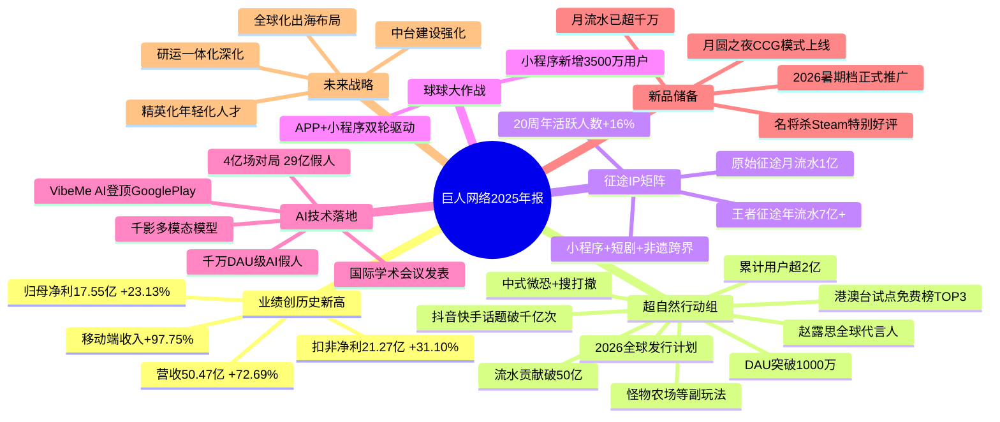

# 26-04-26 突然爆发：上海大厂收入暴涨73%，新品贡献破50亿流水

> 来源：游戏那点事Gamez
> 原始链接：https://mp.weixin.qq.com/s/xpdzX2yp5-Zvx8equTPngw

---

## Phase 3: 概要总览

巨人网络2025年报显示，公司营收首次突破50亿元大关，达到50.47亿元，同比增长72.69%，归母净利润17.55亿元（+23.13%），创上市以来最佳业绩。增长的核心引擎是新品《超自然行动组》——这款以"中式微恐+搜打撤"差异化玩法突围的产品，累计注册用户超2亿、贡献流水突破50亿元。与此同时，征途IP在小程序端持续发力：《原始征途》月流水重回1亿元，《王者征途》年流水突破7亿。AI方面，巨人推出了国内首个千万DAU级原生AI玩法"AI假人"，对局数破4亿场；AI视频产品VibeMe AI登顶美国Google Play摄影榜。新品储备方面，卡牌游戏《月圆之夜》上线CCG模式、《名将杀》Steam获特别好评。巨人网络正从"一个爆款"走向"多引擎驱动"的可持续发展阶段。

---

## Phase 4: 思维导图

---

## Phase 5-6: 提问与回答

### Level 1 - 事实性问题

**Q1: 巨人网络2025年营收和利润的具体数字是多少？**

A: 2025年巨人网络实现营业收入50.47亿元，同比增长72.69%；归母净利润17.55亿元，同比增长23.13%；扣非归母净利润21.27亿元，同比增长31.10%。这是巨人网络自上市以来营收与净利均创新高的一年。

**Q2: 《超自然行动组》的核心玩法和市场表现如何？**

A: 《超自然行动组》于2025年1月23日上线，核心玩法定位于"中式微恐+搜打撤"（搜索、打斗、撤离），属于差异化战术竞技品类。市场表现方面：长期位居iOS免费榜TOP10、畅销榜最高第4名，DAU突破1000万；截至2026年Q1累计注册用户超2亿，累计流水突破50亿元；海外方面已在港澳台试点，进入当地免费榜前三，计划2026年面向全球发行。

**Q3: 巨人网络的AI布局具体包含哪些内容？**

A: AI布局包含三个层面：①游戏内原生AI玩法——在《超自然行动组》中推出"AI假人"，截至2026年Q1参与对局数突破4亿场，累计生成AI假人超29亿，是国内首个千万DAU级游戏原生AI玩法；②AI模型研发——持续优化"千影Qian Ying"多模态模型，成果发表于ACMMM、ICASSP、Inter Speech等国际学术会议；③AI产品化——面向海外推出AI视频内容生成产品VibeMe AI，上线后登顶美国、新加坡Google Play摄影榜第一。此外，公司已实现广告投放、客户服务等全业务流程的AI化。

### Level 2 - 理解性问题

**Q1: 巨人网络收入暴涨73%背后的增长结构是怎样的？是多点开花还是单点爆发？**

A: 增长结构呈现"一超多强"格局。核心爆款《超自然行动组》贡献了最主要的增量（50亿流水），但并非唯一增长引擎：移动端网络游戏收入同比增长97.75%，其中征途小程序矩阵表现亮眼——《原始征途》月流水重回1亿元（+18%），《王者征途》年流水突破7亿；《球球大作战》通过小程序新增3500万用户实现扩圈；其他业务收入增长164.34%。可以说，巨人网络正在从依赖单一爆款转向"新旗舰+老IP焕新+小程序矩阵"的多引擎驱动模式。

**Q2: 《超自然行动组》的成功可以复制吗？巨人为此做了哪些长线布局？**

A: 巨人围绕《超自然行动组》进行了系统性的长线运营布局：①玩法层面——推出怪物农场等特色副玩法，建设UGC作者生态以维持内容新鲜度；②品牌层面——签约赵露思为全球代言人，抖音快手双平台话题播放量破千亿次；③跨界联动——开展IP跨界、非遗文旅联动；④出海试水——先在港澳台验证（进入免费榜前三），再规划2026年全球发行。这套"玩法迭代+品牌营销+跨界破圈+海外验证"的组合拳，显示出巨人已形成可复用的爆款运营方法论。

**Q3: AI在巨人网络的定位是什么？是提效工具还是核心竞争力？**

A: 巨人对AI的定位已从"提效工具"升级为"核心竞争壁垒"。年报明确显示公司已实现业务流程全AI化，但更重要的是将AI作为玩法创新——"AI假人"不是简单的NPC，而是融入核心对局的玩法设计，4亿场对局和29亿假人的数据证明了其市场接受度。同时，巨人在AI模型研发（千影系列，国际顶级会议发表）和AI产品化（VibeMe AI登顶多国榜单）两条线上都有实质性产出，形成了"研究→应用→产品"的完整AI能力闭环。这使其在游戏+AI融合领域具备先行优势。

### Level 3 - 分析性问题

**Q1: 巨人网络从"征途依赖"到"超自然行动组接棒"，对传统MMO大厂的转型有什么启示？**

A: 巨人网络的转型路径对传统MMO大厂具有重要参考价值：①不抛弃老IP，而是通过小程序/短剧/跨界联动等新渠道焕新——征途IP在20周年时活跃人数反增16%，证明老IP在新渠道中仍有爆发力；②新品不走MMO老路，而是切入"搜打撤"这一新兴赛道，以"中式微恐"进行差异化定位，精准捕捉了战术竞技品类的细分需求；③不把鸡蛋放一个篮子里——同步布局卡牌（月圆之夜、名将杀）、休闲竞技（球球大作战），形成品类矩阵。启示在于：转型不是"推翻重来"，而是"老IP做加法（渠道创新）+ 新品做减法（细分聚焦）+ 品类做乘法（矩阵协同）"。

**Q2: 巨人将AI融入游戏核心玩法的做法（AI假人），对游戏设计有什么示范意义？**

A: "AI假人"案例对游戏设计有三重示范意义。第一，AI不再只是幕后工具（降本增效），而是成为前端玩法——玩家与AI假人对战本身就是一种新型游戏体验，这打破了"AI=自动化"的狭义认知。第二，规模化验证了AI原生玩法的商业可行性——4亿场对局意味着玩家不是"尝鲜"而是"常玩"，AI假人已成为留存和活跃的重要支撑。第三，它揭示了一个趋势：在多人竞技游戏中，AI可以解决"匹配等待"和"新手挫败感"两大痛点——用AI假人填充对局、平滑难度曲线，本质上是AI在"优化玩家体验漏斗"。对自走棋等品类而言，AI驱动的"智能对手"或"动态难度调节"是值得探索的方向。

**Q3: 巨人网络2025年的成功是否存在可持续性风险？结合其产品线和战略分析。**

A: 存在以下潜在风险：①单品依赖风险——《超自然行动组》贡献了绝大部分增量收入，若该产品进入自然衰退期而缺乏同等量级的接棒产品，增速将显著放缓；②搜打撤赛道竞争加剧——随着沐瞳等厂商入局同一赛道，差异化优势可能被稀释；③新品验证周期——《名将杀》月流水刚过千万，与《超自然行动组》50亿体量差距悬殊，能否成长为下一支柱尚待市场验证；④全球化不确定性——港澳台试水成功不等于全球成功，不同市场的文化适配、运营策略、合规要求差异巨大。正面因素则是：巨人已形成可复用的爆款方法论，小程序矩阵提供稳定现金流，AI布局形成长期壁垒。总体判断，2025年是巨人"重新找准节奏"的一年，但持续高增长需要新品梯队和全球化两条线同时兑现。

---

## 📝 设计笔记

### 核心洞察

巨人网络案例展示了一个"传统MMO大厂"的经典转型样本：用爆款新品证明创新能力（超自然行动组搜打撤），用老IP矩阵稳住基本盘（征途小程序），用AI建立长期壁垒（AI假人+千影模型）。这套"新爆款 × 老IP焕新 × AI差异化"的三角架构，本质上是将短期业绩、中期增长、长期护城河三者进行了系统性规划。

### 可借鉴的设计点

1. **"差异化品类切入"策略**：超自然行动组选择"中式微恐+搜打撤"而非正面硬刚FPS/BR已有巨头，以文化差异化+玩法差异化双保险降低竞争烈度
2. **小程序矩阵作为"第二曲线"**：征途将老IP嫁接小程序渠道，实现低成本获客和流水增量——对自有IP的老牌厂商来说，小程序是性价比最高的存量激活手段
3. **AI从工具到玩法的跨越**：AI假人证明了"原生AI玩法"的市场接受度，对战斗设计者而言，AI驱动的智能对手、动态难度、个性化体验都是可探索的差异化方向
4. **"小步快跑"的出海策略**：先在港澳台验证再推全球，既控制风险又积累跨区域运营经验

---

*处理时间：2026-05-04 04:13 UTC*
