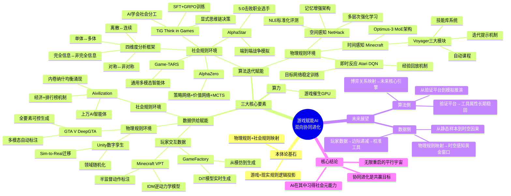

# 26-04-27 AI冲击游戏行业？AI需要游戏行业

> 来源：游戏葡萄
> 原始链接：https://mp.weixin.qq.com/s/T1A0MKJuVlLN8iIafpvOHA

---

## Phase 3: 概要总览

本文基于GBAI联合完美世界、三七互娱、腾讯开悟发布的《双向赋能：AI与游戏的协同进化》白皮书第三章，系统论证了游戏对AI发展的反向赋能价值。文章从本体论高度将游戏定义为现实世界物理规则与社会规则的"逻辑投影"，并围绕AI三大核心要素（算力、数据、算法）展开分析。算力层面，游戏催生了GPU；数据层面，游戏通过玩家交互数据（Minecraft VPT/GameFactory）、物理规则环境（GTA V DeepGTA/Unity数字孪生）和社会规则环境（Aivilization大规模多智能体模拟）三个维度为AI提供高质量训练数据；算法层面，游戏环境作为低成本试验场，推动了DQN经验回放、AlphaZero学习-搜索框架、AlphaStar端到端战争模拟、TiG思维链决策等关键算法突破。未来展望指出：玩家数据边际价值递减，而物理引擎赋能的时空感知训练正迎来黄金窗口期；算法侧将从验证工具升级为社会博弈模拟的关键引擎。核心结论：协同进化，而非单方面冲击，才是AI与游戏的共赢目标。

---

## Phase 4: 思维导图

---

## Phase 5-6: 提问与回答

### Level 1 - 事实性问题

**Q1: 白皮书《双向赋能：AI与游戏的协同进化》由哪些机构联合发布？**

A: 由大湾区人工智能应用研究院（GBAI）联合完美世界、三七互娱、腾讯开悟共同发布。文章节选自该白皮书第三章"游戏赋能AI技术发展"。

**Q2: OpenAI的VPT项目是如何利用《Minecraft》玩家数据训练AI的？**

A: VPT（Video PreTraining）通过四步流程：①用小规模真值轨迹训练IDM逆动力学模型，使其能仅观察视频推断键鼠动作；②用IDM对大规模公开视频自动标注，形成"视频-动作"弱监督数据；③通过行为克隆训练基础策略模型；④通过小样本微调或结合强化学习适配特定任务。核心创新在于以低成本将非结构化视频流转化为高质量训练资产。

**Q3: AlphaStar在星际争霸领域的里程碑成就是什么？**

A: 2018年12月19日的测试赛中，AlphaStar以5:0的绝对优势击败了Team Liquid战队的职业选手，成为星际争霸领域首个击败顶级职业选手的AI。其采用端到端深度神经网络架构，从原始游戏数据中学习，完整覆盖侦察、扩张、骚扰、决战等战争全流程。

### Level 2 - 理解性问题

**Q1: 游戏环境在数据赋能上的三个维度分别解决了AI发展的什么瓶颈？**

A: 三个维度精准对应AI发展的三大数据瓶颈——①玩家数据维度：解决了现实世界人类决策数据难以大规模采集的问题，将海量非结构化游玩记录转化为"状态-动作-反馈"结构化训练数据，帮助AI从模仿人类操作走向理解人类意图；②物理规则环境维度：解决了自动驾驶、具身智能等领域面临的"高成本、高风险、不可控"困境，通过游戏引擎对光学、动力学的高保真模拟，批量生成覆盖长尾分布的合成数据；③社会规则环境维度：解决了大规模社会实验的伦理风险与成本问题，通过经济系统+排行榜机制构建数字沙箱，让AI智能体在博弈中自发涌现社会行为数据。

**Q2: 从DQN到TiG，游戏环境如何推动AI算法的渐进式进化？**

A: 呈现清晰的"认知复杂度递增"进化路径——①DQN阶段（Atari）：解决最基础的物理交互问题，通过经验回放和目标网络两大机制实现了在动态环境中稳定训练，确立了强化学习的工程范式；②AlphaZero阶段（围棋）：在完全信息离散空间中验证了"网络直觉+搜索推演"范式的通用性；③AlphaStar阶段（星际争霸II）：引入连续时间+非完全信息+多兵种协同，挑战不确定性下的战略决策；④TiG阶段（王者荣耀）：叠加"多体协作+社会分工"维度，通过显式思维链训练使AI理解并内化复杂社会规则。每一步都是对前一阶段算法瓶颈的针对性突破。

**Q3: 文章提出的"四维度博弈能力分析框架"如何帮助我们理解游戏类型的AI训练价值？**

A: 四维度框架（单体/多体、离散/连续、对称/非对称、完全信息/非完全信息）提供了一条从简单到复杂的社会模拟进化曲线。维度"右移"意味着AI需要掌握更深层的社会认知能力：围棋（全左端）仅训练纯逻辑计算；RTS引入了连续时间与信息不确定性，要求动态控制与风险管理；MOBA进一步叠加多体维度，要求理解分工与团队协作；大逃杀FPS引入非对称性，模拟资源匮乏下的生存策略。这一框架为选择游戏类型作为AI训练环境提供了量化参考，也解释了为何不同游戏类型对应AI不同层级的认知能力跃迁。

### Level 3 - 分析性问题

**Q1: 白皮书提出"玩家交互数据的边际价值递减"，这意味着游戏行业的海量用户数据优势正在丧失吗？如何辩证看待这一趋势？**

A: 这一判断需要从三个层面辩证理解：①"边际价值递减"不等于"无价值"——人类玩家数据仍是AI对齐人类价值观的关键校准工具，确保AI行为不偏离人类的决策偏好和伦理底线；②AI训练范式的根本转变——从"向人类学习"到"自我对弈优化"（如AlphaZero从零开始自我进化），意味着AI的核心能力提升不再依赖人类数据，而是依赖环境规则的完备性，这对游戏设计提出了更高要求：规则的深度和复杂度本身才是价值所在；③数据价值的"质变转移"——价值正在从"人类行为数据"转向"环境规则数据"，即游戏引擎构建物理一致性的能力、模拟复杂社会博弈机制的能力变得比用户数据更稀缺。对游戏行业而言，这意味着需要重新定义自身的核心资产——不再是DAU和用户时长，而是游戏世界的规则深度与模拟能力。

**Q3: 在当前AI快速冲击游戏行业的背景下，这篇文章提出的"协同进化"观点对游戏从业者的心态和职业发展有什么启示？**

---

## 📝 设计笔记

### 核心洞察

1. **游戏=现实规则的逻辑投影**：从本体论高度重新定义游戏价值，为游戏行业在AI时代找到了不可替代的定位。游戏不是"虚拟的"，而是现实规则的"抽象映射"。

2. **玩家数据从燃料变为校准器**：AI训练范式从"人类学习"转向"自我对弈"，人类数据的核心价值从能力提升变为价值观对齐，这对游戏数据战略有深远影响。

3. **规则深度才是核心资产**：在AI时代，游戏公司的核心竞争力不再是用户规模，而是构建复杂、可度量、可复现的规则环境的能力。

### 可借鉴的设计点

- **四维度博弈框架**（单体/多体、离散/连续、对称/非对称、完全信息/非完全信息）可作为游戏类型分析和玩法设计的理论工具
- **"007内卷均衡"的启示**：Aivilization实验中单一量化指标导致AI集体内卷的现象，对游戏排行榜和经济系统的激励机制设计有直接警示意义
- **显式思维链训练**（TiG）：未来AI NPC的行为设计可借鉴"先思考再行动"的架构，使AI行为更可解释、更可控

---

*处理时间：2026-05-04 00:04 UTC*
