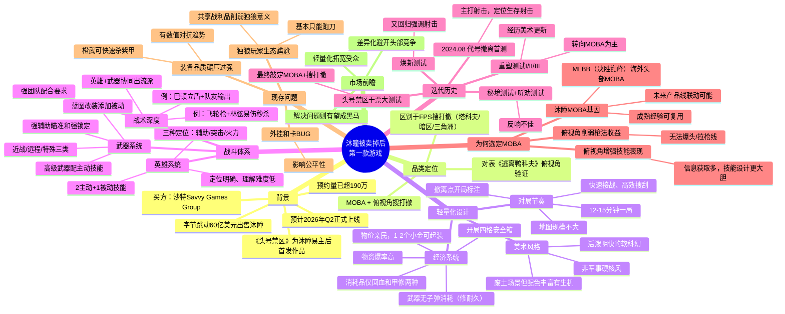

# 26-04-27 沐瞳被卖掉后第一款游戏：竟是搜打撤？

> 来源：游戏那点事Gamez
> 原始链接：https://mp.weixin.qq.com/s/y75vGBzFB_SJKglKVp8QWQ

---

## Phase 3: 概要总览

本文深度剖析沐瞳被字节跳动以60亿美元出售给沙特Savvy Games Group后的首款新作《头号禁区》。该游戏采用"MOBA+俯视角搜打撤"的融合玩法，预约量已超190万，预计2026年Q2上线。文章指出，《头号禁区》对传统搜打撤进行了三重轻量化改造：美术上采用活泼明快的软科幻风格替代军事硬核风；对局压缩至12-15分钟并提前标注关键点位加速节奏；经济系统大幅大方化——高爆率物资、亲民物价、简化背包管理。战斗层面，游戏以MOBA英雄体系（辅助/突击/火力）+武器系统（含高级武器主动技能和蓝图改装）构建"易上手有深度"的体验。文章梳理了游戏从2024年"代号：撤离"至今的7轮测试迭代史，指出其在射击与MOBA之间反复横跳后最终选定MOBA的深层原因——俯视角天然削弱射击精度收益而放大技能表现空间，且与沐瞳MOBA基因（MLBB）一脉相承。当前主要问题为装备品质碾压过强、独狼玩家生态位尴尬及外挂Bug。

---

## Phase 4: 思维导图

---

## Phase 5-6: 提问与回答

### Level 1 - 事实性问题

**Q1: 《头号禁区》的核心玩法是什么？由哪家开发商制作？**

A: 《头号禁区》的核心玩法是"MOBA + 俯视角搜打撤"的融合。由沐瞳（Moonton）开发，该公司此前被字节跳动以60亿美元出售给沙特Savvy Games Group。

**Q2: 游戏对传统搜打撤做了哪些轻量化处理？**

A: 三方面轻量化：①美术上用活泼明快的软科幻风格替代军事硬核风；②对局压缩至12-15分钟，撤离点开局标注，地图规模不大；③经济系统大幅简化——物资爆率高、武器无需子弹、消耗品仅两种、物价亲民。

**Q3: 游戏的英雄和武器系统是如何设计的？**

A: 英雄分辅助/突击/火力三种定位，每个英雄有2个主动+1个被动技能，定位明确。武器分近战/远程/特殊三类，均有强辅助瞄准和强锁定；蓝色品质及以上武器配有专属主动技能，可通过对局获取蓝图改装武器添加新被动。

**Q4: 游戏从立项至今经历了哪些测试阶段？**

A: 2024年8月以"代号：撤离"启动首测（主推射击）→秘境测试和听劝测试（反响不佳）→重塑测试I/II/III（转向MOBA）→焕新测试（又回归强调射击）→获得版号后以《头号禁区》名义开启"干票大测试"。共7轮迭代。

### Level 2 - 理解性问题

**Q1: 为什么《头号禁区》最终选择了MOBA而非射击作为核心战斗玩法？**

A: 三个深层原因：①俯视角天然削弱枪法收益——FPS中的爆头、拉枪线等进阶操作在俯视角中几乎无法实现，射击要素难以拉高玩法上限；②俯视角增强信息获取能力，技能设计和表现可以更加大胆，天然适配MOBA的团战博弈；③沐瞳自身拥有《决胜巅峰（MLBB）》这款海外头部MOBA手游的成熟经验和基因，选MOBA不仅可以复用技术积累，也为未来产品线间的联动打下基础。

**Q2: 《头号禁区》的轻量化设计如何平衡"降低门槛"与"保留深度"？**

A: 采用"操作降门槛、战术拉上限"的策略。操作层面：强辅助瞄准+强锁定降低瞄准依赖，英雄技能描述简单清晰，背包管理直观——让新玩家快速上手。战术层面：英雄定位明确且彼此依赖（如巴顿立盾需队友跟进输出），高级武器主动技能+蓝图改装催生多元化流派（如飞轮枪+林弦易伤秒杀流），MOBA团战逻辑让装备相同的情况下意识配合成为胜负关键。

**Q3: 沐瞳布局"俯视角搜打撤"赛道的时机有什么特别之处？**

A: 沐瞳在2024年8月启动首测时，《三角洲行动》尚未正式上线，"搜打撤"在国内还未得到大规模市场验证。这说明沐瞳在该玩法的公众认知度还很低时就已前瞻性布局。随后的市场走向——暗区突围将品类带火、三角洲5000万DAU验证大众接受度、逃离鸭科夫验证俯视角可行性——逐一证实了沐瞳的判断，展现了其战略眼光。

### Level 3 - 分析性问题

**Q1: 《头号禁区》能否在搜打撤红海中突围成功？需要克服哪些关键挑战？**

A: 突围潜力在于差异化定位：避开与暗区突围、三角洲行动的FPS硬核正面竞争，以轻量化+MOBA特色吸引更广泛的休闲玩家群体。但需克服三个关键挑战：①装备碾压问题必须解决——当前橙武可快速击杀紫甲，若不调整会催生纯数值对抗，抹杀操作和战术的深度价值；②独狼玩家体验需补齐——共享战利品机制使独狼只有跑刀一条路，而MOBA的团队依赖进一步放大了这个痛点，可能需要考虑匹配机制或单人模式；③外挂和Bug必须在正式上线前有效治理，否则会像许多搜打撤游戏一样陷入"外挂毁体验"的困局。如果这三个问题解决得当，凭借190万预约和沐瞳的发行能力，有成为黑马的潜力。

**Q2: 从游戏设计角度看，"MOBA+搜打撤"融合的内在逻辑是什么？这种融合的天花板在哪里？**

A: 内在逻辑在于两者天然互补：搜打撤提供"高风险高回报"的情感曲线（搜→打→撤的压力-释放循环），MOBA提供团队协作的策略深度和技能表达空间。俯视角又恰好是两者的交集——既是MOBA的标准视角也是降低搜打撤操作门槛的手段。天花板可能在于：①MOBA强调公平竞技（同一起跑线），搜打撤核心是"带入装备差异"，两者在数值公平性上存在内在矛盾，这正是当前装备碾压问题的根源；②搜打撤的"撤离成功"满足感来自个体，MOBA的满足感来自团队配合，两者的目标驱动逻辑不完全兼容；③品类融合越深，核心受众越可能两边不讨好——MOBA玩家嫌节奏太慢太随机，搜打撤玩家嫌不够硬核不够刺激。

**Q3: 沐瞳被出售给沙特资本后，对《头号禁区》乃至沐瞳整体战略可能产生什么影响？**

A: 正面影响：①沙特Savvy Games Group资金雄厚且对游戏产业有长期投入意愿，沐瞳可能获得比以前在字节体系下更专注的研发资源和更长线的耐心；②摆脱字节"快速变现"的压力后，团队可能在产品打磨上有更大自由度。潜在风险：①沙特资本对移动端游戏市场的理解深度和文化适配经验尚待验证，可能在发行策略上产生摩擦；②沐瞳从中国互联网巨头体系转入中东资本体系，管理文化、决策链路的改变可能带来短期适应成本；③作为易主后首发作品，《头号禁区》承载了"证明价值"的战略压力——如果表现不达预期，可能影响资本方对沐瞳整体团队的信心和后续投入。

---

## 📝 设计笔记

### 核心洞察

"品类融合不是简单的玩法拼接，而是找到两者的'最大公约视角'——俯视角既是MOBA的天然主场，也是降低搜打撤门槛的巧妙手段，沐瞳在这个交汇点上找到了自己的舒适区。"

### 可借鉴的设计点

1. **操作降门槛、战术拉上限**：强辅助瞄准让所有人能打中，英雄配合和武器改装让高手有发挥空间——这对自走棋等多英雄品类的技能难度曲线设计有参考价值
2. **经济系统"大方化"**：高爆率+低物价让玩家不惧失败、愿意重复尝试——这种"正向反馈频率优先于挑战性"的思路值得在休闲向系统中借鉴
3. **撤离点开局标注**：减少随机跑图时间、加速遇敌节奏——本质是用信息透明度换对局效率，适用于任何需要缩短无效时间的玩法设计
5. **美术风格决定玩法基调**：明快软科幻替代硬核军事，直接改变了玩家的心理预期和压力感受——验证了美术不只是"皮"，而是玩法体验的有机组成部分

---

*处理时间：2026-05-03 20:04*
