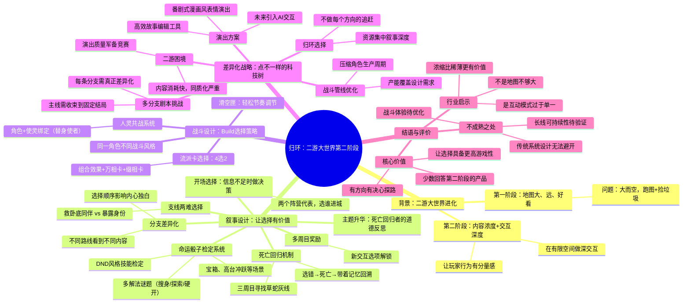

# 26-04-28 腾讯这款二游比别人都小，凭啥还能叫大世界？

> 来源：游戏葡萄
> 原始链接：https://mp.weixin.qq.com/s/aNnhjOUDiRVMo_Bmgmo9jw

---

## Phase 3: 概要总览（200-300字）

本文分析了腾讯萨罗斯工作室旗下二游《归环》的设计理念，探讨其作为二游大世界"第二阶段"产品的思路。文章指出，国产二游大世界的进化已从"把地图做大"的第一阶段，进入"比拼内容浓度与交互深度"的第二阶段。《归环》没有走军备竞赛式的堆量路线——它的地图不算大、NPC不算多，而是将资源高度集中在叙事深度上：通过精心设计的选择时刻、DND风格的命运骰子检定系统、死亡回归与时间回溯机制，让玩家的每一个选择都具有分量与后果。战斗方面的人灵共战系统同样强调Build选择的重要性。文章还揭示了团队的生产策略——搭建高效故事编辑工具、采用番剧式漫画风表情演出替代全3D CG、开发高效角色制作管线——以支撑差异化路线的产能需求。虽然游戏战斗体验和长线可持续性仍需验证，但《归环》是目前少数认真回答"第二阶段该怎么做"的产品，其核心洞察是：吸引玩家的不是地图有多大，而是这个世界和玩家能产生多少联系。

---

## Phase 4: 思维导图

---

## Phase 5-6: 提问与回答

### Level 1 - 事实性问题

**Q1: 《归环》是哪个工作室开发的？**

A: 《归环》由腾讯旗下萨罗斯工作室开发。

**Q2: 文章提出的二游大世界"第二阶段"的核心命题是什么？**

A: 第二阶段的命题是"不是更大，而是更高的浓度"——在有限的空间里把交互做深，把每一个玩家行为的分量感做出来。

**Q3: 《归环》的死亡回归机制是如何运作的？**

A: 玩家在游戏开场会面临选择（跟谁进城），做出选择后会经历一段剧情然后突然死亡。死亡后玩家带着记忆重新回到抉择点，可以选另一条路线。游戏利用了时间回溯让玩家体验不同视角，且选择顺序不同会导致内心独白和剧情文本发生变化。

**Q4: 《归环》战斗系统的核心机制是什么？**

A: 核心是人灵共战系统，角色与使灵（类似替身使者/Persona）绑定。每个使灵有4种战斗流派卡，但只能装备2张，不同组合产生不同效果。配合万相卡和缀相卡系统，同一角色可切换差别很大的战斗风格。

### Level 2 - 理解性问题

**Q1: 《归环》为什么不走"把地图做大"的路线，而是选择收缩世界尺度？**

A: 这是基于团队的差异化战略判断。他们认为当前二游市场同质化严重、玩家容易倦怠，在主流路径上追赶军备竞赛（更精致模型、更华丽演出、更大地图）是红海竞争。团队选择把资源集中在叙事深度上，核心逻辑是：能牢牢吸引住玩家的不是地图有多大，而是这个世界和玩家能产生多少联系。收缩世界尺度是服务于沉浸感和叙事浓度的主动选择，而非产能不足的妥协。

**Q2: 《归环》的多分支叙事如何解决演出产能问题？**

A: 归环采用了三层解决方案：①搭建高效的故事编辑工具支撑多分支内容批量生产；②大量采用番剧式漫画风表情演出替代全3D CG，这种方案辨识度高、与二次元审美贴合、产出效率更快；③未来规划引入AI交互进一步扩展内容产出。核心策略是"用更轻的形式覆盖更多的分支"，保证每条路都有对应的演出反馈，避免在每条分支上都投入全规格CG。

**Q3: 命运骰子检定系统在《归环》中起到了什么作用？**

A: 命运骰子不仅是一个玩法机制，更是一种代入工具。它让玩家时刻身处由命运和自身属性共同决定的冒险中，将DND风格的不确定性融入游戏体验。具体体现在：①路边的宝箱有检定（通过可跳过战斗）；②高台冲跃有检定（成功发现隐藏路径）；③宝箱任务有多种解法（硬开/搜身/探索），不同选择路径对应不同体验；④多周目信息会解锁新的检定交互选项。骰子系统让"选择"从小角落渗透到整体体验。

### Level 3 - 分析性问题

**Q1: 《归环》的"选择有意义"设计哲学与传统二游叙事设计的根本区别在哪里？**

A: 传统二游叙事中，玩家选择往往是被动的、缺乏反馈的——玩家阅读大量世界观设定但"认真看了也不会影响做决定"，选择基本不产生实质后果。归环的核心突破在于：①将选择时机前置且高密度化（开场即面临纠结的两难抉择）；②为选择赋予真实的、有代价的后果（"选择是有代价的"，选错会死）；③通过死亡回归机制让后果可感知、可回溯、可对比，玩家能切身体验到不同选择带来的不同世界；④将选择意识渗透到所有系统层面（主线、支线、战斗Build、骰子检定），让"做选择"本身成为核心游戏性而非叙事附属品。这种设计将内容型游戏的"被动消费"转化为"主动参与"。

A: 风险包括：①多分支叙事的版本迭代压力——主线必须收束到固定结局，但过程中要保持选择有意义，对编剧团队要求极高；②内容消耗速度可能更快——深度叙事意味着玩家对后续内容期待更高，版本更新压力更大；③商业化挑战——叙事驱动型游戏如何平衡Gacha付费与叙事完整性；④长线可持续性——多轮多周目叙事可能在数个版本后出现疲劳或逻辑漏洞。

**Q3: 文章提出的"浓缩比广袤更有价值"这一判断，对于当前中国游戏行业的资源配置有什么启示？**

---

## 📝 设计笔记

### 核心洞察

让"做选择"成为核心游戏性而非叙事附属品——通过死亡回归、骰子检定、多分支差异化，将内容型游戏从被动消费转化为主动参与。玩家和世界的"联系感"比世界的"规模感"更重要。

### 可借鉴的设计点

1. **选择性时刻的前置设计**：在游戏开场（玩家尚未投入情感时）就用高张力两难选择抓住注意力，而不是靠漫长的世界观灌输
2. **后果可视化与回溯**：死亡回归机制让选择后果成为可体验、可对比、可回溯的内容，形成学习闭环
3. **多解法任务设计**：同一关卡提供强制检定/探索/社交等多种解法路径，增加玩家自主权感
4. **轻量演出方案**：番剧式漫画表情替代全3D CG，在控制成本的同时保持辨识度
5. **生产管线工具化**：差异化路线的前提是配套的高效生产工具
6. **节奏调节**：高密度叙事+深度策略之间穿插滑空匣等爽快体验，防止疲劳

---

*处理时间：2026-05-03 16:12*
