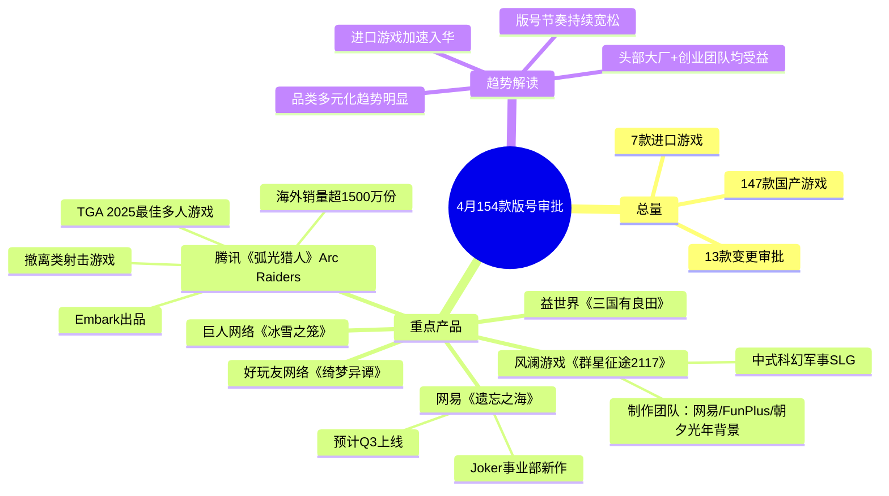

# 26-04-29 4月154款版号：网易遗忘之海、腾讯Arc Raiders获批

> 来源：游戏葡萄
> 作者：王丹
> 原始链接：https://mp.weixin.qq.com/s/jwJ5bCB2agAExq-EZs5E_g

---

## Phase 3: 概要总览（200-300字）

4月版号审批信息公布，共147款国产游戏+7款进口游戏获批，另有13款变更审批信息。本期重点产品：腾讯《弧光猎人》（Arc Raiders）是Embark出品撤离射击游戏，海外销量超1500万份，斩获TGA 2025最佳多人游戏；网易《遗忘之海》为Joker事业部新作，预计Q3上线；风澜游戏《群星征途2117》（代号Space）为中式科幻军事SLG，制作团队核心来自网易、FunPlus、朝夕光年等大厂。此外还有巨人网络《冰雪之笼》、益世界《三国有良田》、好玩友网络《绮梦异谭》等产品获批。本轮版号总量再创新高，头部大厂与创业团队均有斩获，版号审批节奏持续宽松，进口游戏加速入华。

---

## Phase 4: 思维导图

---

## Phase 5-6: 提问与回答

### Level 1 - 事实性问题

**Q1: 4月共多少款游戏获批版号？**

A: 共154款，其中147款国产游戏，7款进口游戏。另有13款游戏变更了审批信息。

**Q2: 《弧光猎人》是什么类型的游戏？海外表现如何？**

A: 《弧光猎人》是Embark旗下的撤离类射击游戏（英文名《Arc Raiders》），2025年10月海外上线以来全球销量突破1500万份，并斩获TGA 2025"最佳多人游戏"奖项。

**Q3: 网易《遗忘之海》预计何时上线？**

A: 根据今年2月网易财报电话会透露的信息，《遗忘之海》预计将于Q3上线，游戏由网易Joker事业部开发。

**Q4: 《群星征途2117》的制作团队有什么背景？**

A: 这是一款中式科幻军事SLG（代号Space），由风澜游戏开发。制作人Tony历经网易、FunPlus、朝夕光年等大厂，参与过不少头部SLG项目；发行侧负责人覃宇清曾在网易、莉莉丝、FunPlus、朝夕光年等大厂任职发行，经手过多个S级项目。

### Level 2 - 理解性问题

**Q1: 《弧光猎人》获版号对腾讯意味着什么？**

A: 这是一次重要补位。腾讯可以将这款在海外验证过的爆款引入国内，填补撤离射击品类在国内市场的空缺。游戏海外销量已超1500万份且有TGA奖项背书，产品力已获验证。叠加腾讯的渠道和运营能力，国内上线后有望取得更大商业成功。同时，腾讯近期对Embark的资本运作暗示其对海外3A工作室的持续布局。

**Q2: 为什么说风澜游戏《群星征途2117》的团队背景值得关注？**

A: 制作人和发行负责人均来自网易、FunPlus、朝夕光年等头部SLG厂商，具备多个S级项目完整经验。SLG品类高度依赖团队积累和长期运营能力，"大厂老兵创业"模式在SLG赛道成功率相对较高。同时，中式科幻题材在SLG中有差异化空间，加上团队对SLG商业化模式的深刻理解，值得观察其创新和突围路径。

**Q3: 网易《遗忘之海》作为Joker事业部新作有何战略意义？**

A: 网易近期财报显示游戏收入持续增长，Joker事业部作为网易内部孵化的新团队，《遗忘之海》承载着网易开拓新品类/新IP的期望。Q3上线节奏也说明项目推进顺利，有望成为网易下半年收入增长的新引擎。

### Level 3 - 分析性问题

**Q1: 本次版号"大放量"反映了监管层的什么信号？**

A: 单月154款创近期新高，持续宽发版号释放了明确信号：监管层对游戏行业持积极支持态度，通过稳定版号供给来促进行业健康发展。进口游戏同步加速获批，显示市场进一步对外开放。同时，13款产品变更审批信息，也说明审批流程更加灵活高效。长远看，版号常态化宽松有利于降低行业不确定性，提振资本和研发信心。

**Q2: 从本次过审产品看，哪些品类趋势值得关注？**

A: 几个趋势值得关注：①撤离射击品类（Arc Raiders）正在从海外火到国内，可能成为下一个热门赛道；②中式科幻题材在SLG中开始出现，是题材创新的方向；③二次元/奇幻品类（绮梦异谭）持续有新品获批，赛道依然活跃；④大厂倾向于引入已验证的海外爆款降低风险，创业团队则在细分赛道寻找突破口。品类多元化趋势明显，为自走棋等创新品类也提供了良好的行业土壤。

**Q3: 版号宽松对自走棋品类有什么启示？**

---

## 📝 设计笔记

### 核心洞察

1. **版号常态化=竞争常态化**：版号不再是稀缺资源，产品力和运营力是胜负手
2. **海外验证→国内引入模式成熟**：Arc Raiders路径说明腾讯在系统化运作这一模式
3. **大厂老兵创业潮持续**：SLG/策略赛道尤为明显，说明品类know-how高度依赖团队积累
4. **审批流程更灵活**：13款变更审批+进口游戏加速，行业环境持续优化

### 可借鉴的设计点

- **中式科幻题材的差异化解法**：群星征途2117用中国文化语境包装科幻SLG，这种文化差异化值得关注

---

*处理时间：2026-05-03 08:04*
