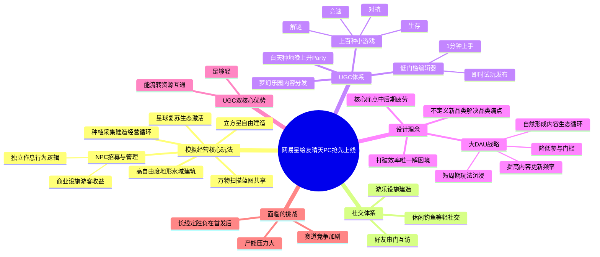

# 26-05-03 研发3年今天PC抢先：网易，真不让人"闲着"

> 来源：游戏那点事Gamez
> 原始链接：https://mp.weixin.qq.com/s/OiggGyldcL6crAYVGqHn0w

---

## Phase 4: 思维导图

---

## Phase 5-6: 提问与回答

### Level 1 - 事实性问题

**Q1: 《星绘友晴天》是什么时候上线的？由哪个厂商开发？**

A: 《星绘友晴天》由网易开发，PC先行版于2026年4月28日正式上线。游戏研发历时3年，经过数个测试版本的迭代，是网易在模拟经营赛道布局的重要产品。

**Q2: 游戏的核心家园系统叫什么？有哪些特点？**

A: 游戏的家园核心是一个可自由改造的"立方星"，可以六面展开。玩家通过"星球复苏"逐步唤醒家园环境，修复星球大气、激活生态。核心玩法循环包括探索、收集、到建造一整套模拟经营系统，涵盖种植、采集、建造、经营等模块。

**Q3: 游戏内置了多少种小游戏？官方内容分发平台叫什么？**

A: 《星绘友晴天》内置了上百种小游戏，涵盖竞速、生存、解谜、对抗等多种类型，支持短时对局与快速匹配。官方设计的内容分发平台叫"梦幻乐园"，玩家可以进入其他人制作的地图进行体验，形成持续更新的内容池。用游戏自己的话说就是"白天种种地，晚上开Party"。

**Q4: "万物扫描"玩法是什么？**

A: "万物扫描"本质上相当于一个"复制器"——玩家在探索其他星球时，可以直接扫描物品获取对应的合成蓝图，再带回自己的星球进行建造。这使得游戏内的经营内容不再完全依赖官方按等级解锁投放，而是通过玩家之间的分享不断扩散。

---

### Level 2 - 理解性问题

**Q1: "万物扫描"玩法如何解决模拟经营游戏的内容消耗问题？**

A: "万物扫描"的核心价值在于将内容解锁从"单一官方投放"转变为"玩家社区扩散"。传统模拟经营游戏的内容解锁通常按官方预设的等级或进度线性投放，一旦玩家完成所有解锁，游戏内容就会被迅速消耗。而"万物扫描"让每个玩家都能成为内容的"搬运工"和"分发者"——在探索他人星球时扫描物品获取蓝图，带回自己家园建造，进而被更多人扫描再传播。这种设计将内容供给的主动权部分交还给玩家社区，内容池理论上可以持续扩容，有效延缓了"内容被消耗完"的疲劳期。

**Q2: 为什么制作组认为中后期疲劳是生活模拟游戏的核心痛点？**

A: 制作组的逻辑链条非常清晰：随着游戏攻略和内容社区日益发达，只要游戏玩法涉及"效率"一词，玩家社区就很容易在短时间内研究出一套"唯一解"。在玩家娱乐时间被越来越多游戏挤占的背景下，用户会跳过"从零探索"的过程，花十几分钟抄一套毕业基建。这不仅导致官方储备的内容被大大压缩消耗，更致命的是玩家完成"最优解"后会快速陷入"不知道接下来该干什么"的长草期。因此，问题的根源不在于内容量不够，而在于内容被消耗的方式——效率导向的攻略文化让体验过程被跳过了。

**Q3: UGC玩法与模拟经营主玩法之间如何实现资源循环？**

A: 文章明确指出《星绘友晴天》UGC与经营主玩法之间存在双向资源互通：一方面，参与派对/小游戏的奖励可以转化为建筑素材，反哺家园建设；另一方面，玩家在家园中建造的设施、装饰的景观又可以转化为新的UGC地图和玩法场景。这种"经营产出→支援UGC创作→UGC产出→反哺经营"的闭环设计，让两个系统不是割裂的"缝合"，而是互为内容引擎。这也是文章认为《星绘友晴天》做得比较好的关键点——"能流转"。

**Q4: 文章认为《星绘友晴天》相比竞品"仅此一家"的差异化优势是什么？**

A: 文章认为差异化优势在于"玩法做厚的同时还能兼顾大量UGC玩法且逻辑自洽"。市面上很多模拟经营产品要么把单一玩法做得足够深但缺乏延展性，要么在传统玩法上强行缝合其他系统导致体验割裂。而《星绘友晴天》在两个维度上都做得相当到位——庞大的内容体量下，建造、经营、社交、UGC等多个板块之间没有明显断层，以一种自然的方式串联在一起。文章将此归结为当今模拟经营赛道的"真正分水岭"：系统能否形成顺畅流动，让玩家感觉自己在玩的是同一款游戏。

---

### Level 3 - 分析性问题

**Q1: 《星绘友晴天》的"大DAU"策略能否真正解决模拟经营品类的长线留存问题？**

A: 从策略本身来看，《星绘友晴天》的"大DAU"思路确实切中了品类要害。模拟经营游戏的长线留存困境本质上是"内容消耗速度 > 内容产出速度"的结构性矛盾。通过引入低门槛UGC（编辑器1分钟上手）+ 高频小游戏 + 资源循环机制，《星绘友晴天》试图将内容生产权部分交给玩家，理论上可以打破官方的产能天花板。

但这种策略能否真正奏效，取决于三个关键变量：第一，UGC生态能否自然冷启动——低门槛是必要条件但非充分条件，如果首批用户创作意愿不足，梦幻乐园的内容池可能沦为"鬼城"；第二，内容质量的分化——低门槛编辑器意味着海量低质量内容涌入，如何通过推荐算法或社区筛选机制让优质内容浮现，是决定UGC体验天花板的关键；第三，大DAU策略意味着需要持续的服务器和运营成本，如果商业化转化率不够理想，维持"上百种小游戏+UGC平台"的运营复杂度将是巨大的财务负担。

从行业经验来看，Roblox、蛋仔派对等产品证明了大DAU+UGC路径的可行性，但它们的成功更多建立在社交裂变与平台效应之上，而《星绘友晴天》的模拟经营基因是否具备同等社交传播力，仍有待市场验证。

**Q2: 相比传统模拟经营游戏，低门槛UGC编辑器是否会带来内容质量参差不齐的风险？《星绘友晴天》如何应对？**

A: 这是一个典型的"量 vs 质"的trade-off。低门槛编辑器的设计哲学本质上是追求UGC参与率而非UGC精品率——"1分钟上手"意味着编辑器功能必然简化，创作出的内容在深度和精致度上难以与专业编辑工具媲美。

对于内容质量参差不齐的风险，《星绘友晴天》的文章中并未详细展开其应对方案，但我们可以从已有的设计线索中推测：一是"梦幻乐园"作为内容分发场，很可能内置了热度排序或推荐机制来筛选优质内容；二是上百种小游戏本身提供了丰富的内容类型，用户可以通过"多而杂"来弥补"单而精"的不足；三是资源循环机制可能通过"使用频率→资源回报"的正反馈来激励高质量创作。

更大的隐忧在于：如果UGC生态长期停留在低质量内容层面，玩家可能对梦幻乐园失去兴趣，UGC内容池的"新鲜感"红利消耗完毕后，游戏又会回到"内容不够玩"的原点。这也是为什么文章认为"真正的分水岭可能在首发之后"——UGC生态的自我进化能力才是长期竞争力的核心。

**Q3: 网易选择PC先行版上线而非移动端首发的策略意义是什么？**

A: PC先行版的策略至少有三层考量：

第一，品类特性匹配。模拟经营游戏的核心玩法（建造、编辑、经营）天然更适合键鼠操作，高自由度的建造体系在PC上能提供更好的精度和体验深度。先用PC验证核心玩法的吸引力，降低变量。

第二，用户群体策略。PC玩家群体更核心、更愿意投入时间深度体验，适合作为游戏的首批种子用户。文章提到需要"积累并沉淀出第一批核心用户"，这批用户不仅能提供高质量的反馈迭代，也是未来UGC生态的早期创作者和内容种子。

第三，竞争窗口抢占。文章指出2026年模拟经营赛道"竞争强度明显抬高"，腾讯、米哈游等头部厂商扎堆入局。PC先行版可以让网易抢先占据赛道认知和时间窗口，积累口碑和用户基础后，移动端上线时自带话题和社交裂变势能。

从行业规律来看，PC→移动的梯度发行策略已有先例（如原神），但模拟经营品类是否具备同等的跨平台吸引力，仍需观察。毕竟移动端用户对操作简化、碎片化体验的要求更高，PC端的深度玩法能否在移动端无损迁移，是后续最大的技术挑战。

---

## Phase 3: 概要总览（200-300字）

网易旗下模拟经营游戏《星绘友晴天》PC先行版于4月28日正式上线，研发历时3年。游戏以"立方星"为核心家园系统，融合星球复苏、自由建造、万物扫描、NPC管理等丰富玩法，通过"让世界活过来"的宏观经营体验拉开与传统模拟经营游戏的差异。

游戏的核心策略是瞄准大DAU市场。制作组洞察到生活模拟游戏最大的痛点是中后期疲劳——玩家社区快速找到"效率唯一解"导致内容被极速消耗。对此，《星绘友晴天》引入了一套完整的UGC体系：内置上百种小游戏、提供1分钟即可上手的低门槛编辑器、以及"梦幻乐园"内容分发平台。UGC与经营主玩法之间实现资源双向循环，形成"经营产出→支援UGC创作→UGC产出→反哺经营"的闭环。

文章认为，在竞争白热化的模拟经营赛道上，单点创新已不足以拉开差距，真正的分水岭在于系统能否形成顺畅流动。《星绘友晴天》虽然没有颠覆品类的革新，但其玩法的密度与衔接性在同类产品中出类拔萃。不过，面临的产能压力和赛道竞争加剧两大挑战也不容忽视，真正的市场检验可能不在首发阶段，而在上线一段时间之后。

---

## 📝 设计笔记

### 核心洞察

1. **痛点驱动的设计哲学**：不是定义新品类，而是解决老品类的核心痛点（中后期疲劳）。这比凭空创造一个"新概念"更务实，也更容易让目标用户产生共鸣。

2. **内容供给的去中心化**：通过"万物扫描"和UGC编辑器，将内容生产权从官方单一下放至玩家社区。这一思路对于任何依赖内容量来维持长线留存的游戏品类都有借鉴意义。

3. **系统间资源循环 > 系统堆叠**：关键不在于加了多少系统，而在于系统之间能否形成资源闭环。好的流转设计能让玩家在每个系统中投入的时间都"不浪费"。

### 可借鉴的设计点

- **"万物扫描"机制**可作为自走棋类游戏的道具/皮肤获取方式的参考——让玩家通过对战中观察/扫描其他玩家的配置来解锁新内容
- **低门槛UGC编辑器**的思路可应用于自走棋自定义模式——允许玩家设计自定义对局规则、棋子阵容挑战地图等
- **"白天种地，晚上开Party"的节奏分层**——让核心循环与休闲玩法在不同时间维度上交替进行，有助于维持心流
- **PC先行→移动端梯度发行**的策略值得关注，特别是对于玩法深度较深的游戏品类

---

*处理时间：2026-05-03 12:04*
