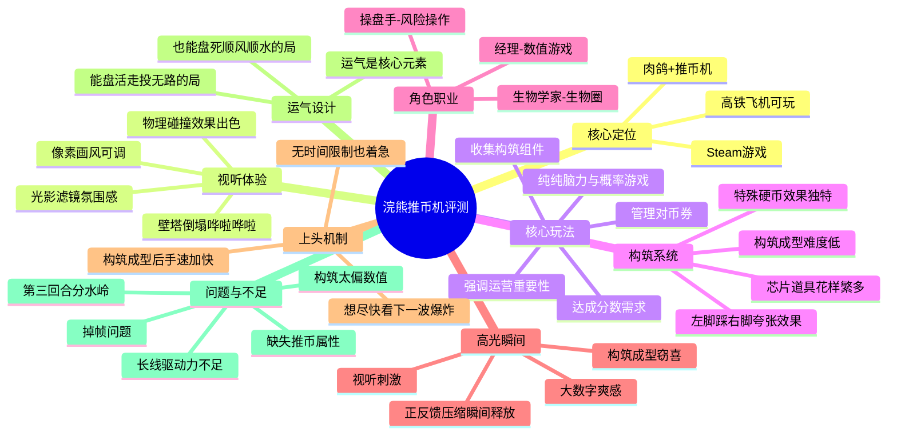

# 【狗蛋的游戏评测】浣熊推币机

> 来源：B站视频
> 日期：2026-03-31
> 链接：https://www.bilibili.com/video/BV1W7XkBxEuj
> UP主：狗蛋

## 🔗 相关笔记
- [[洛克王国世界-首日深度分析]] — 同样是游戏设计分析，可对比学习

---

## 🗺️ 思维导图

## 概要

狗蛋评测了Steam上的肉鸽游戏《浣熊推币机》。游戏将推币机与肉鸽构筑结合，主打视听刺激和构筑成型的爽感。评测指出游戏优点明显：光影氛围感出色、物理碰撞效果优秀、构筑系统丰富、角色职业多样、正反馈强烈。但也存在明显问题：长线驱动力不足、第三回合分水岭卡点、极端构筑下掉帧严重、以及构筑设计过于偏重数值而缺失了推币机本身的"推币"属性。评测者认为，尽管问题存在，但"将现实中拿捏人性的鱼饵做成游戏性"这个核心设计让它很难不好玩。

---

## 文章脉络

### 第一部分：引子与定位（开头）
- 推币机本身的诱惑：物理碰撞不确定性、沉没成本、视听刺激
- 作者作为本能拒绝风险的玩家也忍不住围观
- 肉鸽+推币机的结合让人期待

### 第二部分：视听体验（第一印象）
- 主打氛围感的光影与滤镜
- 像素画风可自定义
- 物理碰撞效果出色
- 停泊时享受哗啦哗啦的声音

### 第三部分：核心玩法（局内体验）
- 强调运营重要性，是脑力与概率游戏
- 达成分数需求、管理对币券、收集构筑组件
- 不是靠推币推分，而是靠构筑组件

### 第四部分：构筑系统详解
- 构筑重要性极高，成型难度低
- 三四组件集齐就能左脚踩右脚
- 芯片道具花样繁多

### 第五部分：角色职业举例
- 经理：数值游戏，E加币打通三种硬币计算
- 生物学家：生物圈生态，小鸡生、狼吃、粑粑养花
- 操盘手：风险操作，无限道具构筑

### 第六部分：高光瞬间与上头机制
- 正反馈压缩到瞬间释放
- 构筑成型后手速不由自主加快
- 没有时间限制也着急

### 第七部分：运气设计
- 运气能盘活也能盘死
- 现实推币机的梦幻体验在电子游戏中实现
- 运气导致失败在推币机中容易被接受

### 第八部分：问题与不足
- 长线驱动力不足（爽感不保鲜）
- 第三回合分水岭（近一半局在此刷掉）
- 掉帧和闪退问题
- 构筑太偏数值，缺失推币属性
- 缺乏强化"推币"本身的基础构筑

### 逻辑主线
**游戏定位 → 视听体验 → 核心玩法 → 构筑系统 → 职业设计 → 上头机制 → 运气设计 → 问题分析 → 总结评价**

---

## Level 1: 基础认知

### Q1: 浣熊推币机的核心玩法是什么？

**答**：游戏是一款肉鸽+推币机结合的作品，核心玩法不是靠推币把分推上去，而是通过收集和组合各种组件来构筑成型。玩家需要达成每个阶段递增的分数需求，管理对币券，带有目的性地去收集构筑组件。构筑在本作中重要性极高，三四个组件集齐就能实现"左脚踩右脚"的夸张效果。

> 📎 来源：浣熊推币机字幕 | 位置：核心玩法
> "这游戏十分强调运营的重要性，是一部纯纯的脑力与概率游戏。你需要达成每个阶段逐步递增的分数需求，管理自己的对币券，并带有强烈目的性的去收集构筑成型所需的一个个组件。"

### Q2: 游戏有哪些主要角色职业？

**答**：游戏有多种可选角色，每名角色的职业特质都不同，分别对应不同的硬币类型与构筑体系。主要例子包括：
- **经理**：主打数值游戏，让其他游友币得分加5，E加币打通三种硬币的互相计算
- **生物学家**：把机台打造成生物圈，小鸡生、狼吃、粑粑养花，猴子浇水、鱼喷水
- **操盘手**：主打风险操作，适合无限道具构筑

> 📎 来源：浣熊推币机字幕 | 位置：角色职业
> "游戏给到了数名的可选角色，每名角色的职业特质都大不一样，分别对应不同的硬币类型与构筑体系。"

### Q3: 游戏的高光瞬间是什么体验？

**答**：当构筑成型、套路开始循环后，玩家的正反馈会被压缩到一个瞬间，然后随着喷涌的硬币与得分同步释放。具体表现是：构筑成型后手速不由自主加快，明明没有时间限制也着急想进入下一回合，只为看硬币的新一波爆炸和数字的新一波膨胀。

> 📎 来源：浣熊推币机字幕 | 位置：高光瞬间
> "推币机本身的视听刺激，大数字带来的直观爽感，构筑成型的游戏取好运半生的心理窃喜，一系列正反馈压缩到一个瞬间，然后随着喷涌的硬币与得分同步释放。"

### Q4: 游戏存在哪些主要问题？

**答**：主要问题包括：
1. **长线驱动力不足**：爽感不保鲜，玩过一遍的构筑基本没兴趣再追一遍
2. **第三回合分水岭**：近一半的局会在第三回合刷掉，此时玩家构筑未见起色却遭遇坏币惩罚
3. **掉帧和闪退**：极端构筑下运算量夸张，掉帧严重
4. **缺失推币属性**：构筑太偏数值，缺乏强化"推币"本身的基础构筑如加速推币机节奏、加大推币力量等

> 📎 来源：浣熊推币机字幕 | 位置：问题不足
> "成人游戏中的代币与道具池子够多，套路也够多。直至目前为止，我还有大把大把的套路没有体验过成堆成堆的道具拿都没拿过，但这个过程它总归是一个能望到头的过程。"

---

## Level 2: 深度理解

### Q5: "构筑成型后手速不由自主加快"说明了什么心理机制？

**答**：这说明游戏成功激活了玩家的"自动化上头"机制。玩家明知没有时间限制、不需要着急，却依然控制不住地加快操作。这种心理机制源于：
1. **即时反馈的渴望**：想尽快看到构筑带来的"下一波爆炸"
2. **正反馈的成瘾循环**：每次"爆炸"都强化了"再来一次"的行为
3. **赌徒心理的延伸**：推币机的核心就是"下一次可能更好"

这个设计将现实中推币机的成瘾机制完美迁移到了电子游戏中。

### Q6: 游戏如何处理运气与实力的关系？

**答**：游戏设计了一个有趣的张力：
- **运气好时**：走投无路的局能被盘活，一个转盘或扭蛋道具就能形成循环把死局救活
- **运气差时**：构筑只差一个组件却死活刷不出来，倾家荡产也买不到

评测者认为，尽管运气因素在肉鸽游戏中本应尽量避免，但放在推币机这个载体中反而容易被接受——因为"推币机本来就是要看运气的"。这是游戏设计者对产品定位的精准把握。

### Q7: "构筑太偏数值而缺失推币属性"是什么问题？

**答**：这是游戏在设计方向上的取舍问题。评测者指出，游戏中的构筑玩法太过专注于数值游戏，而缺少了"强化推币本身"的基础构筑（如加速推币机节奏、加大推币力量、增加出币口等）。这导致：
- **心理两难困境**：玩家知道某些套路很强，但不愿意用
- **体验错位**："与其说是推币机游戏，倒不如说是投币机游戏"

评测者期待的是"如十级海啸般疯狂涌动的臂潮、如高楼爆破般轰然倒塌的地塔"这样的视觉享受，而非纯粹堆叠数字的数学游戏。

---

## Level 3: 创新思考

### Q8: 这款游戏的"将现实中拿捏人性的鱼饵做成游戏性"设计思路，对其他游戏有什么借鉴意义？

**答**：这是一个值得深思的设计哲学问题。现实中用来操控玩家的机制（如推币机的赌徒心理）被做成游戏性后，确实"很难不好玩，也很难不上头"。

这个思路的借鉴价值在于：
- 识别现实中让人上瘾的机制
- 将这些机制"游戏化"而非"商业化"
- 用电子游戏的优势（不用在意赔本）让体验更纯粹

但也需要警惕：这种设计是否在合理边界内？是否有相应的防沉迷机制？

### Q9: 第三回合分水岭的设计是否有改进空间？

**答**：从评测来看，第三回合的分水岭设计存在明显问题：此时玩家构筑通常未见起色，却遭遇第一波坏币惩罚，导致近一半的局在此刷掉。

可能的改进方向：
- 延后坏币出现的时机（如第五或第七回合）
- 在第三回合提供更多消除坏币的手段
- 调整坏币的惩罚力度，让玩家有应对空间

这个问题的本质是：游戏过早地给予了负面反馈，打断了玩家的正向体验积累。

### Q10: 如果你是这款游戏的设计师，会如何平衡"数值构筑"与"推币属性"？

**答**：这是一个设计优先级的问题。可以考虑：
1. **增加"推币强化"类构筑**：加速节奏、加大力量、增加出币口、压缩台面空间
2. **调整得分机制**：让推币数量本身也影响得分，而非只看分数
3. **设计复合型构筑**：让数值构筑和推币构筑可以互相加成，创造新的组合乐趣
4. **保留"纯粹推币"模式**：让想体验推币爽感的玩家有专门的选择

---

## 标签

#游戏评测 #肉鸽 #浣熊推币机 #Steam #游戏设计 #推币机 #构筑系统

---

*整理日期：2026-04-05*
*来源：狗蛋B站视频字幕*
