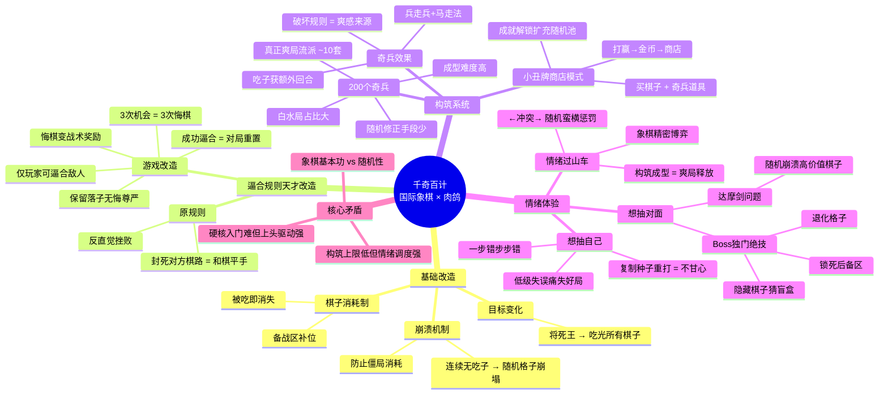

# 2026-05-03_千棋百计—大嘴巴子猛抽

> UP主：Tdogegg（狗蛋的游戏测评） | BVID：BV1X6RFB4E6N
> 视频链接：https://www.bilibili.com/video/BV1X6RFB4E6N
> 播放量：30,939 | 时长：08:20

---

## Phase 1: 概要总览

《千奇百计》是一部**国际象棋基底 + 小丑牌式构筑**的肉鸽游戏。目标不是将死对方王，而是吃掉所有棋子——棋子是消耗品，每吃掉就没。玩家通过商店购买棋子与奇兵道具，改造棋子的走法和能力，形成破格构筑。

核心创新在于对国际象棋规则的**精准改造**：崩溃机制（无吃子则随机格子崩塌）防止僵局；逼合规则被改造成**玩家专属的3次"悔棋"机会**——只有玩家能逼合对手，成功逼合则本局重置。这个设计一举多得：保留了落子无悔的尊严，同时把悔棋变成战术奖励。

游戏带来极端的情绪过山车：底层象棋要求精密博弈，但随机性又蛮横地扰乱秩序，造成"一会儿想抽自己、一会儿想抽对面"的上头体验。构筑成型时爽翻天，白水局时靠基本功硬扛。200个奇兵中真正爽飞的流派约十套以内，成型难度高、随机修正手段少，但对入门者仍有极强的"复制种子重打"的胜负欲驱动。

---

## Phase 2: 思维导图

---

## Phase 3: 提问与回答

### Level 1: 事实性提问（这是什么？）

**Q1: 《千奇百计》的核心玩法是什么？**

A: 以国际象棋为底层规则，目标改为**吃光对方所有棋子**，而非将死王。棋子是消耗品（被吃即消失），但可通过备战区补充新棋子。每局结束后进入商店（参考小丑牌模式），购买额外棋子、扩容登场数量、购入奇兵道具改造棋子能力，通过成就解锁更多奇兵丰富随机池。

**Q2: "崩溃机制"是什么？**

A: 如果连续多个回合没有任何一方吃子，棋盘上随机格子会崩塌，压缩双方落子空间，强制搅动棋局，避免陷入长期消耗僵局。这是对传统象棋规则的一个重要改造。

**Q3: 游戏如何改造国际象棋的"逼合"规则？**

A: 原规则中，封死对方棋路 = 和棋（平手），这在肉鸽中极为挫败。游戏改造为：**只有玩家可以逼合敌人**，成功逼合后对局重置，玩家获得额外机会。每轮3次逼合机会，本质上是把悔棋包装成了战术奖励，既保留落子无悔的原则，又消解了挫败感。

**Q4: 狗蛋为什么说"想抽自己大嘴巴子"？**

A: 因为象棋底层要求精密博弈，玩家经过一小时高压对弈后，往往因一个低级失误导致满盘皆输。这种"一步错步步错"的懊悔感极强，而且不同于其他肉鸽游戏——狗蛋会在痛失好局后**复制种子反复重打**同一局，就是不甘心、不服气。

**Q5: "想抽对面大嘴巴子"又是因为什么？**

A: 主要来自敌方的随机惩罚——比如"吃子时随机崩溃一个格子"恰好全崩在高价值棋子上；Boss独门绝技包括：锁死后备区、撒退化格子、隐藏全部棋子（猜盲盒式开局）等。这些随机惩罚蛮横地扰乱了玩家的精密战术，带来极大的挫败感和"对AI的愤怒"。

---

### Level 2: 机制分析（怎么运作的？为什么有效？）

**Q6: 逼合改造设计为什么是"天才设计"？效果好的原因是什么？**

A: 这个设计实现了**三重价值叠加**：

1. **消解挫败感**：传统肉鸽中的悔棋通常是粗暴的"撤销"按钮，而逼合改造让玩家在"已经失误、想放弃"时不会直接退出，而是**转换战术目标**——从"赢"转为"逼和"，继续游戏。
2. **变惩罚为奖励**：悔棋不是系统施舍的怜悯，而是**玩家通过战术达成的成果**。你成功地逼合了对手，所以你赢得了重置机会——这是对玩家能力的肯定。
3. **保留原则尊严**：落子无悔是象棋的灵魂，游戏没有打破它。你仍然不能撤销单步失误，但你可以"用另一种方式赢下这局"——战术上输了这场，可以用逼合战术赢回一次机会。

这体现了**将负面体验转化为主动选择**的设计哲学——玩家不是被动接受系统的怜悯，而是主动使用战术打开生路。

**Q7: "复制种子"现象揭示了什么独特的游戏心理？**

A: 狗蛋在其他肉鸽中输了就开新的，唯独在千奇百计中会反复复制种子重打同一个局。这揭示了三个关键心理：

1. **确定性归因**：其他肉鸽输了可以归因于"运气不好/构筑不足"，但千奇百计的象棋基底让玩家明确知道**是自己在某一步犯了可识别的错误**——不是运气问题，是"我瞎了"。
2. **不甘心驱动 > 新鲜感驱动**：传统肉鸽靠新鲜感（下一局不同构筑）吸引玩家重开，千奇百计靠**"我能打得更好"的确定性信念**驱动玩家重打同一局。
3. **自我证明需求**：玩家要证明"不带运气的我也能赢"——同种子同构筑，纯粹是操作优化，这是一种极强的竞技心理驱动。

这对自走棋设计的启示：**让玩家清晰地感知到失败是自己操作的问题，而非运气不可控**，会极大增强重试意愿。

**Q8: "达摩剑问题"在本作中的特殊表现是什么？**

A: 达摩剑问题（随机性直接宣判玩家失败）在本作中有一个**独特矛盾**：

- 象棋底层的**确定性要求**极高——每一步都是精密计算的结果
- 肉鸽的**随机惩罚**却蛮横地破坏这个确定性——随机崩溃直接吞掉高价值棋子，Boss隐藏棋子让开局变成赌命

矛盾点在于：其他肉鸽中玩家"预期"有随机性，但千棋百计的象棋基底给了玩家**"这是一场公平对弈"的假象**——当随机惩罚打破这个假象时，挫败感被放大。玩家感觉不是"我棋艺不精"，而是"我被系统耍了"。

**Q9: 崩溃机制作为反僵局设计的优劣？**

A: **优势**：简单直接地解决了象棋肉鸽中"双方耗着不敢动"的僵局问题。崩溃是随机的，双方都无法预测和控制，强制推动局势变化。

**劣势**：崩溃的随机性恰好与服务象棋"精密计算"的玩法产生冲突——玩家精心布置的棋子布局可能被随机崩溃直接摧毁，且无法预防或规避。

**对比**：逼合改造是"规则层面的巧妙转化"，崩溃机制则更像是"系统的粗暴干预"。前者是"优雅的设计"，后者是"实用的妥协"。

---

### Level 3: 元设计（这对游戏设计意味着什么？）

**Q10: 从千棋百计的设计中，能否提炼出"确定性基底 + 随机性叠加"的通用设计原则？**

A: 可以。千棋百计揭示了一个重要的设计公式：**确定性基底提供"我能控制"的错觉 → 随机性叠加放大情绪波动 → 确定性归因驱动重试**。

关键参数：
- **确定性基底不能是纯运气**（否则玩家无法归因"我错了"）
- **随机性不能完全否定确定性**（否则玩家感觉被系统耍了）
- **两者之间的"冲突张力"本身就是体验**（玩家在精密计算和随机冲击之间反复拉扯）

适用场景：
- 自走棋：棋子走位确定 + 装备掉落随机 → 已经有这个结构

**Q11: "把负面规则改造成玩家专属优势"的设计方法论是什么？**

A: 逼合改造的核心方法论可以概括为**非对称规则优待 (Asymmetric Rule Privilege)**：

1. **找出原本对双方公平但会制造挫败的规则**（逼合 = 和棋，双方都能用，但没有成就感）
2. **将该规则从"双方可用的公平工具"改为"仅玩家可用的特殊战术"**（只有玩家能逼合）
3. **给规则赋予新的战术意义**（逼合 = 不是平手，而是获得重置机会）
4. **用量化限制防止滥用**（3次/轮）

这个方法特别适合**将传统对弈类游戏的规则迁移到单机/PvE 肉鸽**中——传统规则追求公平，但单机游戏需要的是"玩家的特权感"。

**Q12: 千棋百计的优缺点对自走棋设计有什么启示？**

A:

**正面启示**：

| 设计点 | 对自走棋的启示 |
|--------|----------------|
| 逼合→悔棋转化 | **失败补偿机制可以包装为战术选择**——例如连败补偿不直接给资源，而是通过某种需要玩家主动操作才能触发的机制 |
| 崩溃反僵局 | 自走棋后期也可能10人站着不动→可设计**缩圈/强制触发**类的节奏推动器 |
| 复制种子心理 | **让玩家感知到失败的确定性原因**——如果玩家知道"我上这个棋子而不是那个就能赢"，重试意愿会远超"运气不好" |
| 情绪过山车 | **确定性博弈 + 随机干扰 = 极强情绪体验**——这比纯随机或纯确定都更具感染力 |

**反面警示**：
- Boss随机惩罚（隐藏棋子猜盲盒）直接否定了玩家的战术准备，在确定性博弈中引入这种蛮横随机 = 极其恼火
- 白水局占比过高说明**构筑乐趣需要足够频率的触发**，不能只靠底层博弈
- 成型难度过高会导致大量玩家在"还没爽到就已经放弃了"

---

## 📝 设计笔记

### 核心洞察

1. **逼合改造是"设计炼金术"的典范**：把一个反直觉的挫败规则（封死对手 = 平手）变成玩家专属的战术武器。这背后的设计思维是——不要删除让人不舒服的规则，而是让玩家成为唯一能利用它的人。

2. **"确定性归因"是驱动重试的关键**：玩家在其他肉鸽中输了开下一局的根本原因不是"不想玩了"，而是"不知道为什么会输"。当失败原因可识别、可归因到自己的具体操作时，"不甘心"会变成极强的重试驱动力。

3. **象棋 + 肉鸽的"情绪化学反应"**：这不仅仅是1+1=2的叠加。象棋的精密计算感让玩家"以为一切可控"，肉鸽的随机惩罚突然打破这个错觉——这种**预期落差的频率和幅度**决定了情绪的强度。这是"设计冲突"而非"设计和谐"的价值。

4. **崩溃机制的"粗暴即功能性"**：有时候不需要优雅的设计，一个简单粗暴的"随机压碎格子"反而最能推动节奏。关键在于这个粗暴是否服务于明确的游戏需求（防止僵局）。

### 可借鉴的设计点

1. **"悔棋"的战术化设计** ⭐⭐⭐⭐⭐
   - 不给撤销按钮，但给"用另一种战术赢回机会"的能力
   - 应用：自走棋的连败转连胜机制可以增加主动操作维度，而非纯被动触发
   - 应用：GoGo卡可设计"触发条件 = 特定操作失误"，补偿以战术选择形式呈现

2. **"崩溃机制"式节奏推动器** ⭐⭐⭐⭐
   - 当对局陷入僵持（例如10秒内无任何一方掉血），触发某种推动

3. **Boss差异化惩罚设计** ⭐⭐⭐
   - 锁死后备/退化/隐藏信息——这些惩罚的核心是**改变玩家已知的规则**
   - ⚠️ 但要注意：惩罚不能否定玩家的构筑努力（隐藏棋子猜盲盒太粗暴）

4. **"复制种子"心理驱动** ⭐⭐⭐⭐⭐
   - 核心：让玩家清楚知道"换一个操作结果就会不同"
   - 这种确定性的错误反馈会极大刺激重试

5. **"200个奇兵但只有10套爽局"的设计教训** ⭐⭐⭐⭐
   - 数量≠质量，玩家真正体验到的是**那10套成型爽局**
   - 不要让玩家在200个选项中翻滚却只有10次真爽

---

*分析时间：2026-05-03 18:16 UTC*
*来源：狗蛋的游戏测评 - 【千棋百计—大嘴巴子猛抽】*
